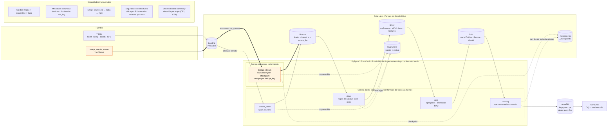
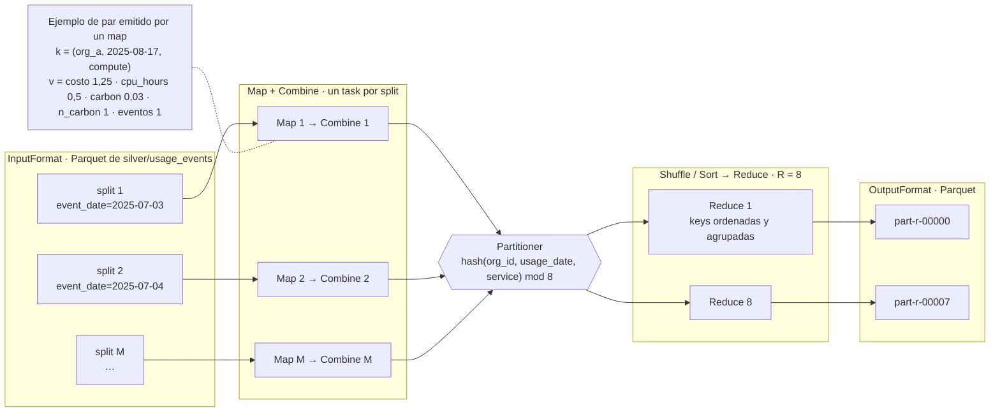

# Cloud Provider Analytics — Documento de diseño v1

| | |
|---|---|
| **Materia** | Big Data · ITBA · 2.º cuatrimestre 2026 · Prof. (Ad.) Diego Mosquera |
| **Instancia** | Primera evaluación parcial: diseño y fundación de datos |
| **Entrega** | Lunes 05/10/2026 · 18:30 h |
| **Equipo** | Jerónimo Esquivel · Agustín Ronda · Pedro Salinas |
| **Versión** | v1.0 · 04/10/2026 |
| **Repositorio** | https://github.com/jeroesquivel/bigdata-20262C-g7 · tag `v1.0-entrega1` |

Cubre los 12 puntos del alcance (consigna §5.2); la trazabilidad con el checklist está en el [Anexo A](#anexo-a--trazabilidad-con-el-checklist-91). Todas las cifras salen de [`notebooks/00_exploracion.ipynb`](../notebooks/00_exploracion.ipynb) (PySpark 3.5.3), y las principales se guardan en [`evidence/entrega1/perfil_landing.json`](../evidence/entrega1/perfil_landing.json). Las marcadas con † vienen de los chequeos de consistencia del notebook: §2.3 (maestros y facturación), §3.1 (eventos contra recursos, series para MAD y keys del mart) y §4 (fechas de modificación).

---

## Resumen

| Tema | En una línea | Dónde |
|---|---|---|
| Qué construimos | Pipeline PySpark: eventos en **streaming**, maestros y facturación en **batch**, Data Lake Parquet Landing → Bronze → Silver → Gold y marts de FinOps, Soporte y Producto en **Cassandra/AstraDB** | §4 |
| Patrón | **Híbrido: ingesta streaming + conformado batch**, una variante de Lambda sin capa de velocidad. Un solo motor y una implementación por transformación; frescura ≤ 15 min (CE4) | §5 |
| Hallazgo clave | **Cada archivo de eventos abarca los 60 días.** Un watermark por *event-time* descartaría entre el 81 % y el 92 % de los eventos (umbral de 1 h a 7 días). Por eso el dedupe usa un watermark sobre `ingest_ts` y los tardíos entran en el recálculo batch | §7.1 |
| Calidad | 15 reglas. A quarantine va solo lo que no se puede interpretar; lo sospechoso se conserva con flag | §6.5 |
| Entorno | Colab, Parquet (disco local con copia a Drive) y AstraDB free tier: costo $0. Cada pieza de Hadoop tiene su equivalente | §4.4, §6.8, §8 |
| Para el feedback | Siete decisiones abiertas (A1–A7) | §10.3 |

---

## 1. Problema, usuarios, preguntas y objetivos medibles

**Problema.** El área de datos de un proveedor de nube recibe telemetría de uso continua y maestros de CRM y facturación con nulos, tipos ambiguos, outliers y cambios de esquema. Necesita datos limpios y consultables por organización, servicio y fecha para tres áreas.

| Usuario | Preguntas (P1–P5 son las consultas obligatorias, consigna §7.4) |
|---|---|
| **FinOps** | P1. Costo y consumo por org × servicio × día en un rango · P2. Servicios con mayor costo de una org en los últimos 14 días · P4. Revenue mensual en USD con créditos e impuestos · ¿Qué costos son anómalos? |
| **Soporte** | P3. Tickets críticos y tasa de SLA breach por día en los últimos 30 días · CSAT promedio |
| **Producto / GenAI** | P5. Tokens GenAI y costo estimado por día · Emisiones (`carbon_kg`) |

**Criterios de éxito** (se verifican con evidencia en la entrega 2 y en la final):

| ID | Criterio | Cómo se mide |
|---|---|---|
| CE1 | Conservación | Por fuente: `filas Landing = válidas + quarantine + duplicados descartados` |
| CE2 | Unicidad | 0 `event_id` repetidos en Silver |
| CE3 | Idempotencia | Re-ejecutar el pipeline no cambia los conteos de Silver, Gold ni AstraDB; Bronze sin filas duplicadas por partición |
| CE4 | Frescura (SLA) | **≤ 15 min** desde que un archivo llega a Landing hasta Gold y AstraDB (producción: corrida cada 5 min que tarda ≤ 10 min). En el MVP, que corre a demanda, `run_log` registra la duración y un archivo nuevo aparece en la corrida siguiente |
| CE5 | Consultas | P1–P5 responden desde AstraDB leyendo una sola partición |
| CE6 | Reproducibilidad | El pipeline corre en un Colab limpio siguiendo el Quickstart |

**Fecha de referencia.** Los datos son de 2025: "últimos 14/30 días" se calcula contra `as_of_date` (configurable; por defecto 2025-08-31, último día con eventos) y no contra la fecha actual. Ninguna regla de calidad depende de ella.

---

## 2. Justificación de Big Data (5V)

La muestra pesa **12,6 MB**: sola **no** es Big Data, y para ese volumen alcanzaría una base convencional. Lo que justifica la arquitectura es el sistema que la muestra representa.

| V | Observado en la muestra | Proyección (supuesto) | Implicancia |
|---|---|---|---|
| **Volumen** | 43.200 eventos en 60 días (720/día), ≈ 300 B cada uno | Métricas por recurso y minuto: 400 recursos → 576.000 eventos/día (≈ 165 MB); 10.000 orgs (×125) → ≈ 72 M/día (≈ 20 GB) | Spark escalable horizontalmente, Parquet columnar, partición por fecha |
| **Velocidad** | 120 archivos de 360 eventos | Flujo continuo; FinOps quiere el costo en minutos | Structured Streaming para la ingesta; el SLA de minutos se cumple con batch incremental, sin capa de velocidad (§5) |
| **Variedad** | 7 CSV, JSONL, JSON embebido (`tags_json`) | Servicios y métricas nuevos | Esquema explícito superset; Silver conforma |
| **Veracidad** | `value` como texto (1.309), `unit` nulo (2.075), 216 costos negativos, spikes de 317 USD (p50 = 1,00), tasas de cambio y CSAT inconsistentes, fechas incoherentes entre fuentes† | Igual o peor | Reglas, quarantine, flags y anomalías con MAD |
| **Variabilidad** | Esquema v1 → v2 el 2025-07-18 (`carbon_kg`, `genai_tokens`); `carbon_kg` llega entero o decimal | Distribuciones de costo cambiantes (precios, estacionalidad) | `schema_version`, null ≠ 0, umbrales configurables |
| **Valor** | Costo, revenue, SLA y adopción de GenAI por org | Pricing, churn, capacidad | Marts Gold y serving query-first |

---

## 3. Inventario y perfil inicial de las fuentes

### 3.1 Inventario

| Fuente | Filas | Tamaño | Grano (clave natural) | Frecuencia | Rango temporal |
|---|---:|---:|---|---|---|
| `customers_orgs.csv` | 80 | 7,6 KB | organización (`org_id`) | Snapshot | alta: 2025-05-04 → 2025-07-02 |
| `users.csv` | 800 | 69,0 KB | usuario (`user_id`) | Snapshot | — |
| `resources.csv` | 400 | 35,8 KB | recurso (`resource_id`) | Snapshot | — |
| `support_tickets.csv` | 1.000 | 69,3 KB | ticket (`ticket_id`) | Diaria | 2025-05-09 → 2025-08-31 |
| `marketing_touches.csv` | 1.500 | 99,6 KB | interacción (`touch_id`) | Diaria | 2025-05-04 → 2025-08-31 |
| `nps_surveys.csv` | 92 | 3,9 KB | encuesta (`org_id`, `survey_date`) | Eventual | 2025-05-24 → 2025-08-31 |
| `billing_monthly.csv` | 240 | 15,5 KB | factura (`invoice_id`) = org × mes | Mensual | 2025-06 → 2025-08 |
| `usage_events_stream/*.jsonl` | 43.200 | 12,3 MB en 120 archivos | evento (`event_id`) | Archivos de 360 eventos (micro-lotes) | 2025-07-03 → 2025-08-31 (UTC) |

**Trazabilidad:** todas las claves naturales son únicas y no hay `org_id` ni `resource_id` huérfanos. En los eventos, `service`, `org_id` y `region` coinciden siempre con los del recurso (0 inconsistencias en 43.200†). En Bronze, cada fila conserva `source_file` e `ingest_ts`.

### 3.2 Perfil de calidad

| Fuente | Hallazgo | Tratamiento (§6.5) |
|---|---|---|
| Eventos | **Esquema:** v1 = 10.800 eventos (hasta 2025-07-17); v2 = 32.400 (desde 2025-07-18). `carbon_kg` está en todos los v2 (2.638 enteros, 29.762 decimales); `genai_tokens`, solo en 3.132 eventos de `genai` | Superset; en v1 quedan `null`, no 0 |
| Eventos | **`value` mixto:** 41.014 numéricos, 1.309 como texto (`"95.0"`) y 877 nulos; todos los textos son casteables | String en Bronze; cast con fallback (R7) |
| Eventos | **`unit` nulo** en 2.075 (2.038 con `value`). Cada `metric` tiene una sola unidad: `requests → count`, `cpu_hours → hours`, `storage_gb_hours → gb_hours` | Imputar desde `metric` + flag (R6) |
| Eventos | **Costos:** 216 negativos (211 < −0,01; mínimo −154,46); p50 1,00 · p99 16,72 · p99,9 133,14 · máximo 317,43 | `is_negative_cost` (R5); anomalías con MAD (§7.3) |
| Eventos | **Orden:** cada archivo abarca los 60 días y los 120 tienen la misma fecha de modificación† | Define el watermark (§7.1); el diseño no depende del orden de lectura |
| Eventos | **Temporal†:** 7.371 (17 %) son anteriores al alta del recurso; 4.167 son de recursos hoy `terminated` (válido: el estado es actual, el evento es histórico) | Flag `is_before_resource_created` (R13) |
| `billing_monthly` | `credits` nulo en 137 (nunca negativo). USD 160 · ARS 51 · EUR 29; las 160 en USD tienen tasa ≠ 1 (0,855–1,118) | `credits` → 0; `fx_suspect` (R9, A3) |
| `billing_monthly` | **Signos†:** 13 subtotales negativos (mínimo −1.671,83; 10 USD, 2 ARS, 1 EUR). `taxes` es el 21 % del \|subtotal\| en las 240, así que en esas 13 queda positivo. Las 9 facturas con `credits > subtotal` son de subtotal negativo | Nota de crédito (R11, R12, A6) |
| `support_tickets` | 240 abiertos sin `resolved_at` (válido); `csat` nulo en 254 y fuera de 1–5 en 40 (0, 6, 7) | `null` + flag (R10) |
| `support_tickets` | **Consistencia†:** 209 anteriores al alta de su org; 172 de los 240 abiertos tienen CSAT, que se mide al cerrar; 25 abiertos tienen el SLA vencido (válido) | Flag (R13); el CSAT de abiertos sale del promedio (R14) |
| `customers_orgs` | **`is_enterprise` contradice `plan_tier`†** en 25 orgs: 9 `enterprise` con `False` y 16 `True` con plan standard (8), pro (6) o free (2) | Manda `plan_tier` (R15, A7) |
| `customers_orgs` / `nps_surveys` | `nps_score` (−100..100) nulo en 11 / 19 filas; un valor de 101 | `null` + flag (R10) |
| `users` | 232 con `last_login < created_at`† | Flag (R13) |
| `users` / `resources` | **Sensibles:** `email` es PII; `tags_json` marca recursos con `pii:true` | Fuera de Gold y del serving |

† `notebooks/00_exploracion.ipynb`: §2.3 para `billing_monthly`, `support_tickets`, `users` y `customers_orgs`; §3.1 para eventos contra recursos; §4 para las fechas de modificación.

### 3.3 Riesgos de datos

- La facturación arranca en junio y los eventos el 03/07: no se concilia facturación contra uso (fuera de alcance).
- La escala de CSAT (1–5) no está documentada en la fuente; es un supuesto (S5).
- La muestra no tiene `event_id` duplicados, pero el dedupe protege ante reenvíos y reprocesos.
- Los maestros son snapshots sin historia: un `created_at` posterior a la actividad puede ser un error o una re-creación, y no hay forma de saberlo. Por eso se marca con flag y no se descarta (R13). Tampoco están documentados el significado de un subtotal negativo ni la definición de "enterprise": proponemos una interpretación (A6, A7) que se puede cambiar recalculando solo Silver y Gold.

---

## 4. Arquitectura v1

### 4.1 Diagrama · v1.0 · 04/10/2026



Las flechas gruesas y los nodos naranjas marcan el camino streaming; todo lo demás es batch.

### 4.2 Componentes y herramientas

| Capa | Componente | Herramienta | Responsabilidad |
|---|---|---|---|
| Ingesta batch | `bronze_batch` | `spark.read.csv` con `StructType` explícito | Landing → Bronze con `ingest_ts`, `source_file` e `ingest_date` |
| Ingesta streaming | `bronze_stream` | `readStream.json`, `maxFilesPerTrigger=10`, `trigger(availableNow=True)` | Landing → Bronze en 12 micro-lotes; checkpoint; dedupe por `dedupe_key`; escritura por `batch_id` (§7.1) |
| Almacenamiento | Data Lake | Parquet snappy (disco local de Colab con copia a Drive) | Landing, Bronze, Silver, Gold y Quarantine (§6) |
| Procesamiento | `silver`, `gold` | PySpark DataFrames (batch) | Limpieza, conformado, joins, features, marts y anomalías |
| Serving | `serving` | AstraDB + spark-cassandra-connector 3.5 | Una tabla por consulta; upsert por clave primaria |
| Orquestación | `run_pipeline` | Notebook o script secuencial | Bronze → Silver → Gold → Serving, registrando conteos y duración |
| Consumo | — | CQL (consola de AstraDB / cqlsh) y notebook | P1–P5 |

### 4.3 Serving preliminar (se implementa en la entrega 2 y en la final)

| Consulta | Tabla | Clave primaria | Justificación |
|---|---|---|---|
| P1 costo y requests por org × servicio en un rango | `org_daily_usage_by_service` | `((org_id), usage_date, service)`, `usage_date DESC` | El rango de fechas va sobre la clustering key, dentro de una partición. Filtrar un servicio se hace en el cliente (sin `ALLOW FILTERING`) |
| P2 top-N servicios en 14 días | la misma tabla | — | Se leen ≤ 84 filas (14 días × 6 servicios) y se ordenan en el cliente (A4) |
| P3 tickets críticos y SLA breach por día | `tickets_by_severity_date` | `((severity), ticket_date)` | Una partición por severidad; 30 días sobre la clustering key (A5) |
| P4 revenue mensual en USD | `revenue_by_org_month` | `((org_id), month)` | Por organización, como el mart de referencia (A5) |
| P5 tokens GenAI y costo por día | `genai_tokens_by_org_date` | `((org_id), usage_date)` | Por organización, como el mart de referencia (A5) |

Cada partición por `org_id` tiene como máximo 360 filas (60 días × 6 servicios). A escala se agregaría un bucket mensual a la clave de partición (documentado, no implementado).

### 4.4 Mapa de componentes: ecosistema Hadoop → nuestro stack

Hadoop es modular. Conservamos su separación entre almacenamiento, gestión de recursos y procesamiento, y reemplazamos cada pieza por un equivalente gestionado acorde al volumen.

| Pieza Hadoop | Qué resuelve | En el proyecto | Nota |
|---|---|---|---|
| HDFS (DataNodes) | Archivos repartidos en bloques de 128 MB, replicación ×3, localidad de datos | Parquet en almacenamiento gestionado (Drive) | Sin localidad ni rack awareness: Spark lee por red. Bloques, archivos chicos y write-once siguen valiendo (§6.8) |
| NameNode | Namespace, permisos y ubicación de los bloques | Convención de rutas + `_meta/run_log` + diccionario | Sin catálogo; el equivalente sería Hive Metastore, Glue o Unity Catalog (§6.7) |
| YARN (RM, NM, AM) | CPU y memoria del clúster en contenedores | Spark `local[*]` en Colab (un nodo) | En clúster: Spark sobre YARN (en modo cluster, el driver corre en el ApplicationMaster) o Kubernetes |
| MapReduce | Batch map → shuffle → reduce, con disco entre jobs | Spark DataFrames (DAG optimizado por Catalyst, en memoria) | Mismo modelo de claves, particiones y shuffle (§8) |
| Hadoop Common | API `FileSystem` y commit protocol compartidos | Spark usa la misma API (`file://`, `gs://`, `s3a://`) | Por eso el *rename* importa fuera de HDFS (§6.8) |
| Hive · Flume/Sqoop/Kafka · Oozie | SQL sobre archivos · ingesta · orquestación | Spark SQL · file source de Structured Streaming (D4) · `run_pipeline` (D10) | Kafka y Airflow serían la evolución |
| HBase | Lectura y escritura por clave con baja latencia | Cassandra/AstraDB | Modelado query-first (§4.3) |
| ZooKeeper | Coordinación y alta disponibilidad | No aplica | Drive y AstraDB son servicios gestionados |

### 4.5 Vistas lógica, física y de despliegue

| Vista | MVP (entrega 2 y final) | Producción a escala |
|---|---|---|
| Lógica | Fuentes → ingesta streaming y batch → Landing/Bronze/Silver/Gold → serving → consumo (§4.1) | La misma |
| Física | Parquet snappy; Spark 3.5 local; AstraDB | Parquet en un bucket (GCS/S3) o HDFS; Spark en clúster |
| Despliegue | Notebook de Colab con Drive montado; corrida a demanda; Colab Secrets | Spark sobre YARN o Kubernetes; `run_pipeline` cada 5 min (CE4); gestor de secretos |

---

## 5. Patrón arquitectónico: híbrido (ingesta streaming + conformado batch)

Un camino streaming (solo `usage_events_stream`) y uno batch (maestros, facturación, tickets y encuestas) escriben en el mismo Bronze; Silver y Gold se calculan en batch y hay una sola capa de serving. **No es Lambda clásica:** no hay capa de velocidad ni merge de vistas en el serving, y la frescura sale de corridas batch incrementales frecuentes (CE4).

**Por qué lo elegimos:**
1. **Responde a las fuentes.** La facturación mensual y los maestros snapshot no son streams; los eventos sí.
2. **Cumple el requisito invariable** (consigna §4.3, que admite "Híbrido"). Lo elegimos por las necesidades de datos y operación, no por el nombre del patrón.
3. **No duplica lógica.** Un motor y una implementación por transformación; el streaming solo ingesta, exactly-once.
4. **Tolera el desorden temporal** (§3.2): los eventos tardíos entran al recalcular Silver.
5. **Alcanza para el negocio.** FinOps necesita el costo en minutos, no en segundos.

| Alternativa descartada | Motivo |
|---|---|
| Kappa | Trata como streams fuentes que son batch por naturaleza; agrega re-stream y backfill sin beneficio |
| Lambda clásica | Duplica la lógica y exige combinar vistas en el serving; el SLA de minutos no la necesita |
| Batch puro | No cumple el requisito de streaming |
| Streaming hasta Gold | Con 60 días de desorden, la agregación con estado exige un estado enorme o descarta datos. Mejora deseable para la final si no compromete el MVP (A1) |

---

## 6. Diseño del Data Lake

### 6.1 Zonas, formato y particiones

La raíz es configurable (`lake.root` en [`config/config.example.yaml`](../config/config.example.yaml)). En Colab se procesa en el disco local (`/content`) y el lago se copia a Drive al final de cada corrida (D22, se valida en el spike de la entrega 2). Las rutas siguen `<zona>/<entidad>/<columna_particion>=<valor>/` en `snake_case`. Landing guarda los CSV/JSONL originales; desde Bronze, todo es Parquet snappy.

| Zona | Contenido | Partición | Escribe → Lee | Acceso y controles |
|---|---|---|---|---|
| Landing | Archivos originales | — | Sistemas fuente → `bronze_batch`, `bronze_stream` | Inmutable y de solo lectura; fuente de verdad para reconstruir el lago |
| Bronze | Mismo grano que la fuente; esquema explícito (`value` como string); `ingest_ts`, `source_file` | `ingest_date` (eventos: `/batch_id`, §7.1) | `bronze_batch` (overwrite de su partición) y `bronze_stream` (un `batch_id` por micro-lote) → `silver` | Append-only; contiene PII: solo el equipo de datos |
| Silver | `usage_events`, `dim_org`, `dim_resource`, `billing`, `tickets`: tipados, deduplicados, v1/v2 unificados, con flags | Eventos: `event_date` | `silver` → `gold` y análisis ad hoc | Solo lo que pasó las reglas bloqueantes; PII marcada |
| Gold | `org_daily_usage_by_service`, `revenue_by_org_month`, `cost_anomaly_mart`, `tickets_by_org_date`, `tickets_by_severity_date` (P3), `genai_tokens_by_org_date` | Ninguna (salvo > ~1 M filas) | `gold` → `serving`, analistas y BI | Sin PII; se publica completo por corrida |
| Quarantine | Registro original + `dq_errors` + `ingest_ts` | `ingest_date` | `bronze_*` (`parse_error`) y `silver` (`dq_errors`) → equipo de datos | Nunca se promueve sola: se corrige la regla o el origen y se reprocesa desde Landing |
| `_meta` · `_checkpoints` | `run_log` (una fila por job: tiempos y conteos) y estado del stream | — | Todos los jobs → `run_pipeline`; Spark al reiniciar el stream | El checkpoint no se edita; solo se borra con un reset explícito |

En el MVP, el control es la carpeta de Drive compartida solo con el equipo. En un clúster se aplicaría con permisos por directorio de HDFS (`chown`/`chmod`, un usuario de servicio por job) o con IAM por prefijo de bucket.

**Particionado:**
- **Bronze por `ingest_date`.** Cada micro-lote abarca 60 días: por fecha de evento escribiría en 60 particiones (miles de archivos diminutos). Por fecha de ingesta, cada carga toca una sola partición y reprocesar es sobreescribirla.
- **Silver de eventos por `event_date`.** Es el filtro de todas las consultas; `repartition("event_date")` deja un archivo por día.
- **Nada más fino** (`service`, `org_id`, hora): con 720 eventos/día generaría archivos diminutos, y `org_id` tiene alta cardinalidad.
- **Trade-off aceptado:** con la muestra cada partición pesa pocos KB; a la escala proyectada el tamaño es el adecuado (§6.8). No optimizamos para la muestra.

### 6.2 Naming

- Tablas y columnas en `snake_case`, en inglés, con el nombre de la fuente. Columnas técnicas: `ingest_ts`, `source_file`, `ingest_date`, `dq_errors`.
- Flags booleanos con prefijo `is_` o sufijo de estado: `is_negative_cost` (R5), `is_credit_note` (R11), `unit_imputed`, `value_cast_failed`, `fx_suspect`. La anomalía MAD se expone en Gold como `anomaly_score` e `is_cost_anomaly` (§7.3), distinta del costo negativo.
- Fechas de negocio `<concepto>_date` (`event_date`, `usage_date`, `ticket_date`); meses en `month` (primer día del mes). Marts de Gold: `<hecho>_by_<grano>`.

### 6.3 Retención

Políticas declaradas; el script de limpieza llega en la entrega final.

| Zona | Retención | Motivo |
|---|---|---|
| Landing | Indefinida | Fuente de verdad: el lago se reconstruye desde acá |
| Bronze | Eventos y facturación: 13 meses. Snapshots de maestros: 90 días | Silver y Gold se recalculan desde Bronze; de los maestros alcanza el último snapshot |
| Silver / Gold | 13 meses | Comparación interanual de FinOps |
| Quarantine | 30 días | Diagnóstico y corrección en origen |
| Checkpoints | Mientras exista el stream | Reinicio controlado sin duplicar |

### 6.4 Metadatos y linaje

- **Técnicos (por fila):** `ingest_ts`, `source_file` (`_metadata.file_path`) e `ingest_date` en Bronze; `source_file` sigue en `silver/usage_events` para el linaje fila → archivo.
- **Operativos (por corrida):** `_meta/run_log` con job, `run_ts`, duración, filas de entrada, salida y quarantine, y la última partición de Bronze procesada. Sostiene CE1, CE4, la observabilidad y el recálculo incremental (§7.3).
- **De negocio y linaje de tablas:** [`docs/diccionario_datos.md`](diccionario_datos.md), con tipo, descripción, origen, regla aplicada y PII por columna (fuente → Bronze → Silver → mart).

### 6.5 Reglas de promoción y calidad

| Promoción | Condición | Si no se cumple |
|---|---|---|
| Landing → Bronze | Se parsea con el esquema explícito (`PERMISSIVE` + `_corrupt_record`) | Quarantine con `parse_error` |
| Bronze → Silver | Pasa las reglas bloqueantes; dedupe por clave natural | Quarantine con `dq_errors` |
| Silver → Gold | Solo registros válidos; los flags viajan marcados | — |
| Gold → AstraDB | El mart completo de la corrida | Upsert por clave primaria (idempotente) |

| # | Regla | Tipo | Acción | Afectados |
|---|---|---|---|---:|
| R1 | `event_id` no nulo | Bloqueante | Quarantine | 0 |
| R2 | `event_id` único | Dedupe | Se conserva una ocurrencia | 0 |
| R3 | `timestamp` parseable y no futuro: `≤ ingest_ts + tolerancia` (5 min, configurable) | Bloqueante | Quarantine | 0 |
| R4 | `org_id` y `resource_id` existen en las dimensiones | Bloqueante | Quarantine | 0 |
| R5 | `cost_usd_increment >= -0.01` (exigida por la consigna) | Flag | `is_negative_cost`; se conserva | 211 |
| R6 | `unit` no nulo cuando hay `value` | Corrección | Se imputa desde `metric` + `unit_imputed`; métrica desconocida → quarantine | 2.038 |
| R7 | `value` casteable a double | Corrección | Cast; si falla, `null` + `value_cast_failed` | 0 |
| R8 | Billing: `currency ∈ {USD, EUR, ARS}` | Bloqueante | Quarantine | 0 |
| R9 | Billing USD con `exchange_rate_to_usd = 1` | Flag | `fx_suspect` (A3) | 160 |
| R10 | `csat ∈ [1, 5]`; `nps_score ∈ [-100, 100]` | Corrección | `null` + flag | 40 / 1 |
| R11 | Billing: `subtotal ≥ 0` | Flag + corrección | Nota de crédito: `is_credit_note` y `taxes` con el signo del subtotal (A6) | 13 |
| R12 | Billing: `credits ≤ subtotal` | Flag | `credits_exceed_subtotal`; se conserva | 9 |
| R13 | Coherencia temporal: evento posterior al alta del recurso · ticket posterior al alta de la org · `last_login ≥ created_at` | Flag | `is_before_resource_created` · `is_before_org_signup` · `is_login_before_created` | 7.371 / 209 / 232 |
| R14 | CSAT solo en tickets cerrados | Flag | `csat_on_open_ticket`; fuera del CSAT promedio en Gold | 172 |
| R15 | `is_enterprise` coherente con `plan_tier` | Corrección + flag | `is_enterprise = (plan_tier = 'enterprise')` + `enterprise_flag_mismatch`; el original queda en Bronze (A7) | 25 |

**Flag vs. quarantine.** A quarantine va solo lo que no se puede interpretar o vincular: no parseable, sin clave, FK huérfana o moneda desconocida. Lo plausible pero sospechoso se conserva con flag, Gold decide si lo filtra y CE1 no se distorsiona. Las inconsistencias temporales (R13) van con flag: los maestros son snapshots y descartarlas perdería el 17 % de los eventos, que tienen costo real.

### 6.6 Evolución de esquema y SCD

- **Eventos:** esquema explícito superset (v2); en v1, `carbon_kg` y `genai_tokens` quedan `null` ("no medido" ≠ "cero"); `schema_version` se conserva.
- **SCD:** `dim_org` y `dim_resource` son Tipo 1 (un único snapshot sin cambios). Los snapshots de Bronze por `ingest_date` guardan la historia por si hiciera falta un Tipo 2.

### 6.7 Formatos, compresión, esquema y catálogo

| Formato | Orientación | Uso | Motivo |
|---|---|---|---|
| CSV · JSONL | Filas, texto | Landing, tal como llegan | Se conservan inmutables para reconstruir el lago |
| **Parquet** | Columnar | Bronze → Gold y quarantine | Lee solo las columnas usadas, *predicate pushdown* por row group, compresión por columna; nativo de Spark y exigido por la consigna |
| ORC | Columnar | — | Similar a Parquet, pero con ecosistema centrado en Hive |
| Avro | Filas, esquema embebido | — | Pensado para ingesta y mensajería (Kafka); la fuente ya es JSONL y el consumo es analítico |

- **Compresión snappy** (default de Spark): rápida, con ratio moderado. gzip comprime más con mucha más CPU; zstd es la alternativa a evaluar a escala. Como Parquet comprime por página, el archivo sigue siendo divisible en splits (§8), a diferencia de un CSV con gzip.
- **Schema-on-read vs. schema-on-write:** Landing es schema-on-read (el esquema se aplica al leer). Desde Bronze es schema-on-write: `StructType` explícito, nunca `inferSchema`, y el esquema queda en cada archivo Parquet.
- **Catálogo:** no hay metastore. Los datasets se descubren por la convención de rutas, el [diccionario](diccionario_datos.md) y `run_log`; Hive Metastore, Glue o Unity Catalog serían la evolución. Lo que evita el *data swamp* es esa combinación más quarantine y retención (§6.3).

### 6.8 Plan de almacenamiento distribuido (mirada HDFS)

No usamos HDFS, pero sus restricciones explican decisiones que valen igual en object storage. Los ≈ 20 GB/día proyectados (§2) equivalen a ≈ 160 bloques de 128 MB por día en Landing; en Parquet ocupan bastante menos (la relación se mide en la entrega 2).

| Dataset | Escritura | Archivo objetivo | Partición | Replicación conceptual | Riesgo y mitigación |
|---|---|---|---|---|---|
| Landing eventos | Una vez por archivo (120 JSONL de ≈ 105 KB) | Lo define la fuente | — | ×3: no se puede regenerar | Archivos chicos; no se tocan (inmutables) |
| Bronze `usage_events` | Un `batch_id` por micro-lote (12 por corrida) | 128 MB – 1 GB | `ingest_date` / `batch_id` | ×3: Silver y Gold salen de acá | ≥ 1 archivo por micro-lote → compactación diaria de la partición cerrada |
| Bronze maestros y billing | Una vez por corrida (overwrite) | `coalesce(1)` | `ingest_date` | ×3 | Volumen de KB: un archivo es lo correcto |
| Silver `usage_events` | Particiones afectadas (§7.3) | 128 MB – 1 GB | `event_date` | ×2: derivable | Particiones de KB con la muestra (aceptado, §6.1) |
| Gold | Por corrida | 1 archivo por mart (muestra); 128 MB – 1 GB a escala | Ninguna (`usage_date` si > ~1 M filas) | ×2 | La cantidad de archivos la fijan los reducers (§8) |
| Quarantine · `_meta` · `_checkpoints` | Por corrida o micro-lote | `coalesce(1)`; el checkpoint genera archivos chicos inevitables | `ingest_date` (quarantine) | ×2; checkpoint ×3 | El checkpoint depende del rename atómico |

- **Archivos pequeños:** el NameNode guarda ≈ 150 B en memoria por archivo y por bloque (10 M de archivos de un bloque ≈ 3 GB de heap), y cada archivo implica al menos una tarea. Por eso usamos `coalesce`/`repartition` al escribir, particiones gruesas y compactación de Bronze. En object storage el costo equivalente está en los listados y requests.
- **Write-once / read-many:** Landing es inmutable, Bronze es append-only, y Silver y Gold reemplazan particiones completas en lugar de actualizar filas.
- **Replicación:** HDFS replica en 3 DataNodes con escritura en pipeline y permite fijar el factor por archivo (`hdfs dfs -setrep`): ×3 donde el dato no se regenera, ×2 donde es derivable. En Drive la durabilidad la gestiona el proveedor.
- **Bloques y splits:** el row group de Parquet (128 MB por defecto) coincide con el bloque de HDFS, así que cada tarea lee un split local (§8).
- **Rename atómico:** el commit de Spark (escribe en `_temporary` y renombra) y el checkpoint de Structured Streaming dependen del rename. En HDFS es una operación de metadatos atómica e instantánea. El montaje FUSE de Drive no lo garantiza y es lento: una corrida interrumpida puede dejar un checkpoint o una partición a medias. Mitigación: R-8 (§10.2).

---

## 7. Flujos de datos

### 7.1 Streaming: `usage_events_stream`

```text
landing/usage_events_stream/*.jsonl
  │ readStream.json(schema=EVENT_SCHEMA + _corrupt_record) · maxFilesPerTrigger=10 · trigger(availableNow=True)
  │ + ingest_ts = current_timestamp() · source_file · ingest_date
  │ + dedupe_key = coalesce(event_id,
  │       sha2(concat_ws('|', source_file, coalesce(_corrupt_record, to_json(struct(<campos del evento>)))), 256))
  │ withWatermark("ingest_ts", "1 hour") · dropDuplicatesWithinWatermark(["dedupe_key"])
  │ foreachBatch(df, batch_id): _corrupt_record nulo → Bronze · no nulo → quarantine
  │                             cada escritura reemplaza la salida previa de su batch_id
  ▼
bronze/usage_events/ingest_date=YYYY-MM-DD/batch_id=N/    (checkpoint: _checkpoints/bronze_usage_events/)
quarantine/usage_events/ingest_date=YYYY-MM-DD/batch_id=N/
```

- **Clave de dedupe.** `dropDuplicates*` trata los nulos como iguales: con `event_id` solo, todas las líneas corruptas y los eventos sin id colapsarían en una fila antes de llegar a quarantine (rompe CE1) y R1 nunca los vería. Con `dedupe_key`, un registro corrupto solo colapsa con una copia idéntica del mismo archivo, que es un duplicado real.
- **Idempotencia por `batch_id`.** `foreachBatch` es *at-least-once*: un reintento reusa el mismo `batch_id` y los mismos archivos (log de offsets) y reemplaza su subpartición, así que no duplica Bronze (CE3). R2 en Silver es la segunda defensa.
- **`availableNow`** procesa lo pendiente en 12 micro-lotes y termina; al re-ejecutar no reprocesa nada gracias al checkpoint.
- **Watermark y eventos tardíos.** La consigna exige watermark, dedupe por `event_id` y manejo de late data. Simulamos la deduplicación con estado por *event-time* sobre los 12 micro-lotes:

  | Umbral (event-time) | 1 hora | 1 día | 7 días | 30 días | 61 días |
  |---|---:|---:|---:|---:|---:|
  | Eventos descartados | 39.566 (91,6 %) | 38.935 (90,1 %) | 34.983 (81,0 %) | 19.758 (45,7 %) | 0 (0,0 %) |

  Como cada archivo abarca los 60 días, el watermark llega al final del período en el primer micro-lote. **Decisión (D5):** el watermark va sobre `ingest_ts`: acota el estado y protege ante reenvíos dentro de 1 hora. Los eventos tardíos por *event-time* no se descartan, sino que entran en el recálculo batch de Silver (§7.3). La viabilidad del watermark sobre `ingest_ts` se valida al inicio de la entrega 2; si no resultara viable, el plan B es dedupe sin estado por `dedupe_key` dentro de cada micro-lote más unicidad global en Silver (R2).

### 7.2 Batch: maestros, facturación, tickets y encuestas

```text
landing/*.csv
  │ read.csv(header, schema=explícito, mode=PERMISSIVE) + ingest_ts · source_file · ingest_date
  ▼
bronze/<fuente>/ingest_date=…/      (overwrite dinámico de partición → re-ejecutar no duplica)
  │ snapshots (customers_orgs, users, resources): Silver toma el último ingest_date
  │ incrementales (support_tickets, billing_monthly, nps_surveys, marketing_touches):
  │   unión de las particiones de Bronze + dedupe por clave natural, gana el ingest_ts más reciente
  │ normalización (trim/lower, fechas, booleanos, credits nulo→0) · reglas R8–R15 · quarantine
  ▼
silver/dim_org · dim_resource · billing · tickets      (users, nps y marketing siguen el mismo patrón)
```

Un snapshot reemplaza al anterior; una fuente incremental se acumula. Así, un ticket que se resuelve conserva en Silver su última versión, tanto si la fuente entrega extractos completos como deltas.

### 7.3 Silver y Gold de eventos (batch)

```text
bronze/usage_events
  │ cast value · imputación de unit · R1–R7 y R13 · dedupe global por event_id · event_date
  │ join dim_org (industry, plan_tier, hq_region) · join dim_resource      (broadcast: dimensiones chicas)
  │ features: cost_usd, requests, cpu_hours, storage_gb_hours, genai_tokens, carbon_kg
  ▼
silver/usage_events/event_date=…/
  │ groupBy(grano) + agregados (§8) · anomalías con MAD por (org_id, service)
  ▼
gold/<mart>/  ──►  AstraDB (upsert por clave primaria)
```

**Anomalías de costo (D11).** Sobre el **costo diario** de cada par `(org_id, service)`, sin los costos de R5: `anomaly_score = 0,6745 · (x − mediana) / MAD` e `is_cost_anomaly = |anomaly_score| > 3,5` (configurable). Es viable con la muestra†: 262 pares, cada uno con 24 a 60 días de dato (mediana 39), y ninguno con MAD = 0. Si un par tuviera MAD = 0, se usan los estadísticos del servicio; si también fueran 0, no se marca. A escala, la serie se toma sobre una ventana móvil (p. ej. 90 días).

**Idempotencia y recálculo.** Checkpoint y `batch_id` (Bronze streaming), overwrite dinámico (Bronze batch), dedupe por `event_id` y clave natural (Silver) y upsert por clave primaria (Cassandra). En el MVP, Silver y Gold se recalculan completos (segundos con la muestra). A escala (≈ 20 GB/día), cada corrida reescribe solo las particiones `event_date` que aparecen en el Bronze nuevo desde la última corrida (según `run_log`), y Gold recalcula esas fechas: los tardíos se incorporan sin reprocesar el histórico (S7).

---

## 8. Flujo batch de referencia en MapReduce: `org_daily_usage_by_service`

```text
INPUT     InputFormat  = Parquet de silver/usage_events/event_date=*/ (poda por rango de event_date)
          InputSplit   = un row group (a escala ≈ un bloque de 128 MB); con la muestra, 1 archivo por día
                         → 60 splits → 60 map tasks
          RecordReader = lee solo las columnas usadas y entrega un evento por registro

MAP       key   = (org_id, usage_date, service)
          value = (cost_usd si no is_negative_cost     si no 0,
                   cost_usd si is_negative_cost        si no 0,
                   1        si is_negative_cost        si no 0,
                   value si metric = 'requests'         si no 0,
                   value si metric = 'cpu_hours'        si no 0,
                   value si metric = 'storage_gb_hours' si no 0,
                   coalesce(genai_tokens, 0),  n_genai  = 1 si genai_tokens no es null si no 0,
                   coalesce(carbon_kg, 0),     n_carbon = 1 si carbon_kg no es null    si no 0,
                   1)

COMBINE   la misma suma que REDUCE, dentro de cada map task. Es válido porque la suma es asociativa y
          conmutativa; n_genai y n_carbon viajan sumados para preservar "null si no hubo medición"

PARTITION reducer = hash(org_id, usage_date, service) mod R, con R = 8

SHUFFLE   cada reducer copia su partición de los M mappers y la ordena por key:
 / SORT   recibe (key, [v1, v2, …]) con las keys agrupadas

REDUCE    suma componente a componente y emite
            (org_id, usage_date, service) → (daily_cost_usd, negative_cost_usd, negative_cost_events,
                                             requests, cpu_hours, storage_gb_hours,
                                             genai_tokens, carbon_kg, event_count)
            genai_tokens = null si n_genai = 0; carbon_kg = null si n_carbon = 0 (null ≠ 0: v1 no los mide)

OUTPUT    OutputFormat = Parquet en gold/org_daily_usage_by_service/, un archivo part-r-0000x por reducer
```



**Equivalente en Spark:** `groupBy("org_id", "usage_date", "service").agg(F.sum(...), …)`. En `.explain()`: InputFormat y RecordReader → `FileScan parquet` (con `PartitionFilters` sobre `event_date`); COMBINE → `HashAggregate (partial)`; Partitioner y SHUFFLE → `Exchange hashpartitioning(org_id, usage_date, service, 8)`; REDUCE → `HashAggregate (final)`. A diferencia de MapReduce, Spark encadena las etapas en memoria y solo materializa en el shuffle.

| Aspecto | Decisión |
|---|---|
| R = 8 | Es `spark.sql.shuffle.partitions`: alcanza para los núcleos de Colab y reparte las 11.050 keys reales† (≈ 1.400 por reducer). A escala, R se elige para que cada reducer reciba 128 MB – 1 GB; AQE puede fusionar particiones chicas |
| Skew | La clave compuesta reparte a una org grande entre días y servicios, y el combiner deja un valor por key y por map task. Si una key dominara: *salting* (`key + rand mod k` y segunda agregación) |
| Archivos de salida | Un archivo por reducer: 8 archivos de KB con la muestra (§6.8). Para este mart se aplica `coalesce(1)`; a escala, R se dimensiona por el tamaño de salida |
| Joins con dimensiones | `dim_org` (80 filas) y `dim_resource` (400) son chicas: map-side join con distributed cache en MapReduce, `BroadcastHashJoin` sin shuffle en Spark |
| Fallos | Un map task fallido se re-ejecuta sobre su split (tareas independientes y deterministas); en Spark, el linaje recalcula solo la partición perdida |

**Mismo patrón para `revenue_by_org_month`:** key = `(org_id, month)`, value = `(subtotal − coalesce(credits, 0) + taxes) × fx_to_usd`, con `taxes` alineado al signo del subtotal (R11): las notas de crédito restan. Volumen del mart con la muestra: como máximo 28.800 filas (80 orgs × 60 días × 6 servicios); las combinaciones reales son 11.050†.

---

## 9. Matriz requisito → componente

| Requisito / objetivo | Origen | V | Componente | CE | Evidencia · entrega |
|---|---|---|---|---|---|
| Métricas de uso y costo casi en tiempo real (≤ 15 min) | Consigna §2.1 | Velocidad | `bronze_stream` + recálculo batch incremental (§5, §7.3) | CE4 | Log de micro-lotes y duración · E2 |
| Batch de maestros y facturación | §2.1, §4.3 | Variedad | `bronze_batch` (snapshots e incrementales, §7.2) | CE1 | Conteos por fuente · E2 |
| Esquema explícito, columnas técnicas | §4.4 | Variedad / Veracidad | `bronze_batch`, `bronze_stream` | CE1 | Esquemas en el código · E2 |
| Compatibilidad v1/v2 | §3.2 | Variedad / Variabilidad | Esquema superset + `silver` | CE1 | Conteos v1/v2 · E1, E2 |
| Tipos ambiguos, nulos, outliers, inconsistencias | §3.2 | Veracidad | R1–R15 + quarantine + flags | CE1 | Muestras de quarantine y conteos por flag · E2 |
| Dedupe por `event_id`, watermark, late data | §4.4 | Veracidad / Velocidad | `bronze_stream` (D5, `dedupe_key`) + R2 | CE1, CE2 | Simulación · E1; conteos · E2 |
| Anomalías de costo | §4.4 | Veracidad / Valor | `gold/cost_anomaly_mart` (MAD, §7.3) | — | Viabilidad · E1; umbral · Final |
| Escalabilidad y control de archivos | §4.4 | Volumen | Spark + Parquet por fecha + compactación (§6.8) | — | `.explain()`, tamaños y rutas · E2 |
| Idempotencia | §4.4 | Veracidad | Checkpoint + `batch_id` + overwrite dinámico + upsert | CE3 | Conteos antes/después · E2 |
| P1–P5 | §7.4 | Valor | Marts Gold + tablas AstraDB (§4.3) | CE5 | CQL + capturas · E2 (2), Final (5) |
| Metadatos y linaje | §4.4 | — | Columnas técnicas, `run_log`, diccionario | CE1 | Diccionario · E1 (borrador) |
| Seguridad | §7.6 | — | Secretos en variables de entorno / Colab Secrets; PII fuera de Gold; accesos por zona (§6.1) | — | Repo sin secretos · todas |
| Reproducibilidad | §8.2 | — | Configuración externa, `requirements.txt`, Quickstart | CE6 | README · todas |

---

## 10. Plan inicial

### 10.1 Supuestos

| # | Supuesto |
|---|---|
| S1 | Equipo de 3 integrantes con dedicación similar |
| S2 | `as_of_date` = 2025-08-31 (último día con eventos); solo define las ventanas "últimos N días" |
| S3 | Revenue USD = `(subtotal − credits + taxes) × exchange_rate_to_usd`, con `credits` nulo = 0 y `taxes` con el signo del subtotal (R11) |
| S4 | El costo GenAI estimado es la suma de `cost_usd_increment` de los eventos `genai` |
| S5 | Escalas: CSAT 1–5 y NPS −100..100 |
| S6 | El free tier de Colab (Spark local) alcanza para la muestra |
| S7 | A escala, el atraso de los eventos es acotado (la mayoría llega el mismo día); el desorden de 60 días por archivo es propio de la simulación. Si no, cada corrida reescribiría hasta 60 particiones de Silver (§7.3) |
| S8 | Un subtotal negativo es una nota de crédito, no un error (A6) |

### 10.2 Riesgos y mitigaciones

| # | Riesgo | Prob. | Impacto | Mitigación |
|---|---|---|---|---|
| R-1 | Falla la conexión Spark → conector → AstraDB (versiones, *secure connect bundle*, token) | Media | Alto | Spike al inicio de la entrega 2. Plan B: `cassandra-driver` de Python (marts < 30.000 filas); capturas de respaldo |
| R-2 | Pérdida de eventos por el watermark o por nulos en la clave de dedupe | Alta (medido) | Alto | D5 (`dedupe_key`) y conteo de conservación (CE1) en cada corrida |
| R-3 | Sesiones de Colab efímeras: se pierden el disco local y los checkpoints | Alta | Medio | Copia del lago y checkpoints a Drive al final de cada corrida y restauración al inicio (D22). Si la sesión cae, se re-ejecuta (idempotencia) o se regenera desde Landing |
| R-4 | Muchos archivos pequeños; Drive es lento con ellos | Media | Bajo | Particionado grueso, `repartition`/`coalesce` y compactación de Bronze (§6.8) |
| R-5 | Credenciales filtradas en el repositorio | Media | Alto | Variables de entorno / Colab Secrets; `.gitignore` con `.env` y `secure-connect*.zip`; revisión antes de cada push |
| R-6 | La muestra no permite demostrar performance a escala | Cierta | Bajo | Se declara como limitación; se muestran plan físico, particiones y tamaños |
| R-7 | Alcance creciente (over-engineering) | Media | Medio | Backlog obligatorio / deseable / fuera de alcance; nada aspiracional en el diagrama |
| R-8 | Rename no atómico y lento sobre el montaje de Drive (§6.8): una corrida interrumpida puede corromper el checkpoint o dejar particiones a medias | Media | Alto | Procesar en `/content` y copiar a Drive al terminar, o usar un bucket (D22). Se valida en el spike de la entrega 2 |

### 10.3 Decisiones abiertas (se cierran con el feedback)

| # | Pregunta | Propuesta |
|---|---|---|
| A1 | ¿Alcanza con Gold por corrida batch (SLA ≤ 15 min) o se espera streaming hasta Gold? | Gold por corrida batch incremental |
| A2 | ¿Los costos < −0,01 se suman en `daily_cost_usd`? | No: van aparte en `negative_cost_usd` y `negative_cost_events` (flag `is_negative_cost`) |
| A3 | Las facturas en USD con tasa ≠ 1, ¿se fuerzan a 1,0? | Sí, con flag `fx_suspect` |
| A4 | El top-N de P2, ¿en el cliente o con tabla precalculada? | En el cliente (≤ 84 filas) |
| A5 | ¿P3, P4 y P5 son globales o por organización? | P3 global por día; P4 y P5 por organización, como los marts de referencia (consigna §7.3) |
| A6 | Las 13 facturas con subtotal negativo, ¿son notas de crédito? | Sí: `is_credit_note`, `taxes` con el signo del subtotal y restan en el revenue (S3). Los `credits` de 9 de ellas se restan igual, con `credits_exceed_subtotal` |
| A7 | ¿Qué define a un cliente enterprise: `plan_tier` o `is_enterprise`? (se contradicen en 25 orgs) | `plan_tier`; `is_enterprise` se deriva y se marca la discrepancia (R15) |

### 10.4 Esfuerzo, roles y recursos

| Rol | Integrante | Responsabilidad |
|---|---|---|
| Ingesta | Agustín Ronda | Batch y streaming hasta Bronze, esquemas, checkpoints |
| Procesamiento y calidad | Pedro Salinas | Silver, Gold, reglas de calidad, anomalías |
| Serving, gobierno y documentación | Jerónimo Esquivel | AstraDB, diccionario, README, diagramas, evidencias |

| Instancia | Horas-persona | Contenido principal |
|---|---:|---|
| Entrega 1 | ≈ 30 | Diseño, perfil de datos, repositorio inicial |
| Entrega 2 | ≈ 80–90 | Pipeline end-to-end mínimo, 3 reglas de calidad, `org_daily_usage_by_service`, 2 consultas en AstraDB |
| Final | ≈ 60–70 | 5 marts, 5 consultas, anomalías, pruebas, documentación, presentación, video |

**Recursos:** Google Colab, Google Drive (< 100 MB), AstraDB free tier, GitHub, PySpark 3.5.3, spark-cassandra-connector 3.5.x. **Costo: $0.**

### 10.5 Próximos pasos (entrega 2)

1. Incorporar el plan de correcciones del feedback.
2. Spike: watermark sobre `ingest_ts` con `dedupe_key` (D5), conexión Colab → AstraDB y escritura en `/content` con copia a Drive (R-8, D22).
3. Bronze batch (≥ 3 maestros) y Bronze streaming con checkpoint.
4. Silver de eventos y de `dim_org`; reglas R1–R7; quarantine.
5. Gold `org_daily_usage_by_service` y carga en AstraDB; P1 y P2 con CQL.
6. Idempotencia demostrada, Quickstart y backlog final.

---

## 11. Repositorio y evidencia

| Elemento | Ubicación |
|---|---|
| README y convenciones | [`README.md`](../README.md) |
| Registro de decisiones | [`DECISIONS.md`](../DECISIONS.md) |
| Diccionario de datos (borrador) | [`docs/diccionario_datos.md`](diccionario_datos.md) |
| Datos de muestra (inmutables) | `datalake/landing/` |
| Exploración en PySpark, con salidas | [`notebooks/00_exploracion.ipynb`](../notebooks/00_exploracion.ipynb) |
| Evidencia | [`evidence/entrega1/`](../evidence/entrega1/) |
| Configuración de ejemplo | [`config/config.example.yaml`](../config/config.example.yaml) |

---

## Anexo A — Trazabilidad con el checklist §9.1

| Ítem del checklist | Dónde |
|---|---|
| Documento de diseño disponible | Este documento |
| Repositorio accesible y versionado | §11 · tag `v1.0-entrega1` |
| Interpretación del caso y objetivos medibles | §1 (CE1–CE6; SLA en CE4) |
| Análisis 5V | §2 (incluye variabilidad) |
| Inventario y perfil de fuentes | §3 (incluye consistencia entre fuentes) |
| Arquitectura v1 y patrón justificado | §4 (diagrama §4.1, mapa Hadoop §4.4, vistas §4.5), §5 |
| Diseño Landing/Bronze/Silver/Gold | §6 (zonas y accesos §6.1, reglas §6.5, formatos y catálogo §6.7, mirada HDFS §6.8) |
| Flujos batch y streaming | §7 |
| Lógica MapReduce o equivalente | §8 (InputFormat → OutputFormat, diagrama, equivalencia con `explain()`) |
| Matriz requisito-componente | §9 |
| Supuestos, riesgos, mitigaciones y estimación de esfuerzo | §10 |
| Evidencia mínima de lectura y exploración de datos | §3, §11 · `notebooks/00_exploracion.ipynb` · `evidence/entrega1/` |
