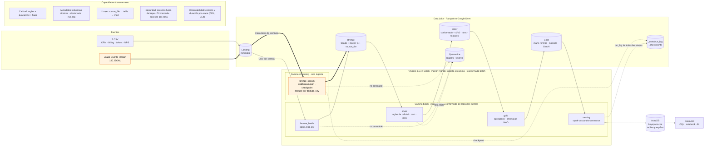
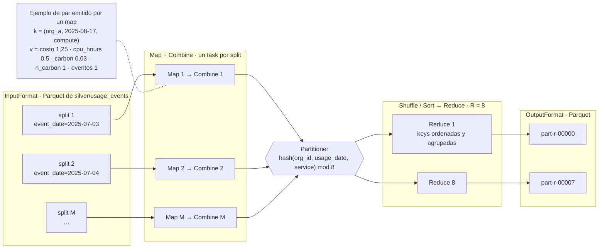

# Cloud Provider Analytics — Documento de diseño v1

| | |
|---|---|
| **Materia** | Big Data · ITBA · 2.º cuatrimestre 2026 · Prof. (Ad.) Diego Mosquera |
| **Instancia** | Primera evaluación parcial: diseño y fundación de datos |
| **Entrega** | Lunes 05/10/2026 · 18:30 h |
| **Equipo** | Jerónimo Esquivel · Agustín Ronda · Pedro Salinas |
| **Versión** | v1.0 · 04/10/2026 |
| **Repositorio** | https://github.com/jeroesquivel/bigdata-20262C-g7 · tag `v1.0-entrega1` |

Este documento cubre los 12 puntos del alcance obligatorio (consigna §5.2). Su correspondencia con el checklist de entrega está en el [Anexo A](#anexo-a--trazabilidad-con-el-checklist-91). Las cifras de datos se obtuvieron ejecutando [`notebooks/00_exploracion.ipynb`](../notebooks/00_exploracion.ipynb) (PySpark 3.5.3): cada cifra se puede ver en las salidas del notebook, y las principales se guardan además en [`evidence/entrega1/perfil_landing.json`](../evidence/entrega1/perfil_landing.json). Las cifras marcadas con † salen de los chequeos de consistencia del notebook: §2.3 (maestros y facturación), §3.1 (eventos contra recursos, series para MAD y keys del mart) y §4 (fechas de modificación de los archivos).

---

## Resumen

- **Qué construimos:** un pipeline PySpark que ingesta en **streaming** los eventos de uso y en **batch** los maestros de CRM y la facturación. El pipeline los conforma en un Data Lake Parquet de cuatro zonas (Landing, Bronze, Silver y Gold) y publica marts de FinOps, Soporte y Producto en **Cassandra/AstraDB** para consultas de baja latencia.
- **Patrón:** **híbrido: ingesta streaming + conformado batch**, una variante de Lambda sin capa de velocidad. El streaming solo ingesta los eventos a Bronze; Silver y Gold se recalculan en batch con un único motor y una única implementación de cada transformación, y hay una sola capa de serving. La frescura objetivo es de 15 minutos como máximo (CE4).
- **Entorno:** Google Colab, Parquet en Google Drive y el free tier de AstraDB. No operamos ningún servicio propio y el costo es $0. Las piezas de Hadoop (HDFS, YARN, MapReduce) se mapean a este stack en §4.4, §6.8 y §8.
- **Hallazgo que condiciona el diseño:** **cada archivo de eventos abarca los 60 días del período**. Una deduplicación con watermark por *event-time* descartaría entre el **81 % y el 92 %** de los eventos con umbrales de 1 hora a 7 días (§7.1). Por eso el streaming deduplica con un watermark sobre la hora de ingesta, y los eventos tardíos se incorporan en el recálculo batch de Silver.

---

## 1. Problema, usuarios, preguntas y objetivos medibles

**Problema.** El área de datos de un proveedor de nube recibe telemetría de uso de forma continua, además de maestros de CRM y facturación con errores de calidad: nulos, tipos ambiguos, outliers y cambios de esquema. Necesita datos limpios, conformados y consultables por organización, servicio y fecha para tres áreas de negocio.

| Usuario | Preguntas principales |
|---|---|
| **FinOps** | P1. ¿Cuánto cuesta y consume cada organización por servicio y día en un rango de fechas? · P2. ¿Cuáles son los servicios con mayor costo acumulado de una organización en los últimos 14 días? · P4. ¿Cuál es el revenue mensual en USD con créditos e impuestos aplicados? · ¿Qué costos son anómalos? |
| **Soporte** | P3. ¿Cómo evolucionan por día los tickets críticos y la tasa de incumplimiento de SLA en los últimos 30 días? · ¿Cuál es el CSAT promedio? |
| **Producto / GenAI** | P5. ¿Cuántos tokens GenAI se consumen por día y a qué costo estimado? · ¿Cuánto carbono (`carbon_kg`) se emite? |

P1 a P5 son las cinco consultas obligatorias de la consigna (§7.4).

**Objetivos medibles (criterios de éxito).** Se verifican con evidencia en la entrega 2 y en la final.

| ID | Criterio | Cómo se mide |
|---|---|---|
| CE1 | Conservación: ningún registro se pierde sin dejar rastro | Por fuente: `filas Landing = filas válidas + filas en quarantine + duplicados descartados` |
| CE2 | Unicidad | 0 `event_id` repetidos en Silver |
| CE3 | Idempotencia | Conteos idénticos en Silver, Gold y AstraDB tras re-ejecutar el pipeline completo; en Bronze, ninguna partición `ingest_date` con filas duplicadas |
| CE4 | Frescura (SLA) | **≤ 15 min** desde que un archivo llega a Landing hasta que sus métricas están en Gold y AstraDB. Supuesto de producción: el pipeline corre cada 5 min y una corrida incremental tarda ≤ 10 min. En el MVP, que se lanza a demanda, se registra en `run_log` la duración end-to-end de cada corrida y se verifica que un archivo nuevo aparece en Gold y AstraDB en la corrida siguiente |
| CE5 | Consultas | P1–P5 responden desde AstraDB leyendo una sola partición por consulta |
| CE6 | Reproducibilidad | El pipeline completo corre en un Colab limpio siguiendo el Quickstart |

**Fecha de referencia.** Los datos son de 2025. Las ventanas "últimos 14 días" y "últimos 30 días" se calculan contra `as_of_date`, un parámetro de configuración cuyo valor por defecto es la última fecha con eventos (2025-08-31), y no contra la fecha actual. `as_of_date` solo define esas ventanas: ninguna regla de calidad depende de ella (R3 compara contra `ingest_ts`).

---

## 2. Justificación de Big Data (5V)

La muestra provista pesa **12,6 MB**: por sí sola **no** es Big Data, y con ese volumen alcanzaría una base analítica convencional. Lo que justifica la arquitectura es el sistema que la muestra representa. A continuación se distingue lo que se observa en la muestra de lo que se proyecta.

| V | Observado en la muestra | Proyección del caso real (supuesto) | Implicancia en la arquitectura |
|---|---|---|---|
| **Volumen** | 43.200 eventos en 60 días (720/día), ≈ 300 B por evento | Un proveedor real emite métricas por recurso y por minuto. Solo los 400 recursos de la muestra generarían 576.000 eventos/día (≈ 165 MB/día); con 10.000 organizaciones (×125) serían ≈ 72 M eventos/día (≈ 20 GB/día) | Spark (procesamiento distribuido y escalable horizontalmente), Parquet columnar comprimido, particionado por fecha |
| **Velocidad** | Los eventos llegan fragmentados en 120 archivos de 360 eventos | Flujo continuo; FinOps necesita ver el costo incremental en minutos, no al cierre del mes | Structured Streaming con checkpoint para la ingesta. Un SLA de minutos (CE4) no exige capa de velocidad: alcanza con recálculo batch incremental frecuente (§5) |
| **Variedad** | 7 CSV, eventos JSONL, JSON embebido (`tags_json`), dos versiones de esquema | Aparecen servicios y métricas nuevos | Esquema explícito superset y zona Silver de conformado |
| **Veracidad** | `value` llega como texto en 1.309 eventos, `unit` es nulo en 2.075, hay 216 costos negativos, spikes de hasta 317 USD (p50 = 1,00), tasas de cambio inconsistentes, CSAT fuera de rango, fechas incoherentes entre fuentes† | Igual o peor a escala | Reglas de calidad, quarantine, flags y detección de anomalías robusta (MAD) |
| **Variabilidad** | El esquema cambia a mitad del período (v1 → v2 el 2025-07-18, con `carbon_kg` y `genai_tokens`); `carbon_kg` llega como entero o decimal | Servicios, métricas y distribuciones de costo nuevas (precios, estacionalidad) | Esquema superset con `schema_version`, null ≠ 0, reglas parametrizadas y umbral MAD configurable |
| **Valor** | Costos, revenue, SLA y adopción de GenAI por organización | Decisiones de pricing, prevención de churn y planificación de capacidad | Marts Gold y serving query-first en Cassandra para dashboards |

---

## 3. Inventario y perfil inicial de las fuentes

### 3.1 Inventario

| Fuente | Filas | Tamaño | Grano (clave natural) | Frecuencia | Rango temporal |
|---|---:|---:|---|---|---|
| `customers_orgs.csv` | 80 | 7,6 KB | organización (`org_id`) | Snapshot | alta: 2025-05-04 → 2025-07-02 |
| `users.csv` | 800 | 69,0 KB | usuario (`user_id`) | Snapshot | — |
| `resources.csv` | 400 | 35,8 KB | recurso (`resource_id`) | Snapshot | — |
| `support_tickets.csv` | 1.000 | 69,3 KB | ticket (`ticket_id`) | Diaria | 2025-05-09 → 2025-08-31 |
| `marketing_touches.csv` | 1.500 | 99,6 KB | interacción (`touch_id`) | Diaria | 2025-05-04 → 2025-08-31 |
| `nps_surveys.csv` | 92 | 3,9 KB | encuesta (`org_id`, `survey_date`) | Eventual | 2025-05-24 → 2025-08-31 |
| `billing_monthly.csv` | 240 | 15,5 KB | factura (`invoice_id`) = org × mes | Mensual | 2025-06 → 2025-08 |
| `usage_events_stream/*.jsonl` | 43.200 | 12,3 MB en 120 archivos | evento (`event_id`) | Archivos de 360 eventos (simulan micro-lotes) | 2025-07-03 → 2025-08-31 (UTC) |

**Trazabilidad:** todas las claves naturales son únicas y no hay `org_id` ni `resource_id` huérfanos en ninguna fuente. En los eventos, `service`, `org_id` y `region` coinciden siempre con los del recurso (0 inconsistencias en 43.200 eventos†). En Bronze, cada fila conserva `source_file` e `ingest_ts`.

### 3.2 Perfil de calidad

| Fuente | Hallazgo | Tratamiento propuesto (§6.5) |
|---|---|---|
| Eventos | **Evolución de esquema:** v1 tiene 10.800 eventos (hasta 2025-07-17); v2 tiene 32.400 (desde 2025-07-18). `carbon_kg` está en todos los v2 (2.638 llegan como entero y 29.762 como decimal). `genai_tokens` está solo en 3.132 eventos, todos del servicio `genai` | Esquema superset; en v1 esos campos quedan en `null`, no en 0 |
| Eventos | **`value` con tipos mezclados:** 41.014 numéricos, 1.309 como texto (p. ej. `"95.0"`) y 877 nulos. Todos los textos son casteables a double | Se lee como string y se castea con fallback |
| Eventos | **`unit` nulo en 2.075 eventos** (2.038 de ellos con `value` presente). Cada `metric` tiene una única unidad: `requests → count`, `cpu_hours → hours`, `storage_gb_hours → gb_hours` | Se imputa desde `metric` y se marca con flag |
| Eventos | **Costos:** 216 negativos (211 menores a −0,01; mínimo −154,46); p50 = 1,00, p99 = 16,72, p99,9 = 133,14, máximo 317,43 | Flag `is_negative_cost` (R5); anomalías con MAD (§7.3) |
| Eventos | **Orden temporal:** cada uno de los 120 archivos abarca los 60 días (07-03 → 08-31), y los 120 tienen la misma fecha de modificación† | Determina la estrategia de watermark (§7.1). El orden de lectura entre archivos no está garantizado y el diseño no depende de él |
| Eventos | **Consistencia temporal†:** 7.371 eventos (17 %) tienen `timestamp` anterior al `created_at` del recurso. 4.167 eventos son de recursos hoy `terminated` (válido: el estado es actual y el evento, histórico) | Flag `is_before_resource_created` (R13); no se descartan |
| `billing_monthly` | `credits` nulo en 137 facturas (nunca negativo). Monedas: USD 160, ARS 51, EUR 29. **Las 160 facturas en USD tienen `exchange_rate_to_usd` distinto de 1** (de 0,855 a 1,118) | `credits` nulo → 0; flag `fx_suspect` (decisión abierta A3) |
| `billing_monthly` | **Signos†:** 13 facturas con `subtotal` negativo (mínimo −1.671,83; 10 USD, 2 ARS y 1 EUR; 8 de 2025-08, 4 de 2025-06 y 1 de 2025-07). En las 240 facturas `taxes` = 21 % del valor absoluto del subtotal, así que en esas 13 el impuesto queda positivo (signo inconsistente). 9 facturas tienen `credits > subtotal`: las 9 son de subtotal negativo | Nota de crédito: flag `is_credit_note` y `taxes` con el signo del subtotal (R11, A6). Flag `credits_exceed_subtotal` (R12) |
| `support_tickets` | 240 tickets sin `resolved_at` (abiertos; no es un error). `csat` nulo en 254 y fuera del rango 1–5 en 40 (valores 0, 6 y 7) | Abiertos: estado válido. CSAT fuera de rango → `null` + flag |
| `support_tickets` | **Consistencia†:** 209 tickets con `created_at` anterior al `signup_date` de su organización. 172 de los 240 tickets abiertos tienen CSAT, que se mide al cerrar. 25 abiertos tienen `sla_breached = True` (válido: el SLA ya venció) | Flag `is_before_org_signup` (R13). El CSAT de tickets abiertos se excluye del promedio (R14) |
| `customers_orgs` / `nps_surveys` | `nps_score` es un NPS en escala −100..100: nulo en 11 y 19 filas respectivamente; 1 valor fuera de rango (101) | Fuera de rango → `null` + flag |
| `customers_orgs` | **`is_enterprise` contradice `plan_tier`†** en 25 organizaciones: 9 con `plan_tier = enterprise` e `is_enterprise = False`, y 16 con `is_enterprise = True` y plan no enterprise (8 standard, 6 pro, 2 free) | `plan_tier` es la fuente de verdad; `is_enterprise` se deriva y se marca la discrepancia (R15, A7) |
| `users` | **Consistencia†:** 232 usuarios con `last_login` anterior a `created_at` | Flag `is_login_before_created` (R13) |
| `users` / `resources` | **Datos sensibles:** `users.email` es PII; `resources.tags_json` incluye la etiqueta `pii:true` | No se publican en Gold ni en serving |

† `notebooks/00_exploracion.ipynb`: §2.3 para `billing_monthly`, `support_tickets`, `users` y `customers_orgs`; §3.1 para eventos contra recursos; §4 para las fechas de modificación.

### 3.3 Riesgos de datos

- La facturación incluye junio, pero los eventos empiezan el 03/07. No se concilia facturación contra uso (queda fuera de alcance).
- La escala de CSAT se asume 1–5; el diccionario de la fuente no la documenta.
- La muestra tiene 0 duplicados de `event_id`. Aun así, la deduplicación es necesaria, porque protege ante reenvíos y reprocesos.
- Los maestros son snapshots sin historia: un `created_at` o `signup_date` posterior a la actividad puede ser un error o una re-creación o migración, y no hay forma de distinguirlo. Por eso las inconsistencias temporales se marcan con flags y no se descartan (R13).
- El significado de un `subtotal` negativo y la definición de cliente enterprise no están documentados. Proponemos una interpretación (A6, A7) y dejamos flags para poder cambiarla recalculando solo Silver y Gold.

---

## 4. Arquitectura v1

### 4.1 Diagrama · v1.0 · 04/10/2026



Las flechas gruesas y los nodos naranjas marcan el camino streaming; todo lo demás es batch.

### 4.2 Componentes y herramientas

| Capa | Componente | Herramienta | Responsabilidad |
|---|---|---|---|
| Ingesta batch | `bronze_batch` | `spark.read.csv` con `StructType` explícito | Landing → Bronze; agrega `ingest_ts`, `source_file` e `ingest_date` |
| Ingesta streaming | `bronze_stream` | `spark.readStream.json`, `maxFilesPerTrigger=10`, `trigger(availableNow=True)` | Landing → Bronze en 12 micro-lotes; checkpoint; dedupe por `dedupe_key`; escritura idempotente por `batch_id` (§7.1) |
| Almacenamiento | Data Lake | Parquet (snappy) en Google Drive | Zonas Landing, Bronze, Silver, Gold y Quarantine (§6) |
| Procesamiento | `silver`, `gold` | PySpark DataFrames (batch) | Limpieza, conformado, joins con dimensiones, features, marts y anomalías |
| Serving | `serving` | AstraDB + spark-cassandra-connector 3.5 | Una tabla por patrón de consulta; upsert por clave primaria |
| Orquestación | `run_pipeline` | Notebook o script que corre las etapas en orden | Bronze → Silver → Gold → Serving, registrando conteos y duración |
| Consumo | — | CQL (consola de AstraDB / cqlsh) y notebook | Las consultas P1–P5 |

### 4.3 Serving preliminar (se implementa en la entrega 2 y en la final)

| Consulta | Tabla | Clave primaria | Justificación |
|---|---|---|---|
| P1 costos y requests por org × servicio en un rango | `org_daily_usage_by_service` | `((org_id), usage_date, service)`, `usage_date DESC` | El rango de fechas se resuelve sobre la clustering key dentro de una sola partición. Devuelve todos los servicios de la org; filtrar uno se hace en el cliente (sin `ALLOW FILTERING`) |
| P2 top-N servicios en 14 días | la misma tabla | — | Se leen ≤ 84 filas (14 días × 6 servicios) y se ordenan en el cliente (A4) |
| P3 tickets críticos y SLA breach por día | `tickets_by_severity_date` | `((severity), ticket_date)` | Una partición por severidad; rango de 30 días sobre la clustering key (A5) |
| P4 revenue mensual en USD | `revenue_by_org_month` | `((org_id), month)` | Por organización, como el grano del mart de referencia (A5) |
| P5 tokens GenAI y costo por día | `genai_tokens_by_org_date` | `((org_id), usage_date)` | Por organización, como el grano del mart de referencia (A5) |

Cada partición por `org_id` tiene como máximo 360 filas (60 días × 6 servicios). A escala real se agregaría un bucket mensual a la clave de partición; queda documentado y no se implementa.

### 4.4 Mapa de componentes: ecosistema Hadoop → nuestro stack

Hadoop es modular. Conservamos su modelo, que separa almacenamiento distribuido, gestión de recursos y motor de procesamiento, y reemplazamos cada pieza por un equivalente gestionado acorde al volumen.

| Pieza Hadoop | Qué problema resuelve | Equivalente en el proyecto | Observación |
|---|---|---|---|
| HDFS (DataNodes) | Guardar archivos más grandes que un disco, repartidos en bloques de 128 MB, con replicación ×3 y localidad de datos | Parquet en Google Drive (almacenamiento gestionado) | Sin localidad de datos ni rack awareness: Spark lee por red. Los principios de bloques, archivos pequeños y write-once valen igual (§6.8) |
| NameNode | Namespace (árbol de directorios, permisos) y ubicación de los bloques de cada archivo | Convención de rutas + `_meta/run_log` + diccionario | No hay catálogo; el equivalente sería Hive Metastore, Glue o Unity Catalog (fuera de alcance, §6.7) |
| YARN (ResourceManager, NodeManager, ApplicationMaster) | Asignar CPU y memoria del clúster en contenedores y coordinar las tareas de cada aplicación | Spark `local[*]` en Colab: driver y executors en un solo nodo | En un clúster, Spark sobre YARN (en modo cluster el driver corre en el ApplicationMaster y los executors en contenedores de los NodeManagers) o sobre Kubernetes |
| MapReduce | Procesamiento batch distribuido map → shuffle → reduce, con escritura a disco entre jobs | Spark DataFrames (DAG optimizado por Catalyst, en memoria) | Mismo modelo de claves, particiones y shuffle (§8) |
| Hadoop Common | Librerías y la API `FileSystem` que comparten todos los componentes | Spark lee y escribe con esa misma API (`file://`, `gs://`, `s3a://`) y con el commit protocol de Hadoop | Por eso el *rename* sigue importando fuera de HDFS (§6.8) |
| Hive | SQL sobre archivos, con metastore | Spark SQL | Sin metastore persistente |
| Flume · Sqoop · Kafka | Ingesta de logs, de bases relacionales y mensajería | File source de Structured Streaming (D4) · `spark.read.csv` | Kafka sería la evolución con productores reales |
| Oozie | Orquestación de workflows | `run_pipeline` (D10) | Airflow como evolución |
| HBase | Lectura y escritura por clave con baja latencia | Cassandra/AstraDB | Modelado query-first (§4.3) |
| ZooKeeper | Coordinación y alta disponibilidad (p. ej. failover del NameNode) | No aplica | Drive y AstraDB resuelven la disponibilidad como servicios gestionados |

### 4.5 Vistas lógica, física y de despliegue

| Vista | MVP (entregas 2 y final) | Producción a escala (proyección) |
|---|---|---|
| Lógica | Fuentes → ingesta streaming y batch → Landing/Bronze/Silver/Gold → serving → consumo (§4.1) | La misma |
| Física | Parquet snappy en Drive; Spark 3.5 en modo local; AstraDB | Parquet en un bucket (GCS/S3) o en HDFS; Spark en clúster |
| Despliegue | Notebook de Colab con Drive montado; corrida a demanda; secretos en Colab Secrets | Spark sobre YARN o Kubernetes; `run_pipeline` cada 5 min (CE4); secretos en un gestor de secretos |

---

## 5. Patrón arquitectónico: híbrido (ingesta streaming + conformado batch)

**Definición.** Hay un camino de streaming (solo para `usage_events_stream`) y un camino batch (maestros, facturación, tickets y encuestas). Ambos escriben en el mismo Bronze. Silver y Gold se calculan en batch sobre Bronze, y hay una única capa de serving. Es una variante de Lambda **sin capa de velocidad**: el streaming solo ingesta.

**Por qué no es Lambda clásica.** En Lambda, una capa de velocidad calcula vistas en tiempo real que el serving combina con las vistas batch. Acá no hay vistas de velocidad ni merge en el serving: Gold tiene una sola versión, que el batch recalcula. La frescura se obtiene con corridas batch incrementales frecuentes (SLA ≤ 15 min, CE4) y no con una segunda implementación.

**Por qué elegimos esta solución:**
1. **Coincide con la naturaleza de las fuentes.** La facturación es mensual y los maestros son snapshots: no son streams. Los eventos sí llegan de forma continua.
2. **Cumple el requisito invariable** de la consigna (§4.3): streaming de eventos y batch de maestros y facturación. La consigna admite "Híbrido" como combinación justificada, y elegimos por las necesidades de datos y de operación, no por el nombre del patrón.
3. **Evita el principal problema de Lambda,** que es duplicar la lógica entre la capa de velocidad y la batch. Hay un solo motor (Spark) y una sola implementación de cada transformación: el streaming solo se encarga de ingerir de forma incremental y exactly-once.
4. **Es robusta frente al desorden temporal observado** (§3.2): los eventos tardíos se incorporan al recalcular Silver.
5. **La latencia que pide el negocio no justifica más.** FinOps necesita el costo en minutos, no en segundos: el SLA de CE4 se cumple con batch incremental.

**Alternativas descartadas:**

| Alternativa | Motivo |
|---|---|
| Kappa | Obliga a tratar como streams fuentes que son batch por naturaleza (3 meses de facturación, snapshots de CRM). Agrega re-stream y backfill sin beneficio |
| Lambda clásica (vistas de velocidad y batch separadas, combinadas en el serving) | Duplica la lógica y exige combinar vistas en el serving. El SLA de minutos no la necesita |
| Batch puro | No cumple el requisito de streaming |
| Streaming de punta a punta hasta Gold | Con eventos desordenados de 60 días, una agregación con estado exige un estado enorme o descarta datos. Queda como mejora deseable para la entrega final si no compromete el MVP (A1) |

---

## 6. Diseño del Data Lake

### 6.1 Zonas, formato y particiones

La raíz del Data Lake es configurable (`lake.root` en [`config/config.example.yaml`](../config/config.example.yaml)). En Colab, el pipeline trabaja sobre el disco local (`/content`) y el lago se copia a Google Drive al final de cada corrida (D22, a validar en el spike de la entrega 2). Las rutas siguen el patrón `<zona>/<entidad>/<columna_particion>=<valor>/`, todo en `snake_case`.

| Zona | Ruta | Formato | Partición | Contenido |
|---|---|---|---|---|
| Landing | `landing/` | CSV / JSONL originales | — | Solo lectura. El pipeline nunca escribe acá |
| Bronze | `bronze/<fuente>/`, p. ej. `bronze/usage_events/` | Parquet snappy | `ingest_date` (eventos: `ingest_date/batch_id`, §7.1) | Mismo grano que la fuente; tipos explícitos (`value` como string); `ingest_ts`, `source_file` |
| Silver | `silver/usage_events/`, `silver/dim_org/`, `silver/dim_resource/`, `silver/billing/`, `silver/tickets/` | Parquet snappy | Eventos: `event_date`. Resto: sin partición | Datos tipados, normalizados, deduplicados, v1/v2 unificados, enriquecidos y con flags de calidad |
| Gold | `gold/org_daily_usage_by_service/`, `gold/revenue_by_org_month/`, `gold/cost_anomaly_mart/`, `gold/tickets_by_org_date/`, `gold/tickets_by_severity_date/` (para P3), `gold/genai_tokens_by_org_date/` | Parquet snappy | Sin partición, salvo que una tabla supere ~1 M de filas | Marts con el grano de la consigna (§7.3) |
| Quarantine | `quarantine/<fuente>/` | Parquet | `ingest_date` | Registro original + `dq_errors` (lista de reglas incumplidas) + `ingest_ts` |
| Metadatos | `_meta/run_log/`, `_checkpoints/<stream>/` | Parquet / checkpoint de Spark | — | Una fila por ejecución de cada job (inicio, fin, filas de entrada, salida y quarantine); estado del stream |

**Quién escribe, quién lee y qué controles se aplican.** Las condiciones para promover un dato de una zona a la siguiente están en §6.5.

| Zona | Escribe | Lee | Acceso y controles |
|---|---|---|---|
| Landing | Los sistemas fuente (fuera del pipeline) | `bronze_batch`, `bronze_stream`; el equipo de datos para auditar o reprocesar | Solo lectura para el pipeline; inmutable; es la fuente de verdad para reconstruir el lago |
| Bronze | `bronze_batch` (overwrite de su partición) y `bronze_stream` (un `batch_id` por micro-lote) | Job `silver` | Solo los jobs del pipeline escriben; esquema explícito al escribir; append-only; contiene PII, así que el acceso se restringe al equipo de datos |
| Silver | Job `silver` | Job `gold`; el equipo de datos para análisis ad hoc | Solo registros que pasaron las reglas bloqueantes; PII marcada en el diccionario |
| Gold | Job `gold` | Job `serving` (carga a AstraDB); analistas y BI | Sin PII; se publica completo por corrida |
| Quarantine | `bronze_*` (`parse_error`) y `silver` (`dq_errors`) | El equipo de datos, para diagnóstico | Nunca se promueve automáticamente: se corrige la regla o el origen y se reprocesa desde Landing |
| `_meta` · `_checkpoints` | Todos los jobs (`run_log`); `bronze_stream` (checkpoint) | `run_pipeline` y el equipo de datos (CE1, observabilidad); Spark al reiniciar el stream | El checkpoint no se edita a mano; solo se borra con un reset explícito |

En el MVP el control efectivo es la carpeta de Drive, compartida solo con el equipo. En un clúster se aplicaría con permisos por directorio de HDFS (`hdfs dfs -chown` / `-chmod`, con un usuario de servicio por job) o con IAM por prefijo en un bucket.

**Justificación del particionado:**
- **Bronze por `ingest_date`.** Bronze es append-only y refleja la llegada de los datos. Si se particionara por fecha de evento, cada micro-lote, que abarca los 60 días, escribiría en 60 particiones (miles de archivos diminutos en total). Por fecha de ingesta, cada carga escribe en una sola partición: en batch, reprocesarla equivale a sobreescribir esa partición.
- **Silver de eventos por `event_date`.** Es el filtro común de todas las consultas. Se aplica `repartition("event_date")` antes de escribir, para obtener un archivo por día.
- **Sin particionar por `service`, `org_id` ni hora.** Con 720 eventos por día, subdividir genera archivos diminutos; `org_id` tiene además alta cardinalidad.
- **Trade-off aceptado.** Con la muestra, cada partición diaria tiene unos 720 registros (archivos de pocos KB). A la escala proyectada (≥ 165 MB/día), la partición diaria produce archivos de tamaño adecuado (§6.8). No se optimiza para la muestra.

### 6.2 Naming

- Tablas y columnas en `snake_case`, en inglés, con el mismo nombre que las fuentes.
- Las columnas técnicas son `ingest_ts`, `source_file`, `ingest_date` y `dq_errors`.
- Los flags de calidad son booleanos con prefijo `is_` o sufijo de estado: `is_negative_cost` (R5), `is_credit_note` (R11), `unit_imputed`, `value_cast_failed`, `fx_suspect`. La anomalía de costo detectada con MAD se expone en Gold como `anomaly_score` (double) e `is_cost_anomaly` (§7.3), y no se confunde con el costo negativo.
- Las fechas de negocio se llaman `<concepto>_date` (`event_date`, `usage_date`, `ticket_date`) y los meses, `month` (primer día del mes).
- Los marts de Gold se nombran `<hecho>_by_<grano>`.

### 6.3 Retención

Las políticas están declaradas; el script de limpieza se implementa en la entrega final.

| Zona | Retención | Motivo |
|---|---|---|
| Landing | Indefinida | Es la fuente de verdad: todo el Data Lake se puede reconstruir desde Landing |
| Bronze | Eventos y facturación: 13 meses. Snapshots de maestros: 90 días | Silver y Gold se recalculan desde Bronze, así que Bronze debe retener al menos lo mismo que ellas. De los maestros alcanza con el último snapshot |
| Silver / Gold | 13 meses | Comparación interanual de FinOps |
| Quarantine | 30 días | Diagnóstico y corrección en origen |
| Checkpoints | Mientras exista el stream; se borran solo con un reset explícito | Reinicio controlado sin duplicar |

### 6.4 Metadatos y linaje

- **Técnicos (por fila):** `ingest_ts`, `source_file` (de `_metadata.file_path` o `input_file_name()`) e `ingest_date` en Bronze. `source_file` se conserva en `silver/usage_events` para el linaje fila → archivo.
- **Operativos (por ejecución):** `_meta/run_log`, con job, `run_ts`, duración, filas de entrada, filas de salida, filas en quarantine y la última partición de Bronze procesada. Es la base de los criterios CE1 y CE4, de la observabilidad y del recálculo incremental (§7.3).
- **De negocio:** [`docs/diccionario_datos.md`](diccionario_datos.md), con tipo, descripción, origen, regla aplicada y marca de PII por columna.
- **Linaje de tablas:** fuente → Bronze → Silver → mart. Se documenta en el diccionario.

### 6.5 Reglas de promoción y calidad

| Promoción | Condición | Si no se cumple |
|---|---|---|
| Landing → Bronze | El registro se parsea con el esquema explícito (modo `PERMISSIVE` con `_corrupt_record`) | Quarantine con `parse_error` |
| Bronze → Silver | Pasa las reglas bloqueantes; deduplicación por clave natural | Quarantine con `dq_errors` |
| Silver → Gold | Solo registros válidos; los registros con flags entran marcados | — |
| Gold → AstraDB | El mart completo de la corrida | Upsert por clave primaria (idempotente) |

| # | Regla | Tipo | Acción | Afectados en la muestra |
|---|---|---|---|---|
| R1 | `event_id` no nulo | Bloqueante | Quarantine | 0 |
| R2 | `event_id` único | Deduplicación | Se conserva una ocurrencia | 0 duplicados |
| R3 | `timestamp` parseable y no futuro: `timestamp ≤ ingest_ts + tolerancia` (5 min, configurable) | Bloqueante | Quarantine | 0 |
| R4 | `org_id` y `resource_id` existen en las dimensiones | Bloqueante | Quarantine | 0 |
| R5 | `cost_usd_increment >= -0.01` | Flag (exigida por la consigna) | `is_negative_cost = true`; el registro se conserva | 211 |
| R6 | `unit` no nulo cuando existe `value` | Corrección | Se imputa desde `metric` + `unit_imputed = true`. Si la métrica es desconocida → quarantine | 2.038 |
| R7 | `value` casteable a double | Corrección | Cast; si falla → `null` + `value_cast_failed` | 0 fallas (1.309 textos casteables) |
| R8 | Billing: `currency ∈ {USD, EUR, ARS}` | Bloqueante | Quarantine | 0 |
| R9 | Billing USD con `exchange_rate_to_usd = 1` | Flag | `fx_suspect = true` (A3) | 160 |
| R10 | `csat ∈ [1, 5]`; `nps_score ∈ [-100, 100]` | Corrección | `null` + flag; el registro se conserva | 40 / 1 |
| R11 | Billing: `subtotal ≥ 0` | Flag + corrección | Se conserva como nota de crédito: `is_credit_note = true` y `taxes` toma el signo del subtotal (A6) | 13 |
| R12 | Billing: `credits ≤ subtotal` | Flag | `credits_exceed_subtotal = true`; se conserva | 9 (las 9 son notas de crédito) |
| R13 | Consistencia temporal entre fuentes: evento posterior al `created_at` del recurso; ticket posterior al `signup_date` de la org; `last_login ≥ created_at` | Flag | `is_before_resource_created` · `is_before_org_signup` · `is_login_before_created`; se conserva | 7.371 / 209 / 232 |
| R14 | CSAT solo en tickets cerrados | Flag | `csat_on_open_ticket = true`; el valor se conserva en Silver y se excluye del CSAT promedio en Gold | 172 |
| R15 | `is_enterprise` coherente con `plan_tier` | Corrección + flag | `plan_tier` es la fuente de verdad: `is_enterprise = (plan_tier = 'enterprise')` y `enterprise_flag_mismatch = true`; el valor original queda en Bronze (A7) | 25 |

**Criterio flag vs. quarantine.** A quarantine va solo lo que no se puede interpretar o vincular: registros no parseables, sin clave, con una FK huérfana o con moneda desconocida. Lo plausible pero sospechoso se conserva con un flag: Gold decide si lo filtra y el conteo de conservación (CE1) no se distorsiona. Las inconsistencias temporales (R13) entran en este grupo. Los maestros son snapshots, y `created_at` o `signup_date` pueden reflejar una re-creación o una migración. Además, descartar esos registros perdería el 17 % de los eventos, que tienen costo real.

### 6.6 Evolución de esquema y SCD

- **Esquema de eventos.** Se lee con un esquema explícito superset (v2). En los registros v1, `carbon_kg` y `genai_tokens` quedan en `null`, para distinguir "no medido" de "cero". `schema_version` se conserva como columna.
- **SCD.** `dim_org` y `dim_resource` son SCD Tipo 1, porque hay un único snapshot sin cambios que historizar. Los snapshots de Bronze particionados por `ingest_date` conservan la historia, por si más adelante se necesita un SCD Tipo 2.

### 6.7 Formatos, compresión, esquema y catálogo

| Formato | Orientación | Uso en el lago | Motivo |
|---|---|---|---|
| CSV · JSONL | Filas, texto | Landing, tal como llegan | Sin tipos ni compresión; se conservan inmutables para poder reconstruir el lago |
| **Parquet** | Columnar | Bronze → Gold y quarantine | Lee solo las columnas usadas, aplica *predicate pushdown* con estadísticas por row group y comprime por columna. Es el formato nativo de Spark y el que exige la consigna |
| ORC | Columnar | — | Prestaciones similares a Parquet, pero su ecosistema está centrado en Hive |
| Avro | Filas, con esquema embebido | — | Conviene para ingesta y mensajería con evolución de esquema (p. ej. Kafka). Se descarta porque la fuente ya es JSONL y el consumo es analítico, por columnas |

- **Compresión snappy**, el default de Spark para Parquet: comprime y descomprime rápido con un ratio moderado. gzip comprime más a costa de mucha más CPU; zstd es la alternativa a evaluar a escala. Como Parquet comprime por página dentro de cada row group, el archivo sigue siendo divisible en splits (§8), a diferencia de un CSV comprimido con gzip.
- **Schema-on-read vs. schema-on-write.** Landing es schema-on-read: los archivos quedan como llegaron y el esquema se aplica al leerlos. Desde Bronze es schema-on-write: se lee con `StructType` explícito (nunca con `inferSchema`) y el esquema queda guardado en cada archivo Parquet. Silver agrega las reglas de negocio (§6.5).
- **Catálogo.** No hay metastore: los datasets se descubren por la convención de rutas (§6.1), el [diccionario de datos](diccionario_datos.md) y `_meta/run_log`. Hive Metastore, Glue o Unity Catalog serían la evolución (fuera de alcance). Lo que evita que el lago se convierta en un *data swamp* es la combinación de convenciones, diccionario, `run_log`, quarantine y retención (§6.3).

### 6.8 Plan de almacenamiento distribuido (mirada HDFS)

No usamos HDFS, pero sus restricciones explican decisiones que valen igual en object storage. La proyección de §2 (≈ 20 GB/día de eventos) equivale a ≈ 160 bloques de 128 MB por día en Landing; en Parquet ocupa bastante menos (la relación JSONL/Parquet se mide en la entrega 2).

| Dataset | Escritura | Archivo objetivo | Partición | Replicación conceptual | Riesgo y mitigación |
|---|---|---|---|---|---|
| Landing eventos | La fuente escribe cada archivo una vez (120 JSONL de ≈ 105 KB) | Lo define la fuente | — | ×3: es la fuente de verdad y no se puede regenerar | Muchos archivos chicos; no se tocan porque son inmutables |
| Bronze `usage_events` | Un `batch_id` por micro-lote (12 por corrida) | 128 MB – 1 GB | `ingest_date` / `batch_id` | ×3: Silver y Gold se recalculan desde acá | Al menos un archivo por micro-lote → compactación diaria de la partición cerrada |
| Bronze maestros y billing | Una vez por corrida (overwrite de partición) | Un archivo por partición (`coalesce(1)`) | `ingest_date` | ×3 | Volumen de KB: un archivo es lo correcto |
| Silver `usage_events` | Recálculo de las particiones afectadas (§7.3) | 128 MB – 1 GB (`repartition` por `event_date`) | `event_date` | ×2: se deriva de Bronze | Particiones de pocos KB con la muestra (aceptado, §6.1) |
| Gold | Recálculo por corrida | Un archivo por mart con la muestra; 128 MB – 1 GB a escala | Ninguna (`usage_date` si supera ~1 M de filas) | ×2 | La cantidad de archivos la fija la cantidad de reducers (§8) |
| Quarantine · `_meta` · `_checkpoints` | Por corrida o por micro-lote | `coalesce(1)`; en el checkpoint los archivos chicos son inevitables | `ingest_date` (quarantine) | ×2; checkpoint ×3 | El checkpoint depende del *rename* atómico (ver abajo) |

- **Archivos pequeños.** El NameNode guarda en memoria ≈ 150 B por archivo y por bloque: diez millones de archivos de un bloque ocupan ≈ 3 GB de heap, y cada archivo implica además al menos una tarea de lectura. Los archivos de pocos KB de la muestra serían un anti-patrón en HDFS. Por eso aplicamos `coalesce`/`repartition` antes de escribir, particiones gruesas (§6.1) y compactación periódica de Bronze. En object storage, el costo equivalente está en los listados y las requests por archivo.
- **Write-once / read-many.** Un archivo de HDFS no se modifica después de cerrarse. Lo respetamos: Landing es inmutable, Bronze es append-only, y Silver y Gold reemplazan particiones completas (overwrite) en lugar de actualizar filas.
- **Replicación.** HDFS replica cada bloque en 3 DataNodes con escritura en pipeline (el primer DataNode reenvía al segundo y este al tercero) y permite fijar el factor por archivo (`hdfs dfs -setrep`): ×3 donde el dato no se puede regenerar y ×2 donde es derivable. En Drive, la durabilidad la gestiona el proveedor y no se configura.
- **Bloques y splits.** El tamaño de row group de Parquet (128 MB por defecto) coincide con el bloque de HDFS: con un row group por bloque, cada tarea lee un split local (§8).
- **Rename atómico.** Spark confirma la escritura de un job con el commit protocol de Hadoop (escribe en `_temporary` y renombra), y el checkpoint de Structured Streaming también escribe y renombra sus archivos de offsets y commits. En HDFS, el rename es una operación de metadatos del NameNode, atómica e instantánea. El montaje FUSE de Google Drive en Colab no garantiza atomicidad y su rename es lento: una corrida interrumpida podría dejar un checkpoint o una partición a medio escribir. La mitigación es R-8 (§10.2).

---

## 7. Flujos de datos

### 7.1 Streaming: `usage_events_stream`

```text
landing/usage_events_stream/*.jsonl
  │ readStream.json(schema=EVENT_SCHEMA + _corrupt_record) · maxFilesPerTrigger=10 · trigger(availableNow=True)
  │ + ingest_ts = current_timestamp() · source_file · ingest_date
  │ + dedupe_key = coalesce(event_id,
  │       sha2(concat_ws('|', source_file, coalesce(_corrupt_record, to_json(struct(<campos del evento>)))), 256))
  │ withWatermark("ingest_ts", "1 hour") · dropDuplicatesWithinWatermark(["dedupe_key"])
  │ foreachBatch(df, batch_id): _corrupt_record nulo → Bronze · no nulo → quarantine
  │                             cada escritura reemplaza la salida previa de su batch_id
  ▼
bronze/usage_events/ingest_date=YYYY-MM-DD/batch_id=N/    (checkpoint: _checkpoints/bronze_usage_events/)
quarantine/usage_events/ingest_date=YYYY-MM-DD/batch_id=N/
```

- **Clave de deduplicación.** `dropDuplicates*` trata los nulos de la clave como iguales. Si se deduplicara por `event_id`, todas las líneas corruptas (todos sus campos son nulos salvo `_corrupt_record`) y todos los eventos sin `event_id` de la ventana colapsarían en una sola fila *antes* de que `foreachBatch` los separe. Se perderían registros sin pasar por quarantine (rompe CE1) y R1 nunca los vería. Con `dedupe_key`, un evento con id se deduplica por id, y uno corrupto o sin id solo colapsa con una copia idéntica del mismo archivo, que es un duplicado real y se cuenta como tal en CE1.
- **Escritura idempotente por `batch_id`.** `foreachBatch` es *at-least-once*: si un micro-lote se reintenta tras una falla, Spark lo vuelve a ejecutar con el mismo `batch_id` y los mismos archivos de entrada (según el log de offsets del checkpoint). Cada micro-lote escribe en su propia subpartición `batch_id=N` y reemplaza cualquier salida previa de ese `batch_id`, así que un reintento no duplica filas en Bronze (CE3). La unicidad global de Silver (R2) queda como segunda defensa.
- `availableNow` procesa todos los archivos pendientes en micro-lotes (12 con la muestra) y termina. La corrida es reproducible, y al re-ejecutarla no se reprocesa nada gracias al checkpoint.
- **Watermark y eventos tardíos.** La consigna exige watermark, dedupe por `event_id` y manejo de late data. Medimos el efecto de un watermark por *event-time* simulando la deduplicación con estado sobre los 12 micro-lotes:

  | Umbral del watermark (event-time) | Eventos descartados |
  |---|---:|
  | 1 hora | 39.566 (91,6 %) |
  | 1 día | 38.935 (90,1 %) |
  | 7 días | 34.983 (81,0 %) |
  | 30 días | 19.758 (45,7 %) |
  | 61 días | 0 (0,0 %) |

  Como cada archivo abarca los 60 días, el watermark llega al final del período en el primer micro-lote. **Decisión (D5):** el watermark de la deduplicación se define sobre `ingest_ts`. Esto acota el estado y protege ante reenvíos del mismo evento dentro de una ventana de 1 hora. Los eventos tardíos según *event-time* no se descartan: se incorporan en el recálculo batch de Silver (§7.3). La viabilidad técnica de usar un watermark sobre `ingest_ts` se valida al comienzo de la entrega 2. Si no resultara viable, la alternativa es deduplicar sin estado por `dedupe_key` dentro de cada micro-lote y garantizar la unicidad global en Silver (R2).

### 7.2 Batch: maestros, facturación, tickets y encuestas

```text
landing/*.csv
  │ read.csv(header, schema=explícito, mode=PERMISSIVE) + ingest_ts · source_file · ingest_date
  ▼
bronze/<fuente>/ingest_date=…/      (overwrite dinámico de partición → re-ejecutar no duplica)
  │ snapshots (customers_orgs, users, resources): Silver toma el último ingest_date
  │ incrementales (support_tickets, billing_monthly, nps_surveys, marketing_touches):
  │   unión de las particiones de Bronze + dedupe por clave natural, gana el ingest_ts más reciente
  │ normalización (trim/lower, fechas, booleanos, credits nulo→0) · reglas R8–R15 · quarantine
  ▼
silver/dim_org · dim_resource · billing · tickets      (users, nps y marketing siguen el mismo patrón)
```

Un snapshot reemplaza al anterior; una fuente incremental se acumula. Un ticket cambia de estado al resolverse: con unión y dedupe, Silver conserva su última versión, tanto si la fuente entrega extractos completos como si entrega deltas.

### 7.3 Silver y Gold de eventos (batch)

```text
bronze/usage_events
  │ cast value · imputación de unit · R1–R7 y R13 · dedupe global por event_id · event_date
  │ join dim_org (industry, plan_tier, hq_region) · join dim_resource      (broadcast: dimensiones chicas)
  │ features: cost_usd, requests, cpu_hours, storage_gb_hours, genai_tokens, carbon_kg
  ▼
silver/usage_events/event_date=…/
  │ groupBy(grano) + agregados (§8) · anomalías con MAD por (org_id, service)
  ▼
gold/<mart>/  ──►  AstraDB (upsert por clave primaria)
```

**Anomalías de costo (D11).** Se calculan en Gold sobre el **costo diario** de cada par `(org_id, service)`, sin los costos marcados por R5:
`anomaly_score = 0,6745 · (x − mediana) / MAD`, donde MAD es la mediana de las desviaciones absolutas respecto de la mediana de la serie del par, e `is_cost_anomaly = abs(anomaly_score) > 3,5` (umbral configurable). Es viable con la muestra†: hay 262 pares org × servicio, con entre 24 y 60 días con dato cada uno (mediana 39), y ningún par tiene MAD = 0. Si en el futuro un par tuviera MAD = 0 (serie casi constante), se usan la mediana y el MAD del servicio sobre todas las organizaciones; si también fueran 0, el día no se marca. A escala, la serie se toma sobre una ventana móvil (p. ej. 90 días).

**Idempotencia y recálculo.** Se apoyan en el checkpoint y la escritura por `batch_id` (Bronze streaming), el overwrite dinámico de partición (Bronze batch), la deduplicación por `event_id` y por clave natural (Silver) y el upsert por clave primaria (Cassandra). En el MVP, Silver y Gold se recalculan completos con overwrite: con la muestra cuesta segundos. A escala (≈ 20 GB/día), cada corrida reescribe con overwrite dinámico solo las particiones `event_date` que aparecen en el Bronze nuevo desde la última corrida (según `run_log`), y Gold recalcula los grupos de esas fechas. Así los eventos tardíos se incorporan sin reprocesar todo el histórico (S7).

---

## 8. Flujo batch de referencia en MapReduce: `org_daily_usage_by_service`

```text
INPUT     InputFormat  = Parquet sobre silver/usage_events/event_date=*/ (poda por rango de event_date)
          InputSplit   = un row group (a escala, ≈ un bloque de 128 MB). Con la muestra, 1 archivo por día
                         → 60 splits → 60 map tasks
          RecordReader = lee solo las columnas usadas y entrega un evento por registro

MAP       para cada evento de silver/usage_events (ya validado):
            key   = (org_id, usage_date, service)
            value = (cost_usd si no is_negative_cost     si no 0,
                     cost_usd si is_negative_cost        si no 0,
                     1        si is_negative_cost        si no 0,
                     value si metric = 'requests'         si no 0,
                     value si metric = 'cpu_hours'        si no 0,
                     value si metric = 'storage_gb_hours' si no 0,
                     coalesce(genai_tokens, 0),  n_genai  = 1 si genai_tokens no es null si no 0,
                     coalesce(carbon_kg, 0),     n_carbon = 1 si carbon_kg no es null    si no 0,
                     1)

COMBINE   suma por key dentro de cada map task (la misma función que REDUCE). Es válido porque la suma
          es asociativa y conmutativa: sumar parciales en cualquier orden da el mismo total. Los
          contadores n_genai y n_carbon viajan sumados para preservar "null si no hubo medición"

PARTITION reducer = hash(org_id, usage_date, service) mod R, con R = 8

SHUFFLE   cada reducer copia su partición de la salida de los M mappers y la ordena por key:
 / SORT   recibe (key, [v1, v2, …]) con las keys agrupadas

REDUCE    suma componente a componente y emite:
            (org_id, usage_date, service) → (daily_cost_usd, negative_cost_usd, negative_cost_events,
                                             requests, cpu_hours, storage_gb_hours,
                                             genai_tokens, carbon_kg, event_count)
            genai_tokens = null si n_genai = 0; carbon_kg = null si n_carbon = 0 (null ≠ 0: v1 no los mide)

OUTPUT    OutputFormat = Parquet en gold/org_daily_usage_by_service/: un archivo part-r-0000x por reducer
```



**Equivalente en Spark:** `groupBy("org_id", "usage_date", "service").agg(F.sum(...), …)`. En el plan físico (`.explain()`), el InputFormat y el RecordReader corresponden a `FileScan parquet` (con `PartitionFilters` sobre `event_date`), el COMBINE a `HashAggregate (partial)`, el Partitioner y el SHUFFLE a `Exchange hashpartitioning(org_id, usage_date, service, 8)` y el REDUCE a `HashAggregate (final)`. A diferencia de MapReduce, Spark encadena las etapas en memoria y solo materializa datos en el shuffle.

- **Por qué R = 8.** Es `spark.sql.shuffle.partitions` en la configuración: alcanza para los núcleos de Colab y reparte las 11.050 keys reales† (≈ 1.400 por reducer). A escala, R se elige para que cada reducer reciba entre 128 MB y 1 GB de shuffle; AQE puede además fusionar particiones chicas después del shuffle.
- **Skew.** Una organización con muchos más eventos que el resto concentra trabajo. La clave compuesta reparte sus eventos entre días y servicios, y el combiner deja como máximo un valor por key y por map task, así que el reducer más cargado recibe poco. Si una key igual dominara, se aplicaría *salting* (`key + rand mod k` y una segunda agregación).
- **Archivos de salida.** Cada reducer escribe un archivo: con la muestra son 8 archivos de pocos KB (archivos pequeños, §6.8). Para este mart se aplica `coalesce(1)` antes de escribir; a escala, R se dimensiona por el tamaño de la salida.
- **Joins con dimensiones.** `dim_org` (80 filas) y `dim_resource` (400) son chicas. En MapReduce se resolverían con un map-side join (cada mapper carga la dimensión desde la distributed cache); en Spark es un broadcast join (`BroadcastHashJoin` en el plan), sin shuffle.
- **Fallos.** Si un map task falla, se re-ejecuta sobre el mismo split, porque las tareas son independientes y deterministas. En Spark, el linaje del DAG recalcula solo la partición perdida.

**Mismo patrón para `revenue_by_org_month`:** key = `(org_id, month)` y value = `(subtotal − coalesce(credits, 0) + taxes) × fx_to_usd`, con `taxes` ya alineado al signo del subtotal (R11): las notas de crédito restan.

Volumen esperado del mart con la muestra: como máximo 28.800 filas (80 organizaciones × 60 días × 6 servicios); las combinaciones reales con dato son 11.050†.

---

## 9. Matriz requisito → componente

| Requisito / objetivo | Origen | V | Componente | CE | Evidencia y entrega |
|---|---|---|---|---|---|
| Métricas de uso y costo casi en tiempo real (SLA ≤ 15 min) | Consigna §2.1 | Velocidad | `bronze_stream` (Structured Streaming + checkpoint) + recálculo batch incremental (§5, §7.3) | CE4 | Log de micro-lotes y duración por corrida · E2 |
| Batch de maestros y facturación | §2.1, §4.3 | Variedad | `bronze_batch` (snapshots e incrementales, §7.2) | CE1 | Conteos por fuente · E2 |
| Esquema explícito, columnas técnicas | §4.4 | Variedad / Veracidad | `bronze_batch`, `bronze_stream` | CE1 | Esquemas en el código · E2 |
| Compatibilidad v1/v2 | §3.2 | Variedad / Variabilidad | Esquema superset + `silver` | CE1 | Conteos v1/v2 · E1 (perfil), E2 |
| Tipos ambiguos, nulos, outliers, inconsistencias entre fuentes | §3.2 | Veracidad | Reglas R1–R15 + quarantine + flags | CE1 | Muestras de quarantine y conteos por flag · E2 |
| Dedupe por `event_id`, watermark, late data | §4.4 | Veracidad / Velocidad | `bronze_stream` (D5, `dedupe_key`) + R2 en `silver` | CE1, CE2 | Simulación · E1; conteos · E2 |
| Anomalías de costo | §4.4 | Veracidad / Valor | `gold/cost_anomaly_mart` (MAD, §7.3) | — | Viabilidad · E1; umbral justificado · Final |
| Escalabilidad y control de archivos | §4.4 | Volumen | Spark + Parquet particionado por fecha + compactación (§6.8) | — | `.explain()`, tamaños y rutas · E2 |
| Idempotencia | §4.4 | Veracidad | Checkpoint + `batch_id` + overwrite dinámico + upsert por clave primaria | CE3 | Conteos antes/después · E2 |
| P1–P5 | §7.4 | Valor | Marts Gold + tablas AstraDB (§4.3) | CE5 | CQL + capturas · E2 (2), Final (5) |
| Metadatos y linaje | §4.4 | — | Columnas técnicas, `run_log`, diccionario | CE1 | Diccionario · E1 (borrador) |
| Seguridad | §7.6 | — | Secretos en variables de entorno / Colab Secrets; PII fuera de Gold; accesos por zona (§6.1) | — | Repositorio sin secretos · todas |
| Reproducibilidad | §8.2 | — | Configuración externa, `requirements.txt`, Quickstart | CE6 | README · todas |

---

## 10. Plan inicial

### 10.1 Supuestos

| # | Supuesto |
|---|---|
| S1 | El equipo es de 3 integrantes con dedicación similar |
| S2 | `as_of_date` = 2025-08-31, la última fecha con eventos; solo define las ventanas "últimos N días" |
| S3 | Revenue USD = `(subtotal − credits + taxes) × exchange_rate_to_usd`, con `credits` nulo = 0 y `taxes` con el signo del subtotal (R11) |
| S4 | El costo GenAI estimado es la suma de `cost_usd_increment` de los eventos con `service = genai` |
| S5 | La escala de CSAT es 1–5 y la de NPS, −100..100 |
| S6 | El free tier de Colab (Spark en modo local) alcanza para el volumen de la muestra |
| S7 | A escala, el atraso de los eventos es acotado (la mayoría llega el mismo día): el desorden de 60 días por archivo es propio de la simulación. Si no fuera así, cada corrida incremental reescribiría hasta 60 particiones de Silver (§7.3) |
| S8 | Un `subtotal` negativo es una nota de crédito y no un error (A6) |

### 10.2 Riesgos y mitigaciones

| # | Riesgo | Prob. | Impacto | Mitigación |
|---|---|---|---|---|
| R-1 | Incompatibilidad o falla de conexión entre Spark, el conector y AstraDB (versiones, *secure connect bundle*, token) | Media | Alto | Spike al comienzo de la entrega 2. Plan B: carga con el driver de Python `cassandra-driver` (los marts tienen < 30.000 filas). Capturas como evidencia de respaldo |
| R-2 | Pérdida de eventos por un watermark mal elegido o por una clave de dedupe con nulos | Alta (medido) | Alto | Decisión D5 (`dedupe_key`) y conteo de conservación (CE1) en cada corrida |
| R-3 | Sesiones de Colab efímeras: se pierden el disco local y los checkpoints | Alta | Medio | Al final de cada corrida, el lago y los checkpoints se copian a Drive y se restauran al iniciar (D22). Si la sesión cae a mitad de corrida, se re-ejecuta (idempotencia) o se regenera desde Landing en minutos |
| R-4 | Muchos archivos pequeños; Drive es lento con ellos | Media | Bajo | Particionado grueso (§6.1), `repartition`/`coalesce` antes de escribir y compactación de Bronze (§6.8) |
| R-5 | Filtración de credenciales en el repositorio | Media | Alto | Variables de entorno / Colab Secrets; `.gitignore` incluye `.env` y `secure-connect*.zip`; revisión antes de cada push |
| R-6 | La muestra no permite demostrar performance a escala | Cierta | Bajo | Se declara como limitación; se muestran el plan físico, las particiones y los tamaños |
| R-7 | Alcance creciente (over-engineering) | Media | Medio | Backlog con categorías obligatorio / deseable / fuera de alcance; nada aspiracional en el diagrama |
| R-8 | Checkpoints y escrituras Parquet sobre el montaje de Drive: el rename no es atómico y es lento (§6.8), y una corrida interrumpida puede dejar un checkpoint corrupto o particiones a medias | Media | Alto | Procesar sobre el disco local de Colab (`/content`) y copiar el lago a Drive al terminar cada corrida, o usar un bucket (D22). Se valida en el spike de la entrega 2 |

### 10.3 Decisiones abiertas (se cierran con el feedback)

| # | Pregunta | Propuesta |
|---|---|---|
| A1 | ¿Se acepta que Gold se actualice por corrida batch (SLA ≤ 15 min, CE4), o se espera streaming hasta Gold? | Gold por corrida batch incremental |
| A2 | ¿Los costos negativos (< −0,01) se suman en `daily_cost_usd`? | Se excluyen de la suma y se exponen en las columnas `negative_cost_usd` y `negative_cost_events` (flag `is_negative_cost`) |
| A3 | Las facturas en USD con tasa ≠ 1, ¿se fuerzan a 1,0 o se respeta la tasa? | Forzar 1,0 y marcar con `fx_suspect` |
| A4 | El top-N de P2, ¿se resuelve en el cliente o con una tabla precalculada? | En el cliente (≤ 84 filas) |
| A5 | La consigna no aclara si P3, P4 y P5 son globales o por organización | P3 global por día (`tickets_by_severity_date`); P4 y P5 por organización, como el grano de los marts de referencia (§7.3 de la consigna) |
| A6 | Las 13 facturas con `subtotal` negativo, ¿son notas de crédito? | Sí: se conservan con `is_credit_note`, `taxes` toma el signo del subtotal y restan en el revenue (S3). Los `credits` de 9 de ellas se restan igual, con el flag `credits_exceed_subtotal` |
| A7 | ¿Qué define a un cliente enterprise: `plan_tier` o `is_enterprise`? (se contradicen en 25 organizaciones) | `plan_tier`; `is_enterprise` se deriva y se marca la discrepancia (R15) |

### 10.4 Esfuerzo, roles y recursos

| Rol | Integrante | Responsabilidad |
|---|---|---|
| Ingesta | Agustín Ronda | Batch y streaming hasta Bronze, esquemas, checkpoints |
| Procesamiento y calidad | Pedro Salinas | Silver, Gold, reglas de calidad, anomalías |
| Serving, gobierno y documentación | Jerónimo Esquivel | AstraDB, diccionario, README, diagramas, evidencias |

| Instancia | Esfuerzo estimado (horas-persona) | Contenido principal |
|---|---:|---|
| Entrega 1 | ≈ 30 | Diseño, perfil de datos, repositorio inicial |
| Entrega 2 | ≈ 80–90 | Pipeline end-to-end mínimo, 3 reglas de calidad, `org_daily_usage_by_service`, 2 consultas en AstraDB |
| Final | ≈ 60–70 | 5 marts, 5 consultas, anomalías, pruebas, documentación, presentación, video |

**Recursos:** Google Colab (gratuito), Google Drive (< 100 MB de uso), AstraDB (free tier), GitHub, PySpark 3.5.3, spark-cassandra-connector 3.5.x. **Costo: $0.**

### 10.5 Próximos pasos (entrega 2)

1. Incorporar el plan de correcciones del feedback.
2. Spike: validar D5 (watermark sobre `ingest_ts` con `dedupe_key`), la conexión Colab → AstraDB y la escritura de Parquet y checkpoints en `/content` con copia a Drive (R-8, D22).
3. Bronze batch (≥ 3 maestros) y Bronze streaming con checkpoint.
4. Silver de eventos y de `dim_org`; reglas R1–R7; quarantine.
5. Gold `org_daily_usage_by_service` y carga en AstraDB; P1 y P2 con CQL.
6. Demostrar la idempotencia, escribir el Quickstart y armar el backlog final.

---

## 11. Repositorio y evidencia

| Elemento | Ubicación |
|---|---|
| README y convenciones | [`README.md`](../README.md) |
| Registro de decisiones | [`DECISIONS.md`](../DECISIONS.md) |
| Diccionario de datos (borrador) | [`docs/diccionario_datos.md`](diccionario_datos.md) |
| Datos de muestra (inmutables) | `datalake/landing/` |
| Exploración en PySpark | [`notebooks/00_exploracion.ipynb`](../notebooks/00_exploracion.ipynb), con las salidas de la ejecución |
| Evidencia | [`evidence/entrega1/`](../evidence/entrega1/) |
| Configuración de ejemplo | [`config/config.example.yaml`](../config/config.example.yaml) |

---

## Anexo A — Trazabilidad con el checklist §9.1

| Ítem del checklist | Dónde |
|---|---|
| Documento de diseño disponible | Este documento |
| Repositorio accesible y versionado | §11 · tag `v1.0-entrega1` |
| Interpretación del caso y objetivos medibles | §1 (CE1–CE6; SLA de frescura en CE4) |
| Análisis 5V | §2 (incluye variabilidad) |
| Inventario y perfil de fuentes | §3 (incluye la consistencia entre fuentes, §3.1 y §3.2) |
| Arquitectura v1 y patrón justificado | §4 (diagrama §4.1, mapa del ecosistema Hadoop §4.4, vistas lógica/física/despliegue §4.5), §5 |
| Diseño Landing/Bronze/Silver/Gold | §6 (zonas y accesos §6.1, reglas de promoción §6.5, formatos y catálogo §6.7, plan de almacenamiento distribuido §6.8) |
| Flujos batch y streaming | §7 |
| Lógica MapReduce o equivalente | §8 (InputFormat → OutputFormat, diagrama y equivalencia con `explain()`) |
| Matriz requisito-componente | §9 |
| Supuestos, riesgos, mitigaciones y estimación de esfuerzo | §10 |
| Evidencia mínima de lectura y exploración de datos | §3, §11 · `notebooks/00_exploracion.ipynb` · `evidence/entrega1/` |
