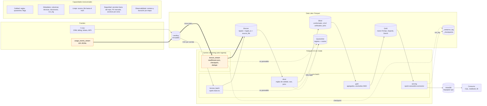
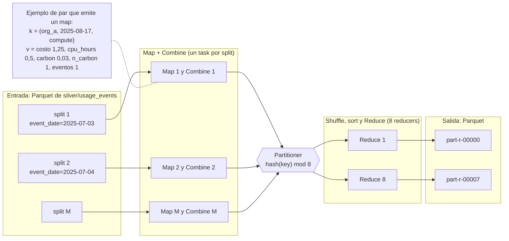

# Cloud Provider Analytics: documento de diseño v1

| | |
|---|---|
| **Materia** | Big Data, ITBA, 2.º cuatrimestre 2026. Prof. (Ad.) Diego Mosquera |
| **Instancia** | Primera evaluación parcial: diseño y fundación de datos |
| **Entrega** | Lunes 05/10/2026, 18:30 h |
| **Equipo** | Jerónimo Esquivel, Agustín Ronda, Pedro Salinas |
| **Versión** | v1.0 (04/10/2026) |
| **Repositorio** | https://github.com/jeroesquivel/bigdata-20262C-g7 (tag `v1.0-entrega1`) |

El documento sigue los 12 puntos del alcance de la consigna (sección 5.2); en el [Anexo A](#anexo-a-trazabilidad-con-el-checklist-de-la-consigna) está la correspondencia con el checklist de entrega. Los números salen de [`notebooks/00_exploracion.ipynb`](../notebooks/00_exploracion.ipynb), ejecutado con PySpark 3.5.3, y los principales quedaron guardados en [`evidence/entrega1/perfil_landing.json`](../evidence/entrega1/perfil_landing.json). Los chequeos de consistencia entre fuentes están en las secciones 2.3 y 3.1 del notebook.

---

## Resumen

Proponemos un pipeline en PySpark que ingesta los eventos de uso en streaming y los maestros y la facturación en batch. Todo pasa por un Data Lake en Parquet con zonas Landing, Bronze, Silver y Gold, y los marts de FinOps, Soporte y Producto se publican en Cassandra/AstraDB.

El patrón es híbrido: el streaming se usa solo para ingestar eventos y todo el conformado se hace en batch. No hay capa de velocidad, así que cada transformación se escribe una sola vez.

Lo que más condicionó el diseño fue un hallazgo en los datos: cada archivo de eventos trae eventos de los 60 días del período. Si el watermark se define sobre la fecha del evento, se pierde entre el 81 % y el 92 % de los eventos. Por eso deduplicamos con un watermark sobre la hora de ingesta y los eventos atrasados se incorporan al recalcular Silver.

Todo corre en Colab, con Parquet en disco local y copia a Drive, y AstraDB en el plan gratuito. Las preguntas que nos quedaron abiertas para el feedback están en la sección 10.3.

---

## 1. Problema, usuarios, preguntas y objetivos medibles

El área de datos de un proveedor de nube recibe telemetría de uso de forma continua, además de maestros de CRM y facturación con nulos, tipos ambiguos, outliers y un cambio de esquema a mitad del período. Necesita esos datos limpios y consultables por organización, servicio y fecha para tres áreas.

| Usuario | Preguntas (P1 a P5 son las consultas obligatorias de la consigna, sección 7.4) |
|---|---|
| **FinOps** | P1. Costo y consumo por organización, servicio y día en un rango de fechas. P2. Servicios con mayor costo de una organización en los últimos 14 días. P4. Revenue mensual en USD con créditos e impuestos. También: qué costos son anómalos |
| **Soporte** | P3. Tickets críticos y tasa de SLA breach por día en los últimos 30 días. También: CSAT promedio |
| **Producto / GenAI** | P5. Tokens GenAI y costo estimado por día. También: emisiones (`carbon_kg`) |

**Criterios de éxito.** Los verificamos con evidencia en la entrega 2 y en la final.

| ID | Criterio | Cómo se mide |
|---|---|---|
| CE1 | Conservación | Para cada fuente, las filas de Landing tienen que ser iguales a válidas + quarantine + duplicados descartados |
| CE2 | Unicidad | Ningún `event_id` repetido en Silver |
| CE3 | Idempotencia | Re-ejecutar el pipeline no cambia los conteos de Silver, Gold ni AstraDB, y Bronze no tiene filas duplicadas |
| CE4 | Frescura | Como máximo 15 minutos desde que un archivo llega a Landing hasta que se ve en AstraDB. En el MVP el pipeline se corre a mano, así que medimos la duración de cada corrida en `run_log` |
| CE5 | Consultas | P1 a P5 se responden desde AstraDB leyendo una sola partición |
| CE6 | Reproducibilidad | El pipeline corre en un Colab limpio siguiendo el Quickstart |

Como los datos son de 2025, "últimos 14 días" y "últimos 30 días" se calculan contra `as_of_date`, un parámetro de configuración que por defecto vale 2025-08-31 (el último día con eventos). Ninguna regla de calidad depende de esa fecha.

---

## 2. Justificación de Big Data (5V)

La muestra pesa 12,6 MB. Con ese volumen alcanzaría una base de datos convencional, así que la justificación no puede venir de la muestra en sí, sino del sistema que representa. En la tabla separamos lo que vimos en los datos de lo que suponemos para un proveedor real.

| V | Lo que vimos en la muestra | Supuesto para el caso real | Qué decide en la arquitectura |
|---|---|---|---|
| **Volumen** | 43.200 eventos en 60 días (720 por día), unos 300 bytes cada uno | Si cada recurso emite una métrica por minuto, los 400 recursos de la muestra ya generan 576.000 eventos por día (unos 165 MB). Con 10.000 organizaciones serían unos 72 millones de eventos y 20 GB por día | Spark para escalar horizontalmente, Parquet columnar y partición por fecha |
| **Velocidad** | 120 archivos de 360 eventos | Flujo continuo; FinOps quiere ver el costo en minutos | Structured Streaming para la ingesta. Para una latencia de minutos alcanza con batch frecuente |
| **Variedad** | 7 CSV, eventos en JSONL y un campo con JSON adentro (`tags_json`) | Aparecen servicios y métricas nuevos | Esquema explícito que incluye todas las versiones, y una capa Silver que unifica |
| **Veracidad** | `value` como texto en 1.309 eventos, `unit` nulo en 2.075, 216 costos negativos, picos de 317 USD cuando la mediana es 1, tasas de cambio y CSAT inconsistentes, fechas que no cierran entre fuentes | Igual o peor | Reglas de calidad, quarantine, flags y detección de anomalías con MAD |
| **Variabilidad** | El esquema cambia el 2025-07-18 (aparecen `carbon_kg` y `genai_tokens`) y `carbon_kg` llega a veces entero y a veces decimal | Los costos cambian con precios y estacionalidad | Columna `schema_version`, nulo distinto de cero y umbrales configurables |
| **Valor** | Costo, revenue, SLA y uso de GenAI por organización | Decisiones de pricing, churn y capacidad | Marts en Gold y tablas en Cassandra diseñadas a partir de las consultas |

---

## 3. Inventario y perfil inicial de las fuentes

### 3.1 Inventario

| Fuente | Filas | Tamaño | Grano (clave natural) | Frecuencia | Rango temporal |
|---|---:|---:|---|---|---|
| `customers_orgs.csv` | 80 | 7,6 KB | organización (`org_id`) | Snapshot | altas del 2025-05-04 al 2025-07-02 |
| `users.csv` | 800 | 69,0 KB | usuario (`user_id`) | Snapshot | |
| `resources.csv` | 400 | 35,8 KB | recurso (`resource_id`) | Snapshot | |
| `support_tickets.csv` | 1.000 | 69,3 KB | ticket (`ticket_id`) | Diaria | 2025-05-09 a 2025-08-31 |
| `marketing_touches.csv` | 1.500 | 99,6 KB | interacción (`touch_id`) | Diaria | 2025-05-04 a 2025-08-31 |
| `nps_surveys.csv` | 92 | 3,9 KB | encuesta (`org_id`, `survey_date`) | Eventual | 2025-05-24 a 2025-08-31 |
| `billing_monthly.csv` | 240 | 15,5 KB | factura (`invoice_id`), una por organización y mes | Mensual | 2025-06 a 2025-08 |
| `usage_events_stream/*.jsonl` | 43.200 | 12,3 MB en 120 archivos | evento (`event_id`) | Archivos de 360 eventos que simulan micro-lotes | 2025-07-03 a 2025-08-31 (UTC) |

Todas las claves naturales son únicas y no hay `org_id` ni `resource_id` huérfanos. En los 43.200 eventos, `service`, `org_id` y `region` coinciden siempre con los del recurso. En Bronze cada fila guarda de qué archivo vino (`source_file`) y cuándo se ingestó (`ingest_ts`).

### 3.2 Perfil de calidad

| Fuente | Qué encontramos | Cómo lo tratamos |
|---|---|---|
| Eventos | Cambio de esquema: 10.800 eventos v1 (hasta el 2025-07-17) y 32.400 v2 (desde el 2025-07-18). `carbon_kg` está en todos los v2 (2.638 como entero y 29.762 como decimal). `genai_tokens` aparece solo en 3.132 eventos, todos del servicio `genai` | Un esquema que incluye ambas versiones. En los v1 esos campos quedan en nulo, no en 0 |
| Eventos | `value` mezcla tipos: 41.014 numéricos, 1.309 como texto (por ejemplo `"95.0"`) y 877 nulos. Todos los textos se pueden convertir a número | Se guarda como texto en Bronze y se convierte en Silver (R7) |
| Eventos | `unit` es nulo en 2.075 eventos, 2.038 de ellos con `value`. Cada métrica tiene siempre la misma unidad: `requests` en `count`, `cpu_hours` en `hours`, `storage_gb_hours` en `gb_hours` | Se completa a partir de `metric` y se marca (R6) |
| Eventos | 216 costos negativos (211 por debajo de -0,01; el mínimo es -154,46). Percentiles: p50 1,00, p99 16,72, p99,9 133,14 y máximo 317,43 | Flag `is_negative_cost` (R5) y detección de anomalías con MAD |
| Eventos | Cada archivo trae eventos de los 60 días, y los 120 archivos tienen la misma fecha de modificación | Define cómo usamos el watermark. El diseño no depende del orden en que se lean los archivos |
| Eventos | 7.371 eventos (17 %) son anteriores a la fecha de alta de su recurso. Otros 4.167 son de recursos que hoy figuran como `terminated`, lo cual es esperable porque el estado es el actual y el evento es histórico | Flag `is_before_resource_created` (R13) |
| `billing_monthly` | `credits` es nulo en 137 facturas y nunca es negativo. Monedas: 160 en USD, 51 en ARS y 29 en EUR. Las 160 facturas en USD tienen una tasa de cambio distinta de 1 (entre 0,855 y 1,118) | `credits` nulo pasa a 0; las facturas USD se marcan con `fx_suspect` (R9, A3) |
| `billing_monthly` | 13 facturas tienen subtotal negativo (la menor, -1.671,83). En las 240 facturas `taxes` es el 21 % del valor absoluto del subtotal, así que en esas 13 el impuesto queda positivo. Las 9 facturas con `credits` mayor que el subtotal son de este grupo | Las tratamos como notas de crédito (R11, R12, A6) |
| `support_tickets` | 240 tickets sin `resolved_at`, que son los abiertos. `csat` es nulo en 254 y está fuera de 1 a 5 en 40 (valores 0, 6 y 7) | El CSAT fuera de rango pasa a nulo con flag (R10) |
| `support_tickets` | 209 tickets son anteriores al alta de su organización. 172 de los 240 abiertos tienen CSAT, que se supone que se mide al cerrar. 25 abiertos ya tienen el SLA vencido, lo cual es válido | Flags (R13) y el CSAT de tickets abiertos no entra en el promedio (R14) |
| `customers_orgs` | `is_enterprise` contradice a `plan_tier` en 25 organizaciones: 9 con plan `enterprise` y `False`, y 16 con `True` y plan standard (8), pro (6) o free (2) | Tomamos `plan_tier` como fuente de verdad (R15, A7) |
| `customers_orgs` / `nps_surveys` | `nps_score` (escala de -100 a 100) es nulo en 11 y 19 filas. Hay un valor de 101 | Fuera de rango pasa a nulo con flag (R10) |
| `users` | 232 usuarios tienen `last_login` anterior a `created_at` | Flag (R13) |
| `users` / `resources` | `email` es un dato personal y algunos recursos tienen la etiqueta `pii:true` en `tags_json` | No se publican en Gold ni en Cassandra |

### 3.3 Riesgos de datos

- La facturación arranca en junio y los eventos el 3 de julio, así que no conciliamos facturación contra uso. Queda fuera de alcance.
- La fuente no documenta la escala del CSAT. Suponemos 1 a 5 (S5).
- La muestra no tiene `event_id` duplicados. Igual deduplicamos, porque en un sistema real hay reenvíos y reprocesos.
- Los maestros son una foto del momento, sin historia. Un `created_at` posterior a la actividad puede ser un error o un recurso que se volvió a crear, y no hay forma de saberlo con estos datos. Por eso lo marcamos y no lo descartamos (R13). Tampoco está documentado qué significa un subtotal negativo ni qué define a un cliente enterprise. Proponemos una interpretación en A6 y A7; si el profesor la corrige, alcanza con recalcular Silver y Gold.

---

## 4. Arquitectura v1

### 4.1 Diagrama (v1.0, 04/10/2026)



En naranja y con flechas gruesas está el camino streaming; el resto es batch.

### 4.2 Componentes y herramientas

| Capa | Componente | Herramienta | Qué hace |
|---|---|---|---|
| Ingesta batch | `bronze_batch` | `spark.read.csv` con esquema explícito (`StructType`) | Pasa los CSV de Landing a Bronze agregando `ingest_ts`, `source_file` e `ingest_date` |
| Ingesta streaming | `bronze_stream` | `readStream.json` con `maxFilesPerTrigger=10` y `trigger(availableNow=True)` | Pasa los eventos a Bronze en 12 micro-lotes, con checkpoint y deduplicación |
| Almacenamiento | Data Lake | Parquet con compresión snappy | Zonas Landing, Bronze, Silver, Gold y Quarantine |
| Procesamiento | `silver`, `gold` | DataFrames de PySpark en batch | Limpieza, joins, features, marts y anomalías |
| Serving | `serving` | AstraDB con spark-cassandra-connector 3.5 | Una tabla por consulta, con upsert por clave primaria |
| Orquestación | `run_pipeline` | Un notebook o script que corre las etapas en orden | Bronze, Silver, Gold y serving, registrando conteos y duración |
| Consumo | | CQL desde la consola de AstraDB o desde el notebook | Consultas P1 a P5 |

### 4.3 Serving preliminar

Esto se implementa en la entrega 2 y en la final. Lo incluimos porque el modelo de Cassandra se diseña a partir de las consultas y condiciona el grano de los marts.

| Consulta | Tabla | Clave primaria | Por qué |
|---|---|---|---|
| P1 | `org_daily_usage_by_service` | `((org_id), usage_date, service)`, con `usage_date` descendente | El rango de fechas se resuelve sobre la clustering key dentro de una sola partición. Si se quiere un solo servicio, se filtra en el cliente para no usar `ALLOW FILTERING` |
| P2 | la misma tabla | | Son como mucho 84 filas (14 días por 6 servicios), que se ordenan en el cliente (A4) |
| P3 | `tickets_by_severity_date` | `((severity), ticket_date)` | Una partición por severidad y los 30 días sobre la clustering key (A5) |
| P4 | `revenue_by_org_month` | `((org_id), month)` | Por organización, igual que el mart de referencia de la consigna (A5) |
| P5 | `genai_tokens_by_org_date` | `((org_id), usage_date)` | Por organización, igual que el mart de referencia (A5) |

Con la muestra, cada partición por `org_id` tiene como mucho 360 filas (60 días por 6 servicios). Con más historia habría que agregar el mes a la clave de partición; lo dejamos anotado pero no lo implementamos.

### 4.4 Del ecosistema Hadoop a nuestro stack

Hadoop separa almacenamiento, gestión de recursos y procesamiento, y cada pieza se puede reemplazar. Mantenemos esa separación, pero con herramientas acordes al volumen que tenemos.

| Pieza de Hadoop | Qué resuelve | En el proyecto |
|---|---|---|
| HDFS (DataNodes) | Guarda archivos repartidos en bloques de 128 MB, replicados 3 veces | Parquet en disco local de Colab con copia en Drive. Perdemos la localidad de datos, pero los problemas de archivos chicos y de escritura única siguen aplicando |
| NameNode | Namespace, permisos y ubicación de los bloques | Convención de rutas, `run_log` y diccionario de datos. No usamos un catálogo como Hive Metastore |
| YARN | Reparte CPU y memoria del clúster | Spark en modo `local[*]` en una sola máquina. En un clúster correría sobre YARN o Kubernetes |
| MapReduce | Procesamiento batch map, shuffle y reduce, escribiendo a disco entre etapas | DataFrames de Spark, que siguen el mismo modelo de claves, particiones y shuffle pero trabajan en memoria |
| Hive, Flume/Kafka, Oozie | SQL sobre archivos, ingesta y orquestación | Spark SQL, file source de Structured Streaming y `run_pipeline` |
| HBase | Lecturas y escrituras por clave con baja latencia | Cassandra/AstraDB |

### 4.5 Vistas lógica, física y de despliegue

| Vista | MVP | Producción a escala |
|---|---|---|
| Lógica | Fuentes, ingesta streaming y batch, zonas del lago, serving y consumo | La misma |
| Física | Parquet snappy, Spark 3.5 local y AstraDB | Parquet en un bucket (GCS o S3) o en HDFS, con Spark en clúster |
| Despliegue | Notebook de Colab con Drive montado, corrido a mano, con los secretos en Colab Secrets | Spark sobre YARN o Kubernetes, `run_pipeline` programado cada 5 minutos y un gestor de secretos |

---

## 5. Patrón arquitectónico: híbrido

Los eventos (`usage_events_stream`) entran por streaming y el resto de las fuentes (maestros, facturación, tickets y encuestas) entran en batch. Los dos caminos escriben en el mismo Bronze. Silver y Gold se calculan en batch y hay una sola capa de serving.

No lo llamamos Lambda porque no tiene capa de velocidad ni combina dos vistas en el serving. La frescura sale de correr el batch seguido (CE4).

Lo elegimos por estas razones:

1. Las fuentes lo piden. La facturación es mensual y los maestros son snapshots; los únicos datos que llegan de forma continua son los eventos.
2. Cumple el requisito de la consigna (sección 4.3), que exige streaming de eventos y batch de maestros, y admite un patrón híbrido.
3. No duplica lógica. Hay un solo motor y cada transformación se escribe una vez; el streaming se limita a ingestar.
4. Aguanta el desorden temporal de los eventos, porque los atrasados entran cuando se recalcula Silver.
5. Alcanza para el negocio: FinOps necesita el costo en minutos, no en segundos.

| Alternativa | Por qué la descartamos |
|---|---|
| Kappa | Obliga a tratar como streams fuentes que son batch por naturaleza, y suma re-stream y backfill sin beneficio |
| Lambda clásica | Duplica la lógica en dos caminos y exige combinar vistas en el serving. Para una latencia de minutos no hace falta |
| Batch puro | No cumple el requisito de streaming |
| Streaming hasta Gold | Con eventos desordenados en 60 días, agregar en streaming exige guardar muchísimo estado o descartar datos. Si sobra tiempo lo evaluamos para la final (A1) |

---

## 6. Diseño del Data Lake

### 6.1 Zonas, formato y particiones

La raíz del lago se configura en `lake.root` ([`config/config.example.yaml`](../config/config.example.yaml)). En Colab procesamos en el disco local (`/content`) y al final de cada corrida copiamos el lago a Drive (D22). Las rutas siguen el patrón `<zona>/<entidad>/<columna_particion>=<valor>/`. Landing guarda los archivos tal como llegan; de Bronze en adelante todo es Parquet snappy.

| Zona | Contenido | Partición | Quién escribe y quién lee | Controles |
|---|---|---|---|---|
| Landing | Archivos originales | | La escriben los sistemas fuente; la leen `bronze_batch` y `bronze_stream` | No se modifica nunca. Desde acá se puede reconstruir todo el lago |
| Bronze | Mismo grano que la fuente, con esquema explícito (`value` como texto), `ingest_ts` y `source_file` | `ingest_date` (en eventos, además `batch_id`) | La escriben `bronze_batch` y `bronze_stream`; la lee `silver` | Solo se agrega, no se actualiza. Tiene PII, así que la ve solo el equipo de datos |
| Silver | `usage_events`, `dim_org`, `dim_resource`, `billing` y `tickets`, tipados, deduplicados y con flags | Eventos por `event_date` | La escribe `silver`; la leen `gold` y análisis ad hoc | Solo llegan registros que pasaron las reglas bloqueantes |
| Gold | `org_daily_usage_by_service`, `revenue_by_org_month`, `cost_anomaly_mart`, `tickets_by_org_date`, `tickets_by_severity_date` (para P3) y `genai_tokens_by_org_date` | Ninguna mientras las tablas sean chicas | La escribe `gold`; la leen `serving`, analistas y BI | Sin PII. Se reescribe completa en cada corrida |
| Quarantine | Registro original, lista de reglas incumplidas (`dq_errors`) e `ingest_ts` | `ingest_date` | La escriben `bronze_*` y `silver`; la revisa el equipo de datos | Nada sale de quarantine solo: se corrige la regla o el origen y se reprocesa desde Landing |
| `_meta` y `_checkpoints` | `run_log` (una fila por job con tiempos y conteos) y el estado del stream | | Las escriben todos los jobs y Spark | El checkpoint no se toca a mano; solo se borra para reiniciar el stream desde cero |

En el MVP el control de acceso es la carpeta de Drive compartida solo con el equipo. En un clúster se haría con permisos por directorio en HDFS o con IAM por prefijo del bucket.

Criterios de particionado:

- Bronze se particiona por fecha de ingesta. Como cada micro-lote trae eventos de 60 días distintos, particionar por fecha de evento haría que cada micro-lote escriba en 60 carpetas y terminaríamos con miles de archivos diminutos. Por fecha de ingesta, cada carga escribe en una sola partición y reprocesarla es reemplazarla.
- Silver de eventos se particiona por `event_date`, porque es el filtro de todas las consultas. Antes de escribir hacemos `repartition("event_date")` para que quede un archivo por día.
- No particionamos por `service`, `org_id` ni hora: con 720 eventos por día quedarían archivos minúsculos.
- Con la muestra, cada partición diaria pesa pocos KB. Lo aceptamos: con el volumen proyectado el tamaño sería razonable.

### 6.2 Naming

- Tablas y columnas en `snake_case` y en inglés, respetando el nombre de la fuente. Las columnas técnicas son `ingest_ts`, `source_file`, `ingest_date` y `dq_errors`.
- Los flags son booleanos que empiezan con `is_` o terminan en un estado: `is_negative_cost` (R5), `is_credit_note` (R11), `unit_imputed`, `value_cast_failed`, `fx_suspect`. La anomalía calculada con MAD aparece en Gold como `anomaly_score` e `is_cost_anomaly`, y es independiente del flag de costo negativo.
- Las fechas de negocio se llaman `<concepto>_date` (`event_date`, `usage_date`, `ticket_date`) y los meses van en `month`, como primer día del mes. Los marts de Gold se llaman `<hecho>_by_<grano>`.

### 6.3 Retención

Por ahora solo definimos las políticas; el script que borra se hace para la entrega final.

| Zona | Retención | Por qué |
|---|---|---|
| Landing | Indefinida | Es la fuente de verdad para reconstruir el lago |
| Bronze | 13 meses para eventos y facturación; 90 días para los snapshots de maestros | Silver y Gold se recalculan desde Bronze. De los maestros alcanza con el último snapshot |
| Silver y Gold | 13 meses | Permite comparar contra el mismo mes del año anterior |
| Quarantine | 30 días | Tiempo para diagnosticar y corregir en origen |
| Checkpoints | Mientras exista el stream | Permiten reiniciar sin duplicar |

### 6.4 Metadatos y linaje

- Por fila: `ingest_ts`, `source_file` (tomado de `_metadata.file_path`) e `ingest_date` en Bronze. `source_file` se mantiene en `silver/usage_events`, así que cada evento se puede rastrear hasta su archivo.
- Por corrida: `_meta/run_log` guarda el job, la hora, la duración, las filas de entrada, salida y quarantine, y la última partición de Bronze procesada. De ahí salen CE1 y CE4.
- De negocio: el [diccionario de datos](diccionario_datos.md) describe cada columna (tipo, descripción, origen, regla aplicada y si es PII) y el camino de cada tabla desde la fuente hasta el mart.

### 6.5 Reglas de promoción y calidad

| Paso | Condición para avanzar | Si no se cumple |
|---|---|---|
| Landing a Bronze | El registro se puede leer con el esquema explícito (modo `PERMISSIVE` con `_corrupt_record`) | Va a quarantine con `parse_error` |
| Bronze a Silver | Pasa las reglas bloqueantes y se deduplica por clave natural | Va a quarantine con `dq_errors` |
| Silver a Gold | Solo registros válidos; los que tienen flags pasan marcados | |
| Gold a AstraDB | El mart completo de la corrida | Upsert por clave primaria, que no duplica |

| # | Regla | Tipo | Acción | Casos en la muestra |
|---|---|---|---|---:|
| R1 | `event_id` no nulo | Bloqueante | Quarantine | 0 |
| R2 | `event_id` único | Deduplicación | Se queda una sola copia | 0 |
| R3 | `timestamp` legible y no posterior a `ingest_ts` más 5 minutos de tolerancia | Bloqueante | Quarantine | 0 |
| R4 | `org_id` y `resource_id` existen en las dimensiones | Bloqueante | Quarantine | 0 |
| R5 | `cost_usd_increment >= -0.01` (la pide la consigna) | Flag | `is_negative_cost`; el registro se conserva | 211 |
| R6 | `unit` no nulo cuando hay `value` | Corrección | Se completa desde `metric` y se marca `unit_imputed`. Si la métrica es desconocida, quarantine | 2.038 |
| R7 | `value` convertible a número | Corrección | Se convierte; si falla, queda nulo con `value_cast_failed` | 0 |
| R8 | `currency` es USD, EUR o ARS | Bloqueante | Quarantine | 0 |
| R9 | Facturas en USD con tasa de cambio igual a 1 | Flag | `fx_suspect` (A3) | 160 |
| R10 | `csat` entre 1 y 5; `nps_score` entre -100 y 100 | Corrección | Queda nulo con flag | 40 / 1 |
| R11 | `subtotal` no negativo | Flag y corrección | Se marca como nota de crédito (`is_credit_note`) y `taxes` toma el signo del subtotal (A6) | 13 |
| R12 | `credits` no mayor que `subtotal` | Flag | `credits_exceed_subtotal`; se conserva | 9 |
| R13 | Fechas coherentes: evento posterior al alta del recurso, ticket posterior al alta de la organización, `last_login` posterior a `created_at` | Flag | `is_before_resource_created`, `is_before_org_signup`, `is_login_before_created` | 7.371 / 209 / 232 |
| R14 | CSAT solo en tickets cerrados | Flag | `csat_on_open_ticket`; no entra en el CSAT promedio de Gold | 172 |
| R15 | `is_enterprise` coherente con `plan_tier` | Corrección y flag | `is_enterprise` se recalcula desde `plan_tier` y se marca `enterprise_flag_mismatch`. El valor original queda en Bronze (A7) | 25 |

A quarantine mandamos solo lo que no se puede interpretar o vincular: registros ilegibles, sin clave, con una clave foránea que no existe o con una moneda desconocida. Lo que es raro pero puede ser cierto se conserva con un flag, y Gold decide si lo usa. Por ejemplo, las fechas incoherentes de R13: si las mandáramos a quarantine perderíamos el 17 % de los eventos, que tienen costo real.

### 6.6 Evolución de esquema y SCD

- Los eventos se leen con un esquema explícito que incluye los campos de v2. En los eventos v1, `carbon_kg` y `genai_tokens` quedan nulos para distinguir "no se midió" de "fue cero". Se conserva la columna `schema_version`.
- `dim_org` y `dim_resource` son SCD tipo 1, porque tenemos un único snapshot y no hay cambios que historizar. Como Bronze guarda cada snapshot en su `ingest_date`, si más adelante hiciera falta un tipo 2 la historia está.

### 6.7 Formatos, compresión, esquema y catálogo

| Formato | Organización | Dónde lo usamos | Por qué |
|---|---|---|---|
| CSV y JSONL | Por filas, texto | Landing, tal como llegan | Los dejamos intactos para poder reconstruir el lago |
| Parquet | Columnar | De Bronze a Gold y en quarantine | Lee solo las columnas que se usan, permite filtrar sin leer todo el archivo (*predicate pushdown*) y comprime bien. Además lo pide la consigna |
| ORC | Columnar | No lo usamos | Es parecido a Parquet, pero su ecosistema gira alrededor de Hive |
| Avro | Por filas, con el esquema adentro | No lo usamos | Está pensado para ingesta y mensajería, como Kafka. Nuestra fuente ya es JSONL y el uso es analítico |

- Usamos snappy, la compresión por defecto de Spark, porque es rápida aunque comprima menos que gzip. Como Parquet comprime por bloques internos, el archivo se puede seguir dividiendo para leer en paralelo, cosa que no pasa con un CSV comprimido con gzip.
- En Landing el esquema se aplica al leer (schema-on-read). Desde Bronze el esquema se fija al escribir (schema-on-write): siempre `StructType` explícito y nunca `inferSchema`.
- No tenemos un catálogo como Hive Metastore. Los datasets se encuentran por la convención de rutas, el diccionario y `run_log`. Junto con quarantine y la retención, eso es lo que evita que el lago se vuelva un *data swamp*.

### 6.8 Plan de almacenamiento pensado desde HDFS

No usamos HDFS, pero sus restricciones explican decisiones que valen igual en Drive o en un bucket. Los 20 GB por día proyectados equivalen a unos 160 bloques de 128 MB por día en Landing.

| Dataset | Cómo se escribe | Tamaño de archivo buscado | Partición | Replicación | Riesgo |
|---|---|---|---|---|---|
| Landing eventos | Un archivo por envío (120 JSONL de unos 105 KB) | Lo define la fuente | | 3 copias, porque no se puede regenerar | Archivos chicos, pero no los tocamos |
| Bronze `usage_events` | Un `batch_id` por micro-lote (12 por corrida) | 128 MB a 1 GB | `ingest_date` y `batch_id` | 3 copias, porque Silver y Gold salen de acá | Muchos archivos chicos; se compacta la partición del día cuando cierra |
| Bronze maestros y facturación | Se reemplaza en cada corrida | Un archivo (`coalesce(1)`) | `ingest_date` | 3 copias | Son pocos KB, un archivo alcanza |
| Silver `usage_events` | Se reescriben las particiones afectadas | 128 MB a 1 GB | `event_date` | 2 copias, porque se puede regenerar | Con la muestra quedan particiones de pocos KB |
| Gold | Se reescribe en cada corrida | Un archivo por mart con la muestra | Ninguna | 2 copias | La cantidad de archivos depende de los reducers |
| Quarantine, `_meta` y `_checkpoints` | Por corrida o micro-lote | Un archivo; el checkpoint genera archivos chicos que no se pueden evitar | `ingest_date` en quarantine | 2 copias; 3 para el checkpoint | El checkpoint necesita que renombrar archivos sea atómico |

- Archivos chicos: el NameNode guarda en memoria los metadatos de cada archivo y de cada bloque, y cada archivo genera al menos una tarea. Por eso escribimos con `coalesce` o `repartition`, usamos particiones gruesas y compactamos Bronze. En un bucket el costo equivalente está en los listados y en la cantidad de pedidos.
- Escribir una vez y leer muchas: Landing no se modifica, Bronze solo crece, y Silver y Gold reemplazan particiones enteras en lugar de actualizar filas.
- Replicación: HDFS permite elegir el factor por archivo. Usaríamos 3 copias para lo que no se puede regenerar y 2 para lo derivado. En Drive la durabilidad la maneja Google.
- Bloques: el tamaño por defecto de un row group de Parquet (128 MB) coincide con el bloque de HDFS, así que cada tarea puede leer un bloque local.
- Renombrado atómico: Spark escribe primero en una carpeta temporal y después renombra, y el checkpoint del streaming funciona igual. En HDFS renombrar es instantáneo y atómico; sobre el montaje de Drive no está garantizado y además es lento, así que una corrida cortada puede dejar datos a medias. Por eso procesamos en `/content` y copiamos a Drive al final (R-8).

---

## 7. Flujos de datos

### 7.1 Streaming: `usage_events_stream`

```text
landing/usage_events_stream/*.jsonl
  | readStream.json(schema=EVENT_SCHEMA + _corrupt_record)
  |   maxFilesPerTrigger=10, trigger(availableNow=True)
  | agrega ingest_ts, source_file, ingest_date
  | dedupe_key = event_id, o un hash del registro si event_id es nulo
  | withWatermark("ingest_ts", "1 hour")
  | dropDuplicatesWithinWatermark(["dedupe_key"])
  | foreachBatch(df, batch_id):
  |   registros legibles a Bronze, ilegibles a quarantine,
  |   cada uno en su carpeta batch_id=N (reemplaza si ya existe)
  v
bronze/usage_events/ingest_date=YYYY-MM-DD/batch_id=N/
quarantine/usage_events/ingest_date=YYYY-MM-DD/batch_id=N/
checkpoint en _checkpoints/bronze_usage_events/
```

- **Clave de deduplicación.** Spark considera iguales a todos los nulos. Si deduplicáramos solo por `event_id`, todos los registros corruptos o sin id se juntarían en una sola fila y se perderían antes de llegar a quarantine. Con `dedupe_key`, un registro sin id solo se descarta si aparece otra copia idéntica del mismo archivo.
- **Reintentos.** Si un micro-lote falla a la mitad, Spark lo vuelve a ejecutar con el mismo `batch_id` y los mismos archivos. Como cada micro-lote escribe en su propia carpeta `batch_id=N` y la reemplaza, el reintento no duplica filas (CE3). La deduplicación de Silver (R2) es una segunda protección.
- **`availableNow`** procesa todos los archivos pendientes en 12 micro-lotes y termina. Si se vuelve a correr, el checkpoint evita reprocesar lo que ya se leyó.
- **Watermark y eventos tardíos.** La consigna pide watermark, deduplicación por `event_id` y manejo de datos tardíos. Simulamos en el notebook qué pasaría con un watermark sobre la fecha del evento, procesando los 12 micro-lotes en orden:

  | Umbral sobre la fecha del evento | 1 hora | 1 día | 7 días | 30 días | 61 días |
  |---|---:|---:|---:|---:|---:|
  | Eventos descartados | 39.566 (91,6 %) | 38.935 (90,1 %) | 34.983 (81,0 %) | 19.758 (45,7 %) | 0 |

  Como cada archivo trae eventos de los 60 días, el watermark avanza hasta el final del período en el primer micro-lote y casi todo lo que viene después queda como "tardío". Por eso definimos el watermark sobre `ingest_ts` (decisión D5). Así el estado de la deduplicación queda acotado y protege contra reenvíos dentro de la misma hora, y los eventos atrasados según su fecha no se descartan: entran cuando Silver recalcula esas fechas. Lo vamos a probar al principio de la entrega 2. Si no funciona, la alternativa es deduplicar dentro de cada micro-lote, sin estado, y garantizar la unicidad en Silver.

### 7.2 Batch: maestros, facturación, tickets y encuestas

```text
landing/*.csv
  | read.csv(header, schema explícito, mode=PERMISSIVE)
  | agrega ingest_ts, source_file, ingest_date
  v
bronze/<fuente>/ingest_date=.../
  (se reemplaza la partición del día, así que re-ejecutar no duplica)
  |
  | snapshots (customers_orgs, users, resources): Silver toma el último ingest_date
  | incrementales (support_tickets, billing_monthly, nps_surveys, marketing_touches):
  |   une todas las particiones y deduplica por clave natural; gana la versión más reciente
  | normaliza texto, fechas y booleanos; credits nulo pasa a 0; reglas R8 a R15
  v
silver/dim_org, dim_resource, billing, tickets (users, nps y marketing siguen el mismo patrón)
```

La diferencia entre snapshots e incrementales importa para los tickets: cuando un ticket se resuelve, Silver se queda con su última versión, venga la fuente como extracto completo o como novedades.

### 7.3 Silver y Gold de eventos (batch)

```text
bronze/usage_events
  | convierte value, completa unit, aplica R1 a R7 y R13
  | deduplica por event_id sobre todo el histórico y calcula event_date
  | join con dim_org (industry, plan_tier, hq_region) y dim_resource
  |   (broadcast, porque las dimensiones son chicas)
  | features: cost_usd, requests, cpu_hours, storage_gb_hours, genai_tokens, carbon_kg
  v
silver/usage_events/event_date=.../
  | groupBy por el grano del mart y agregados; anomalías con MAD
  v
gold/<mart>/  y de ahí a AstraDB (upsert por clave primaria)
```

**Anomalías de costo (D11).** Para cada par organización y servicio tomamos la serie de costo diario, sin los costos negativos de R5, y calculamos `anomaly_score = 0,6745 · (x - mediana) / MAD`. Marcamos `is_cost_anomaly` cuando el valor absoluto supera 3,5; el umbral es configurable. Usamos la mediana y el MAD en lugar de la media y el desvío porque los picos de costo distorsionan la media. Con la muestra funciona: hay 262 pares con entre 24 y 60 días de datos (39 de mediana) y ninguno tiene MAD igual a cero. Si alguno lo tuviera, usaríamos los valores del servicio completo.

**Idempotencia y recálculo.** Cada capa evita duplicar a su manera: el checkpoint y las carpetas por `batch_id` en el Bronze de eventos, el reemplazo de partición en el Bronze batch, la deduplicación en Silver y el upsert en Cassandra. En el MVP Silver y Gold se recalculan completos, lo que tarda segundos con la muestra. Con 20 GB por día no sería viable, así que cada corrida reescribiría solo las fechas que aparecen en el Bronze nuevo (según `run_log`), y los eventos atrasados se incorporarían sin reprocesar todo el histórico (S7).

---

## 8. Flujo batch en MapReduce: `org_daily_usage_by_service`

Elegimos este mart porque es el que pide la entrega 2 y es la agregación central de FinOps.

```text
INPUT     InputFormat: Parquet de silver/usage_events/event_date=*/
          InputSplit: con la muestra, un archivo por día, o sea 60 splits y 60 map tasks
                      (a escala, un row group de unos 128 MB)
          RecordReader: lee solo las columnas que se usan y entrega un evento por vez

MAP       key   = (org_id, usage_date, service)
          value = (costo si no es negativo, si no 0,
                   costo si es negativo, si no 0,
                   1 si es negativo, si no 0,
                   value si metric = requests, si no 0,
                   value si metric = cpu_hours, si no 0,
                   value si metric = storage_gb_hours, si no 0,
                   genai_tokens o 0,  n_genai = 1 si genai_tokens no es nulo,
                   carbon_kg o 0,     n_carbon = 1 si carbon_kg no es nulo,
                   1)

COMBINE   la misma suma que el REDUCE, hecha dentro de cada map task.
          Se puede porque la suma es asociativa y conmutativa.

PARTITION reducer = hash(org_id, usage_date, service) mod 8

SHUFFLE   cada reducer trae su parte de todos los mappers y la ordena por key,
y SORT    así recibe cada key con la lista de todos sus valores

REDUCE    suma componente a componente y emite
            (org_id, usage_date, service) -> (daily_cost_usd, negative_cost_usd,
              negative_cost_events, requests, cpu_hours, storage_gb_hours,
              genai_tokens, carbon_kg, event_count)
          genai_tokens queda nulo si n_genai = 0, y carbon_kg si n_carbon = 0,
          para no confundir "no se midió" (eventos v1) con cero

OUTPUT    Parquet en gold/org_daily_usage_by_service/, un archivo por reducer
```



En Spark todo esto es un `groupBy("org_id", "usage_date", "service").agg(...)`. Si se mira el plan con `.explain()`, se ve la misma estructura: `FileScan parquet` es la lectura, el primer `HashAggregate (partial)` hace de combiner, `Exchange hashpartitioning(..., 8)` es el shuffle y el segundo `HashAggregate (final)` es el reduce. La diferencia con MapReduce es que Spark encadena las etapas en memoria y solo escribe a disco en el shuffle.

Algunas decisiones del flujo:

- **8 reducers.** Es el valor que fijamos en `spark.sql.shuffle.partitions`. Alcanza para los núcleos de Colab y reparte las 11.050 combinaciones reales de la muestra (unas 1.400 por reducer). A escala habría que elegirlo según el volumen que recibe cada reducer.
- **Desbalance (skew).** Como la clave combina organización, día y servicio, una organización grande queda repartida entre muchas keys, y el combiner reduce lo que viaja por la red. Si una key concentrara demasiados datos, se le puede agregar un sufijo aleatorio y agregar en dos pasos.
- **Joins con dimensiones.** `dim_org` (80 filas) y `dim_resource` (400) son chicas. En MapReduce se mandarían a cada mapper por caché distribuida; en Spark es un broadcast join, sin shuffle.
- **Fallos.** Si un map task falla, se re-ejecuta sobre el mismo split porque las tareas son independientes. En Spark, el linaje permite recalcular solo la partición perdida.

`revenue_by_org_month` sigue el mismo patrón con key `(org_id, month)` y value `(subtotal - credits + taxes) * tasa de cambio`, con `credits` nulo como 0 y `taxes` con el signo del subtotal (R11), así las notas de crédito restan.

---

## 9. Matriz requisito-componente

| Requisito u objetivo | Sección de la consigna | V | Componente | CE | Evidencia y entrega |
|---|---|---|---|---|---|
| Métricas de uso y costo casi en tiempo real (15 minutos) | 2.1 | Velocidad | `bronze_stream` y recálculo batch incremental | CE4 | Log de micro-lotes y duración (E2) |
| Batch de maestros y facturación | 2.1 y 4.3 | Variedad | `bronze_batch`, con snapshots e incrementales | CE1 | Conteos por fuente (E2) |
| Esquema explícito y columnas técnicas | 4.4 | Variedad, veracidad | `bronze_batch`, `bronze_stream` | CE1 | Esquemas en el código (E2) |
| Compatibilidad v1/v2 | 3.2 | Variedad, variabilidad | Esquema con todos los campos y `silver` | CE1 | Conteos v1/v2 (E1 y E2) |
| Tipos ambiguos, nulos, outliers e inconsistencias | 3.2 | Veracidad | Reglas R1 a R15, quarantine y flags | CE1 | Muestras de quarantine y conteos por flag (E2) |
| Deduplicación por `event_id`, watermark y datos tardíos | 4.4 | Veracidad, velocidad | `bronze_stream` (D5) y R2 | CE1, CE2 | Simulación (E1); conteos (E2) |
| Anomalías de costo | 4.4 | Veracidad, valor | `gold/cost_anomaly_mart` con MAD | | Viabilidad (E1); umbral (final) |
| Escalabilidad y control de archivos | 4.4 | Volumen | Spark, Parquet particionado por fecha y compactación | | `.explain()`, tamaños y rutas (E2) |
| Idempotencia | 4.4 | Veracidad | Checkpoint, carpetas por `batch_id`, reemplazo de particiones y upsert | CE3 | Conteos antes y después (E2) |
| Consultas P1 a P5 | 7.4 | Valor | Marts de Gold y tablas de AstraDB | CE5 | CQL y capturas (2 en E2, 5 en la final) |
| Metadatos y linaje | 4.4 | | Columnas técnicas, `run_log` y diccionario | CE1 | Diccionario (borrador en E1) |
| Seguridad | 7.6 | | Secretos en variables de entorno o Colab Secrets, PII fuera de Gold, accesos por zona | | Repositorio sin secretos (todas) |
| Reproducibilidad | 8.2 | | Configuración externa, `requirements.txt` y Quickstart | CE6 | README (todas) |

---

## 10. Plan inicial

### 10.1 Supuestos

| # | Supuesto |
|---|---|
| S1 | Somos 3 integrantes con dedicación parecida |
| S2 | `as_of_date` es 2025-08-31, el último día con eventos, y solo se usa para las ventanas de "últimos N días" |
| S3 | Revenue en USD = (subtotal - credits + taxes) * tasa de cambio, con `credits` nulo como 0 y `taxes` con el signo del subtotal |
| S4 | El costo GenAI estimado es la suma de `cost_usd_increment` de los eventos del servicio `genai` |
| S5 | El CSAT va de 1 a 5 y el NPS de -100 a 100 |
| S6 | Colab gratuito, con Spark local, alcanza para la muestra |
| S7 | En un sistema real los eventos llegan con poco atraso (la mayoría el mismo día). El desorden de 60 días por archivo es propio de la simulación |
| S8 | Un subtotal negativo es una nota de crédito y no un error (A6) |

### 10.2 Riesgos y mitigaciones

| # | Riesgo | Probabilidad | Impacto | Mitigación |
|---|---|---|---|---|
| R-1 | Que no funcione la conexión entre Spark, el conector y AstraDB (versiones, *secure connect bundle*, token) | Media | Alto | Probarlo al principio de la entrega 2. Plan B: cargar con el driver de Python `cassandra-driver`, que alcanza porque los marts tienen menos de 30.000 filas |
| R-2 | Perder eventos por un watermark mal definido o por nulos en la clave de deduplicación | Alta (lo medimos) | Alto | Decisión D5 y control de conservación (CE1) en cada corrida |
| R-3 | Colab borra el disco local y los checkpoints al cerrar la sesión | Alta | Medio | Copiar el lago y los checkpoints a Drive al terminar y restaurarlos al empezar (D22). Si la sesión se cae, se vuelve a correr o se regenera todo desde Landing |
| R-4 | Muchos archivos chicos, con los que Drive es lento | Media | Bajo | Particiones gruesas, `repartition`/`coalesce` y compactación de Bronze |
| R-5 | Subir credenciales al repositorio | Media | Alto | Variables de entorno o Colab Secrets; `.env` y `secure-connect*.zip` en `.gitignore`; revisar antes de cada push |
| R-6 | Con la muestra no se puede mostrar rendimiento a escala | Segura | Bajo | Lo declaramos como limitación y mostramos el plan físico, las particiones y los tamaños |
| R-7 | Que el alcance crezca más de lo necesario | Media | Medio | Backlog dividido en obligatorio, deseable y fuera de alcance; el diagrama muestra solo lo que se va a construir |
| R-8 | Que una corrida cortada deje un checkpoint o una partición a medias en Drive, porque ahí renombrar no es atómico | Media | Alto | Procesar en `/content` y copiar a Drive al final, o pasar a un bucket (D22). Se prueba al principio de la entrega 2 |

### 10.3 Preguntas abiertas para el feedback

| # | Pregunta | Lo que proponemos |
|---|---|---|
| A1 | ¿Alcanza con actualizar Gold en batch cada pocos minutos, o se espera streaming hasta Gold? | Gold en batch incremental |
| A2 | ¿Los costos menores a -0,01 se suman en `daily_cost_usd`? | No. Van aparte, en `negative_cost_usd` y `negative_cost_events` |
| A3 | Las facturas en USD con tasa distinta de 1, ¿se fuerzan a 1? | Sí, marcadas con `fx_suspect` |
| A4 | El top-N de P2, ¿se calcula en el cliente o en una tabla aparte? | En el cliente, porque son como mucho 84 filas |
| A5 | ¿P3, P4 y P5 son globales o por organización? | P3 global por día; P4 y P5 por organización, como los marts de referencia de la consigna (sección 7.3) |
| A6 | Las 13 facturas con subtotal negativo, ¿son notas de crédito? | Sí. Se marcan con `is_credit_note`, el impuesto toma el signo del subtotal y restan en el revenue |
| A7 | ¿Qué define a un cliente enterprise, `plan_tier` o `is_enterprise`? Se contradicen en 25 organizaciones | `plan_tier`. `is_enterprise` se recalcula a partir de él y se marca la diferencia |

### 10.4 Esfuerzo, roles y recursos

| Rol | Integrante | Responsabilidad |
|---|---|---|
| Ingesta | Agustín Ronda | Batch y streaming hasta Bronze, esquemas y checkpoints |
| Procesamiento y calidad | Pedro Salinas | Silver, Gold, reglas de calidad y anomalías |
| Serving, gobierno y documentación | Jerónimo Esquivel | AstraDB, diccionario, README, diagramas y evidencias |

| Instancia | Horas-persona estimadas | Qué incluye |
|---|---:|---|
| Entrega 1 | 30 | Diseño, perfil de datos y repositorio inicial |
| Entrega 2 | 80 a 90 | Pipeline end-to-end mínimo, 3 reglas de calidad, `org_daily_usage_by_service` y 2 consultas en AstraDB |
| Final | 60 a 70 | 5 marts, 5 consultas, anomalías, pruebas, documentación, presentación y video |

Recursos: Google Colab, Google Drive (menos de 100 MB), AstraDB en plan gratuito, GitHub, PySpark 3.5.3 y spark-cassandra-connector 3.5. No tiene costo.

### 10.5 Próximos pasos para la entrega 2

1. Incorporar las correcciones del feedback.
2. Probar primero lo más riesgoso: el watermark sobre `ingest_ts` con `dedupe_key` (D5), la conexión de Colab a AstraDB y la escritura en `/content` con copia a Drive (D22).
3. Bronze batch con al menos 3 maestros y Bronze streaming con checkpoint.
4. Silver de eventos y de `dim_org`, reglas R1 a R7 y quarantine.
5. Gold `org_daily_usage_by_service`, carga en AstraDB y consultas P1 y P2 en CQL.
6. Demostrar la idempotencia, escribir el Quickstart y armar el backlog final.

---

## 11. Repositorio y evidencia

| Qué | Dónde |
|---|---|
| README y convenciones | [`README.md`](../README.md) |
| Registro de decisiones | [`DECISIONS.md`](../DECISIONS.md) |
| Diccionario de datos (borrador) | [`docs/diccionario_datos.md`](diccionario_datos.md) |
| Datos de muestra, sin modificar | `datalake/landing/` |
| Exploración en PySpark, con las salidas | [`notebooks/00_exploracion.ipynb`](../notebooks/00_exploracion.ipynb) |
| Evidencia | [`evidence/entrega1/`](../evidence/entrega1/) |
| Configuración de ejemplo | [`config/config.example.yaml`](../config/config.example.yaml) |

---

## Anexo A: trazabilidad con el checklist de la consigna

| Ítem del checklist | Dónde está |
|---|---|
| Documento de diseño disponible | Este documento |
| Repositorio accesible y versionado | Sección 11 y tag `v1.0-entrega1` |
| Interpretación del caso y objetivos medibles | Sección 1 |
| Análisis 5V | Sección 2 |
| Inventario y perfil de fuentes | Sección 3 |
| Arquitectura v1 y patrón justificado | Secciones 4 (diagrama en 4.1, Hadoop en 4.4, vistas en 4.5) y 5 |
| Diseño Landing/Bronze/Silver/Gold | Sección 6 (zonas en 6.1, reglas en 6.5, formatos en 6.7, almacenamiento en 6.8) |
| Flujos batch y streaming | Sección 7 |
| Lógica MapReduce o equivalente | Sección 8 |
| Matriz requisito-componente | Sección 9 |
| Supuestos, riesgos, mitigaciones y estimación de esfuerzo | Sección 10 |
| Evidencia mínima de lectura y exploración de datos | Secciones 3 y 11, `notebooks/00_exploracion.ipynb` y `evidence/entrega1/` |
