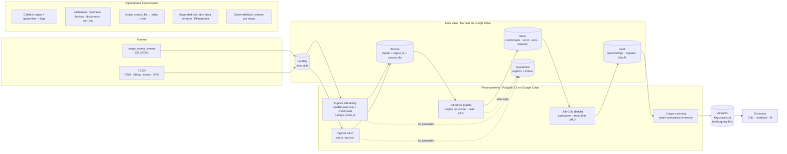

# Cloud Provider Analytics — Documento de diseño v1

| | |
|---|---|
| **Materia** | Big Data · ITBA · 2.º cuatrimestre 2026 · Prof. (Ad.) Diego Mosquera |
| **Instancia** | Primera evaluación parcial: diseño y fundación de datos |
| **Entrega** | Lunes 05/10/2026 · 18:30 h |
| **Equipo** | [Integrante A] · [Integrante B] · [Integrante C] |
| **Versión** | v1.0 · 02/10/2026 |
| **Repositorio** | [URL del repositorio] · tag `v1.0-entrega1` |

Este documento cubre los 12 puntos del alcance obligatorio (consigna §5.2). Su correspondencia con el checklist de entrega está en el [Anexo A](#anexo-a--trazabilidad-con-el-checklist-91). Las cifras de datos se obtuvieron ejecutando [`notebooks/00_exploracion.ipynb`](../notebooks/00_exploracion.ipynb) (PySpark 3.5.3): cada cifra se puede ver en las salidas del notebook, y las principales se guardan además en [`evidence/entrega1/perfil_landing.json`](../evidence/entrega1/perfil_landing.json). 

---

## Resumen

- **Qué construimos:** un pipeline PySpark que ingesta en **streaming** los eventos de uso y en **batch** los maestros de CRM y la facturación. El pipeline los conforma en un Data Lake Parquet de cuatro zonas (Landing, Bronze, Silver y Gold) y publica marts de FinOps, Soporte y Producto en **Cassandra/AstraDB** para consultas de baja latencia.
- **Patrón:** **Lambda simplificada**. Hay dos caminos de ingesta, un único motor y una única implementación de las transformaciones, y una sola capa de serving.
- **Entorno:** Google Colab, Parquet en Google Drive y el free tier de AstraDB. No operamos ningún servicio propio y el costo es $0.
- **Hallazgo que condiciona el diseño:** **cada archivo de eventos abarca los 60 días del período**. Una deduplicación con watermark por *event-time* descartaría entre el **81 % y el 92 %** de los eventos con umbrales de 1 hora a 7 días (§7.1). Por eso el streaming deduplica con un watermark sobre la hora de ingesta, y los eventos tardíos se incorporan en el recálculo batch de Silver.

---

## 1. Problema, usuarios, preguntas y objetivos medibles

**Problema.** El área de datos de un proveedor de nube recibe telemetría de uso de forma continua, además de maestros de CRM y facturación con errores de calidad: nulos, tipos ambiguos, outliers y cambios de esquema. Necesita datos limpios, conformados y consultables por organización, servicio y fecha para tres áreas de negocio.

| Usuario | Preguntas principales |
|---|---|
| **FinOps** | P1. ¿Cuánto cuesta y consume cada organización por servicio y día en un rango de fechas? · P2. ¿Cuáles son los servicios con mayor costo acumulado de una organización en los últimos 14 días? · P4. ¿Cuál es el revenue mensual en USD con créditos e impuestos aplicados? · ¿Qué costos son anómalos? |
| **Soporte** | P3. ¿Cómo evolucionan por día los tickets críticos y la tasa de incumplimiento de SLA en los últimos 30 días? · ¿Cuál es el CSAT promedio? |
| **Producto / GenAI** | P5. ¿Cuántos tokens GenAI se consumen por día y a qué costo estimado? · ¿Cuánto carbono (`carbon_kg`) se emite? |

P1 a P5 son las cinco consultas obligatorias de la consigna (§7.4).

**Objetivos medibles (criterios de éxito).** Se verifican con evidencia en la entrega 2 y en la final.

| ID | Criterio | Cómo se mide |
|---|---|---|
| CE1 | Conservación: ningún registro se pierde sin dejar rastro | Por fuente: `filas Landing = filas válidas + filas en quarantine + duplicados descartados` |
| CE2 | Unicidad | 0 `event_id` repetidos en Silver |
| CE3 | Idempotencia | Conteos idénticos en Silver, Gold y AstraDB tras re-ejecutar el pipeline completo; en Bronze, ninguna partición `ingest_date` con filas duplicadas |
| CE4 | Frescura | Un archivo nuevo de eventos llega a Bronze y a Gold en la siguiente ejecución del pipeline (en el MVP se lanza a demanda; en producción se programaría, p. ej., cada 15 minutos) |
| CE5 | Consultas | P1–P5 responden desde AstraDB leyendo una sola partición por consulta |
| CE6 | Reproducibilidad | El pipeline completo corre en un Colab limpio siguiendo el Quickstart |

**Fecha de referencia.** Los datos son de 2025. Las ventanas "últimos 14 días" y "últimos 30 días" se calculan contra `as_of_date`, un parámetro de configuración cuyo valor por defecto es la última fecha con eventos (2025-08-31), y no contra la fecha actual.

---

## 2. Justificación de Big Data (5V)

La muestra provista pesa **12,6 MB**: por sí sola **no** es Big Data. Lo que justifica la arquitectura es el sistema que la muestra representa. A continuación se distingue lo que se observa en la muestra de lo que se proyecta.

| V | Observado en la muestra | Proyección del caso real (supuesto) | Implicancia en la arquitectura |
|---|---|---|---|
| **Volumen** | 43.200 eventos en 60 días (720/día), ≈ 300 B por evento | Un proveedor real emite métricas por recurso y por minuto. Solo los 400 recursos de la muestra generarían 576.000 eventos/día (≈ 165 MB/día); con 10.000 organizaciones (×125) serían ≈ 72 M eventos/día (≈ 20 GB/día) | Spark (procesamiento distribuido y escalable horizontalmente), Parquet columnar comprimido, particionado por fecha |
| **Velocidad** | Los eventos llegan fragmentados en 120 archivos de 360 eventos | Flujo continuo; FinOps necesita ver el costo incremental en minutos, no al cierre del mes | Structured Streaming con checkpoint |
| **Variedad** | 7 CSV, eventos JSONL, JSON embebido (`tags_json`), dos versiones de esquema | Aparecen servicios y métricas nuevos | Esquema explícito superset y zona Silver de conformado |
| **Veracidad** | `value` llega como texto en 1.309 eventos, `unit` es nulo en 2.075, hay 216 costos negativos, spikes de hasta 317 USD (p50 = 1,00), tasas de cambio inconsistentes, CSAT fuera de rango | Igual o peor a escala | Reglas de calidad, quarantine, flags y detección de anomalías robusta (MAD) |
| **Valor** | Costos, revenue, SLA y adopción de GenAI por organización | Decisiones de pricing, prevención de churn y planificación de capacidad | Marts Gold y serving query-first en Cassandra para dashboards |

---

## 3. Inventario y perfil inicial de las fuentes

### 3.1 Inventario

| Fuente | Filas | Tamaño | Grano (clave natural) | Frecuencia | Rango temporal |
|---|---:|---:|---|---|---|
| `customers_orgs.csv` | 80 | 7,6 KB | organización (`org_id`) | Snapshot | alta: 2025-05-04 → 2025-07-02 |
| `users.csv` | 800 | 69,0 KB | usuario (`user_id`) | Snapshot | — |
| `resources.csv` | 400 | 35,8 KB | recurso (`resource_id`) | Snapshot | — |
| `support_tickets.csv` | 1.000 | 69,3 KB | ticket (`ticket_id`) | Diaria | 2025-05-09 → 2025-08-31 |
| `marketing_touches.csv` | 1.500 | 99,6 KB | interacción (`touch_id`) | Diaria | 2025-05-04 → 2025-08-31 |
| `nps_surveys.csv` | 92 | 3,9 KB | encuesta (`org_id`, `survey_date`) | Eventual | 2025-05-24 → 2025-08-31 |
| `billing_monthly.csv` | 240 | 15,5 KB | factura (`invoice_id`) = org × mes | Mensual | 2025-06 → 2025-08 |
| `usage_events_stream/*.jsonl` | 43.200 | 12,3 MB en 120 archivos | evento (`event_id`) | Archivos de 360 eventos (simulan micro-lotes) | 2025-07-03 → 2025-08-31 (UTC) |

**Trazabilidad:** todas las claves naturales son únicas y no hay `org_id` ni `resource_id` huérfanos en ninguna fuente. En los eventos, el `service` coincide siempre con el del recurso. En Bronze, cada fila conserva `source_file` e `ingest_ts`.

### 3.2 Perfil de calidad

| Fuente | Hallazgo | Tratamiento propuesto (§6.5) |
|---|---|---|
| Eventos | **Evolución de esquema:** v1 tiene 10.800 eventos (hasta 2025-07-17); v2 tiene 32.400 (desde 2025-07-18). `carbon_kg` está en todos los v2 (2.638 llegan como entero y 29.762 como decimal). `genai_tokens` está solo en 3.132 eventos, todos del servicio `genai` | Esquema superset; en v1 esos campos quedan en `null`, no en 0 |
| Eventos | **`value` con tipos mezclados:** 41.014 numéricos, 1.309 como texto (p. ej. `"95.0"`) y 877 nulos. Todos los textos son casteables a double | Se lee como string y se castea con fallback |
| Eventos | **`unit` nulo en 2.075 eventos** (2.038 de ellos con `value` presente). Cada `metric` tiene una única unidad: `requests → count`, `cpu_hours → hours`, `storage_gb_hours → gb_hours` | Se imputa desde `metric` y se marca con flag |
| Eventos | **Costos:** 216 negativos (211 menores a −0,01; mínimo −154,46); p50 = 1,00, p99 = 16,72, p99,9 = 133,14, máximo 317,43 | Flag de anomalía; se detectan anomalías con MAD |
| Eventos | **Orden temporal:** cada uno de los 120 archivos abarca los 60 días (07-03 → 08-31) | Determina la estrategia de watermark (§7.1) |
| `billing_monthly` | `credits` nulo en 137 facturas (nunca negativo). Monedas: USD 160, ARS 51, EUR 29. **Las 160 facturas en USD tienen `exchange_rate_to_usd` distinto de 1** (de 0,855 a 1,118) | `credits` nulo → 0; flag `fx_suspect` (decisión abierta A3) |
| `support_tickets` | 240 tickets sin `resolved_at` (abiertos; no es un error). `csat` nulo en 254 y fuera del rango 1–5 en 40 (valores 0, 6 y 7) | Abiertos: estado válido. CSAT fuera de rango → `null` + flag |
| `customers_orgs` / `nps_surveys` | `nps_score` es un NPS en escala −100..100: nulo en 11 y 19 filas respectivamente; 1 valor fuera de rango (101) | Fuera de rango → `null` + flag |
| `users` / `resources` | **Datos sensibles:** `users.email` es PII; `resources.tags_json` incluye la etiqueta `pii:true` | No se publican en Gold ni en serving |

### 3.3 Riesgos de datos

- La facturación incluye junio, pero los eventos empiezan el 03/07. No se concilia facturación contra uso (queda fuera de alcance).
- La escala de CSAT se asume 1–5; el diccionario de la fuente no la documenta.
- La muestra tiene 0 duplicados de `event_id`. Aun así, la deduplicación es necesaria, porque protege ante reenvíos y reprocesos.

---

## 4. Arquitectura v1

### 4.1 Diagrama · v1.0 · 02/10/2026



### 4.2 Componentes y herramientas

| Capa | Componente | Herramienta | Responsabilidad |
|---|---|---|---|
| Ingesta batch | `bronze_batch` | `spark.read.csv` con `StructType` explícito | Landing → Bronze; agrega `ingest_ts`, `source_file` e `ingest_date` |
| Ingesta streaming | `bronze_stream` | `spark.readStream.json`, `maxFilesPerTrigger=10`, `trigger(availableNow=True)` | Landing → Bronze en 12 micro-lotes; checkpoint; dedupe por `event_id` |
| Almacenamiento | Data Lake | Parquet (snappy) en Google Drive | Zonas Landing, Bronze, Silver, Gold y Quarantine (§6) |
| Procesamiento | `silver`, `gold` | PySpark DataFrames (batch) | Limpieza, conformado, joins con dimensiones, features, marts y anomalías |
| Serving | `serving` | AstraDB + spark-cassandra-connector 3.5 | Una tabla por patrón de consulta; upsert por clave primaria |
| Orquestación | `run_pipeline` | Notebook o script que corre las etapas en orden | Bronze → Silver → Gold → Serving, registrando conteos |
| Consumo | — | CQL (consola de AstraDB / cqlsh) y notebook | Las consultas P1–P5 |

### 4.3 Serving preliminar (se implementa en la entrega 2 y en la final)

| Consulta | Tabla | Clave primaria | Justificación |
|---|---|---|---|
| P1 costos y requests por org × servicio en un rango | `org_daily_usage_by_service` | `((org_id), usage_date, service)`, `usage_date DESC` | El rango de fechas se resuelve sobre la clustering key dentro de una sola partición. Devuelve todos los servicios de la org; filtrar uno se hace en el cliente (sin `ALLOW FILTERING`) |
| P2 top-N servicios en 14 días | la misma tabla | — | Se leen ≤ 84 filas (14 días × 6 servicios) y se ordenan en el cliente (A4) |
| P3 tickets críticos y SLA breach por día | `tickets_by_severity_date` | `((severity), ticket_date)` | Una partición por severidad; rango de 30 días sobre la clustering key (A5) |
| P4 revenue mensual en USD | `revenue_by_org_month` | `((org_id), month)` | Por organización, como el grano del mart de referencia (A5) |
| P5 tokens GenAI y costo por día | `genai_tokens_by_org_date` | `((org_id), usage_date)` | Por organización, como el grano del mart de referencia (A5) |

Cada partición por `org_id` tiene como máximo 360 filas (60 días × 6 servicios). A escala real se agregaría un bucket mensual a la clave de partición; queda documentado y no se implementa.

---

## 5. Patrón arquitectónico: Lambda simplificada

**Definición.** Hay un camino de streaming (solo para `usage_events_stream`) y un camino batch (maestros, facturación, tickets y encuestas). Ambos escriben en el mismo Bronze. Silver y Gold se calculan en batch sobre Bronze, y hay una única capa de serving.

**Por qué elegimos esta solución:**
1. **Coincide con la naturaleza de las fuentes.** La facturación es mensual y los maestros son snapshots: no son streams. Los eventos sí llegan de forma continua.
2. **Cumple el requisito invariable** de la consigna (§4.3): streaming de eventos y batch de maestros y facturación.
3. **Evita el principal problema de Lambda,** que es duplicar la lógica entre la capa de velocidad y la batch. Hay un solo motor (Spark) y una sola implementación de cada transformación: el streaming solo se encarga de ingerir de forma incremental y exactly-once.
4. **Es robusta frente al desorden temporal observado** (§3.2): los eventos tardíos se incorporan al recalcular Silver.

**Alternativas descartadas:**

| Alternativa | Motivo |
|---|---|
| Kappa | Obliga a tratar como streams fuentes que son batch por naturaleza (3 meses de facturación, snapshots de CRM). Agrega re-stream y backfill sin beneficio |
| Lambda clásica (vistas de velocidad y batch separadas, combinadas en el serving) | Duplica lógica y complica el serving. Desproporcionada para el alcance |
| Batch puro | No cumple el requisito de streaming |
| Streaming de punta a punta hasta Gold | Con eventos desordenados de 60 días, una agregación con estado exige un estado enorme o descarta datos. Queda como mejora deseable para la entrega final si no compromete el MVP |

---

## 6. Diseño del Data Lake

### 6.1 Zonas, formato y particiones

La raíz del Data Lake es configurable (`lake.root` en [`config/config.example.yaml`](../config/config.example.yaml); en Colab apunta a Google Drive). Las rutas siguen el patrón `<zona>/<entidad>/<columna_particion>=<valor>/`, todo en `snake_case`.

| Zona | Ruta | Formato | Partición | Contenido |
|---|---|---|---|---|
| Landing | `landing/` | CSV / JSONL originales | — | Solo lectura. El pipeline nunca escribe acá |
| Bronze | `bronze/<fuente>/`, p. ej. `bronze/usage_events/` | Parquet snappy | `ingest_date` | Mismo grano que la fuente; tipos explícitos (`value` como string); `ingest_ts`, `source_file` |
| Silver | `silver/usage_events/`, `silver/dim_org/`, `silver/dim_resource/`, `silver/billing/`, `silver/tickets/` | Parquet snappy | Eventos: `event_date`. Resto: sin partición | Datos tipados, normalizados, deduplicados, v1/v2 unificados, enriquecidos y con flags de calidad |
| Gold | `gold/org_daily_usage_by_service/`, `gold/revenue_by_org_month/`, `gold/cost_anomaly_mart/`, `gold/tickets_by_org_date/`, `gold/tickets_by_severity_date/` (para P3), `gold/genai_tokens_by_org_date/` | Parquet snappy | Sin partición, salvo que una tabla supere ~1 M de filas | Marts con el grano de la consigna (§7.3) |
| Quarantine | `quarantine/<fuente>/` | Parquet | `ingest_date` | Registro original + `dq_errors` (lista de reglas incumplidas) + `ingest_ts` |
| Metadatos | `_meta/run_log/`, `_checkpoints/<stream>/` | Parquet / checkpoint de Spark | — | Una fila por ejecución de cada job (inicio, fin, filas de entrada, salida y quarantine); estado del stream |

**Justificación del particionado:**
- **Bronze por `ingest_date`.** Bronze es append-only y refleja la llegada de los datos. Si se particionara por fecha de evento, cada micro-lote, que abarca los 60 días, escribiría en 60 particiones (miles de archivos diminutos en total). Por fecha de ingesta, cada carga escribe en una sola partición: en batch, reprocesarla equivale a sobreescribir esa partición.
- **Silver de eventos por `event_date`.** Es el filtro común de todas las consultas. Se aplica `repartition("event_date")` antes de escribir, para obtener un archivo por día.
- **Sin particionar por `service`, `org_id` ni hora.** Con 720 eventos por día, subdividir genera archivos diminutos; `org_id` tiene además alta cardinalidad.
- **Trade-off aceptado.** Con la muestra, cada partición diaria tiene unos 720 registros (archivos de pocos KB). A la escala proyectada (≥ 165 MB/día), la partición diaria produce archivos de tamaño adecuado. No se optimiza para la muestra.

### 6.2 Naming

- Tablas y columnas en `snake_case`, en inglés, con el mismo nombre que las fuentes.
- Las columnas técnicas son `ingest_ts`, `source_file`, `ingest_date` y `dq_errors`.
- Los flags de calidad son booleanos con prefijo `is_` o sufijo de estado: `is_cost_anomaly`, `unit_imputed`, `value_cast_failed`, `fx_suspect`.
- Las fechas de negocio se llaman `<concepto>_date` (`event_date`, `usage_date`, `ticket_date`) y los meses, `month` (primer día del mes).
- Los marts de Gold se nombran `<hecho>_by_<grano>`.

### 6.3 Retención

Las políticas están declaradas; el script de limpieza se implementa en la entrega final.

| Zona | Retención | Motivo |
|---|---|---|
| Landing | Indefinida | Es la fuente de verdad: todo el Data Lake se puede reconstruir desde Landing |
| Bronze | Eventos y facturación: 13 meses. Snapshots de maestros: 90 días | Silver y Gold se recalculan desde Bronze, así que Bronze debe retener al menos lo mismo que ellas. De los maestros alcanza con el último snapshot |
| Silver / Gold | 13 meses | Comparación interanual de FinOps |
| Quarantine | 30 días | Diagnóstico y corrección en origen |
| Checkpoints | Mientras exista el stream; se borran solo con un reset explícito | Reinicio controlado sin duplicar |

### 6.4 Metadatos y linaje

- **Técnicos (por fila):** `ingest_ts`, `source_file` (de `_metadata.file_path` o `input_file_name()`) e `ingest_date` en Bronze. `source_file` se conserva en `silver/usage_events` para el linaje fila → archivo.
- **Operativos (por ejecución):** `_meta/run_log`, con job, `run_ts`, filas de entrada, filas de salida y filas en quarantine. Es la base del criterio CE1 y de la observabilidad.
- **De negocio:** [`docs/diccionario_datos.md`](diccionario_datos.md), con tipo, descripción, origen, regla aplicada y marca de PII por columna.
- **Linaje de tablas:** fuente → Bronze → Silver → mart. Se documenta en el diccionario.

### 6.5 Reglas de promoción y calidad

| Promoción | Condición | Si no se cumple |
|---|---|---|
| Landing → Bronze | El registro se parsea con el esquema explícito (modo `PERMISSIVE` con `_corrupt_record`) | Quarantine con `parse_error` |
| Bronze → Silver | Pasa las reglas bloqueantes; deduplicación por clave natural | Quarantine con `dq_errors` |
| Silver → Gold | Solo registros válidos; las anomalías entran con flag | — |
| Gold → AstraDB | El mart completo de la corrida | Upsert por clave primaria (idempotente) |

| # | Regla | Tipo | Acción | Afectados en la muestra |
|---|---|---|---|---|
| R1 | `event_id` no nulo | Bloqueante | Quarantine | 0 |
| R2 | `event_id` único | Deduplicación | Se conserva una ocurrencia | 0 duplicados |
| R3 | `timestamp` parseable y `event_date` ≤ `as_of_date` | Bloqueante | Quarantine | 0 |
| R4 | `org_id` y `resource_id` existen en las dimensiones | Bloqueante | Quarantine | 0 |
| R5 | `cost_usd_increment >= -0.01` | Flag (exigida por la consigna) | `is_cost_anomaly = true`; el registro se conserva | 211 |
| R6 | `unit` no nulo cuando existe `value` | Corrección | Se imputa desde `metric` + `unit_imputed = true`. Si la métrica es desconocida → quarantine | 2.038 |
| R7 | `value` casteable a double | Corrección | Cast; si falla → `null` + `value_cast_failed` | 0 fallas (1.309 textos casteables) |
| R8 | Billing: `currency ∈ {USD, EUR, ARS}` | Bloqueante | Quarantine | 0 |
| R9 | Billing USD con `exchange_rate_to_usd = 1` | Flag | `fx_suspect = true` (A3) | 160 |
| R10 | `csat ∈ [1, 5]`; `nps_score ∈ [-100, 100]` | Corrección | `null` + flag; el registro se conserva | 40 / 1 |

### 6.6 Evolución de esquema y SCD

- **Esquema de eventos.** Se lee con un esquema explícito superset (v2). En los registros v1, `carbon_kg` y `genai_tokens` quedan en `null`, para distinguir "no medido" de "cero". `schema_version` se conserva como columna.
- **SCD.** `dim_org` y `dim_resource` son SCD Tipo 1, porque hay un único snapshot sin cambios que historizar. Los snapshots de Bronze particionados por `ingest_date` conservan la historia, por si más adelante se necesita un SCD Tipo 2.

---

## 7. Flujos de datos

### 7.1 Streaming: `usage_events_stream`

```text
landing/usage_events_stream/*.jsonl
  │ readStream.json(schema=EVENT_SCHEMA)  · maxFilesPerTrigger=10 · trigger(availableNow=True)
  │ + ingest_ts = current_timestamp() · source_file · ingest_date
  │ withWatermark("ingest_ts", "1 hour") · dropDuplicatesWithinWatermark(["event_id"])
  │ foreachBatch: filas parseables → Bronze (append) · _corrupt_record → quarantine
  ▼
bronze/usage_events/ingest_date=YYYY-MM-DD/    (checkpoint: _checkpoints/bronze_usage_events/)
quarantine/usage_events/ingest_date=YYYY-MM-DD/
```

- Una única query con `foreachBatch` escribe Bronze y quarantine. `foreachBatch` es *at-least-once*: si un micro-lote se reintenta tras una falla, sus filas podrían duplicarse en Bronze, y la unicidad global de Silver (R2) lo corrige.
- `availableNow` procesa todos los archivos pendientes en micro-lotes (12 con la muestra) y termina. La corrida es reproducible, y al re-ejecutarla no se reprocesa nada gracias al checkpoint.
- **Watermark y eventos tardíos.** La consigna exige watermark, dedupe por `event_id` y manejo de late data. Medimos el efecto de un watermark por *event-time* simulando la deduplicación con estado sobre los 12 micro-lotes:

  | Umbral del watermark (event-time) | Eventos descartados |
  |---|---:|
  | 1 hora | 39.566 (91,6 %) |
  | 1 día | 38.935 (90,1 %) |
  | 7 días | 34.983 (81,0 %) |
  | 30 días | 19.758 (45,7 %) |
  | 61 días | 0 (0,0 %) |

  Como cada archivo abarca los 60 días, el watermark llega al final del período en el primer micro-lote. **Decisión (D5):** el watermark de la deduplicación se define sobre `ingest_ts`. Esto acota el estado y protege ante reenvíos del mismo evento dentro de una ventana de 1 hora. Los eventos tardíos según *event-time* no se descartan: el job de Silver recalcula las `event_date` afectadas. La viabilidad técnica de usar un watermark sobre `ingest_ts` se valida al comienzo de la entrega 2. Si no resultara viable, la alternativa es deduplicar sin estado dentro de cada micro-lote y garantizar la unicidad global en Silver (R2).

### 7.2 Batch: maestros, facturación, tickets y encuestas

```text
landing/*.csv
  │ read.csv(header, schema=explícito, mode=PERMISSIVE) + ingest_ts · source_file · ingest_date
  ▼
bronze/<fuente>/ingest_date=…/      (overwrite dinámico de partición → re-ejecutar no duplica)
  │ Silver toma el último ingest_date de cada fuente
  │ normalización (trim/lower, fechas, booleanos, credits nulo→0) · reglas R8–R10 · quarantine
  ▼
silver/dim_org · dim_resource · billing · tickets
```

### 7.3 Silver y Gold de eventos (batch)

```text
bronze/usage_events
  │ cast value · imputación de unit · R1–R7 · dedupe global por event_id · event_date
  │ join dim_org (industry, plan_tier, hq_region) · join dim_resource
  │ features: cost_usd, requests, cpu_hours, storage_gb_hours, genai_tokens, carbon_kg
  ▼
silver/usage_events/event_date=…/
  │ groupBy(grano) + agregados (§8) · robust z-score con MAD por (org_id, service)
  ▼
gold/<mart>/  ──►  AstraDB (upsert por clave primaria)
```

**Idempotencia:** checkpoint (cada archivo se procesa una sola vez), deduplicación por `event_id`, overwrite dinámico por partición en el Bronze batch, recálculo completo con overwrite en Silver y Gold (con este volumen, recalcular todo cuesta segundos) y upsert por clave primaria en Cassandra.

---

## 8. Flujo batch de referencia en MapReduce: `org_daily_usage_by_service`

```text
MAP      para cada evento válido de silver/usage_events:
           key   = (org_id, usage_date, service)
           value = (cost_usd si no is_cost_anomaly       si no 0,
                    cost_usd si is_cost_anomaly          si no 0,
                    1        si is_cost_anomaly          si no 0,
                    value si metric = 'requests'         si no 0,
                    value si metric = 'cpu_hours'        si no 0,
                    value si metric = 'storage_gb_hours' si no 0,
                    genai_tokens, carbon_kg,             -- null en v1: la suma ignora nulls
                    1)

COMBINE  suma parcial por key dentro de cada partición (reduce el volumen del shuffle)

SHUFFLE  redistribuye por hash(key): todos los valores de una misma key llegan al mismo reducer

REDUCE   suma componente a componente:
           (org_id, usage_date, service) → (daily_cost_usd, negative_cost_usd, anomalous_events,
                                            requests, cpu_hours, storage_gb_hours,
                                            genai_tokens, carbon_kg, event_count)
           genai_tokens y carbon_kg quedan en null si en el grupo no hubo ninguna medición (≠ 0)
```

**Equivalente en Spark:** `groupBy("org_id", "usage_date", "service").agg(F.sum(...), …)`. En el plan físico (`.explain()`), el COMBINE corresponde a `HashAggregate (partial)`, el SHUFFLE a `Exchange hashpartitioning(org_id, usage_date, service)` y el REDUCE a `HashAggregate (final)`.

**Mismo patrón para `revenue_by_org_month`:** key = `(org_id, month)` y value = `(subtotal − coalesce(credits, 0) + taxes) × fx_to_usd`.

Volumen esperado del mart con la muestra: como máximo 28.800 filas (80 organizaciones × 60 días × 6 servicios).

---

## 9. Matriz requisito → componente

| Requisito / objetivo | Origen | V | Componente | Evidencia y entrega |
|---|---|---|---|---|
| Métricas de uso y costo casi en tiempo real | Consigna §2.1 | Velocidad | `bronze_stream` (Structured Streaming + checkpoint) | Log de micro-lotes · E2 |
| Batch de maestros y facturación | §2.1, §4.3 | Variedad | `bronze_batch` | Conteos por fuente · E2 |
| Esquema explícito, columnas técnicas | §4.4 | Variedad / Veracidad | `bronze_batch`, `bronze_stream` | Esquemas en el código · E2 |
| Compatibilidad v1/v2 | §3.2 | Variedad | Esquema superset + `silver` | Conteos v1/v2 · E1 (perfil), E2 |
| Tipos ambiguos, nulos, outliers | §3.2 | Veracidad | Reglas R1–R10 + quarantine | Muestras de quarantine · E2 |
| Dedupe por `event_id`, watermark, late data | §4.4 | Veracidad / Velocidad | `bronze_stream` (D5) + R2 en `silver` | Simulación · E1; conteos · E2 |
| Anomalías de costo | §4.4 | Veracidad / Valor | `gold/cost_anomaly_mart` (MAD) | Umbral justificado · Final |
| Escalabilidad | §4.4 | Volumen | Spark + Parquet particionado por fecha | `.explain()`, tamaños y rutas · E2 |
| Idempotencia | §4.4 | Veracidad | Checkpoint + overwrite dinámico + upsert por clave primaria | Conteos antes/después · E2 |
| P1–P5 | §7.4 | Valor | Marts Gold + tablas AstraDB (§4.3) | CQL + capturas · E2 (2), Final (5) |
| Metadatos y linaje | §4.4 | — | Columnas técnicas, `run_log`, diccionario | Diccionario · E1 (borrador) |
| Seguridad | §7.6 | — | Secretos en variables de entorno / Colab Secrets; PII fuera de Gold | Repositorio sin secretos · todas |
| Reproducibilidad | §8.2 | — | Configuración externa, `requirements.txt`, Quickstart | README · todas |

---

## 10. Plan inicial

### 10.1 Supuestos

| # | Supuesto |
|---|---|
| S1 | El equipo es de 3 integrantes con dedicación similar |
| S2 | `as_of_date` = 2025-08-31, la última fecha con eventos |
| S3 | Revenue USD = `(subtotal − credits + taxes) × exchange_rate_to_usd`, con `credits` nulo = 0 |
| S4 | El costo GenAI estimado es la suma de `cost_usd_increment` de los eventos con `service = genai` |
| S5 | La escala de CSAT es 1–5 y la de NPS, −100..100 |
| S6 | El free tier de Colab (Spark en modo local) alcanza para el volumen de la muestra |

### 10.2 Riesgos y mitigaciones

| # | Riesgo | Prob. | Impacto | Mitigación |
|---|---|---|---|---|
| R-1 | Incompatibilidad o falla de conexión entre Spark, el conector y AstraDB (versiones, *secure connect bundle*, token) | Media | Alto | Spike al comienzo de la entrega 2. Plan B: carga con el driver de Python `cassandra-driver` (los marts tienen < 30.000 filas). Capturas como evidencia de respaldo |
| R-2 | Pérdida de eventos por un watermark mal elegido | Alta (medido) | Alto | Decisión D5 y conteo de conservación (CE1) en cada corrida |
| R-3 | Sesiones de Colab efímeras: se pierden el disco local y los checkpoints | Alta | Medio | Data Lake y checkpoints en Google Drive; el pipeline completo se regenera desde Landing en minutos |
| R-4 | Muchos archivos pequeños; Drive es lento con ellos | Media | Bajo | Particionado grueso (§6.1) y `repartition`/`coalesce` antes de escribir |
| R-5 | Filtración de credenciales en el repositorio | Media | Alto | Variables de entorno / Colab Secrets; `.gitignore` incluye `.env` y `secure-connect*.zip`; revisión antes de cada push |
| R-6 | La muestra no permite demostrar performance a escala | Cierta | Bajo | Se declara como limitación; se muestran el plan físico, las particiones y los tamaños |
| R-7 | Alcance creciente (over-engineering) | Media | Medio | Backlog con categorías obligatorio / deseable / fuera de alcance; nada aspiracional en el diagrama |

### 10.3 Decisiones abiertas (se cierran con el feedback)

| # | Pregunta | Propuesta |
|---|---|---|
| A1 | ¿Se acepta que Gold se actualice por corrida batch, o se espera streaming hasta Gold? | Gold por corrida batch |
| A2 | ¿Los costos negativos (< −0,01) se suman en `daily_cost_usd`? | Se excluyen de la suma y se exponen en las columnas `negative_cost_usd` y `anomalous_events` |
| A3 | Las facturas en USD con tasa ≠ 1, ¿se fuerzan a 1,0 o se respeta la tasa? | Forzar 1,0 y marcar con `fx_suspect` |
| A4 | El top-N de P2, ¿se resuelve en el cliente o con una tabla precalculada? | En el cliente (≤ 84 filas) |
| A5 | La consigna no aclara si P3, P4 y P5 son globales o por organización | P3 global por día (`tickets_by_severity_date`); P4 y P5 por organización, como el grano de los marts de referencia (§7.3 de la consigna) |

### 10.4 Esfuerzo, roles y recursos

| Rol | Integrante | Responsabilidad |
|---|---|---|
| Ingesta | [Integrante A] | Batch y streaming hasta Bronze, esquemas, checkpoints |
| Procesamiento y calidad | [Integrante B] | Silver, Gold, reglas de calidad, anomalías |
| Serving, gobierno y documentación | [Integrante C] | AstraDB, diccionario, README, diagramas, evidencias |

| Instancia | Esfuerzo estimado (horas-persona) | Contenido principal |
|---|---:|---|
| Entrega 1 | ≈ 30 | Diseño, perfil de datos, repositorio inicial |
| Entrega 2 | ≈ 80–90 | Pipeline end-to-end mínimo, 3 reglas de calidad, `org_daily_usage_by_service`, 2 consultas en AstraDB |
| Final | ≈ 60–70 | 5 marts, 5 consultas, anomalías, pruebas, documentación, presentación, video |

**Recursos:** Google Colab (gratuito), Google Drive (< 100 MB de uso), AstraDB (free tier), GitHub, PySpark 3.5.3, spark-cassandra-connector 3.5.x. **Costo: $0.**

### 10.5 Próximos pasos (entrega 2)

1. Incorporar el plan de correcciones del feedback (`docs/plan_correcciones.md`).
2. Spike: validar D5 (watermark sobre `ingest_ts`) y la conexión Colab → AstraDB.
3. Bronze batch (≥ 3 maestros) y Bronze streaming con checkpoint.
4. Silver de eventos y de `dim_org`; reglas R1–R7; quarantine.
5. Gold `org_daily_usage_by_service` y carga en AstraDB; P1 y P2 con CQL.
6. Demostrar la idempotencia, escribir el Quickstart y armar el backlog final.

---

## 11. Repositorio y evidencia

| Elemento | Ubicación |
|---|---|
| README y convenciones | [`README.md`](../README.md) |
| Registro de decisiones | [`DECISIONS.md`](../DECISIONS.md) |
| Diccionario de datos (borrador) | [`docs/diccionario_datos.md`](diccionario_datos.md) |
| Datos de muestra (inmutables) | `datalake/landing/` |
| Exploración en PySpark | [`notebooks/00_exploracion.ipynb`](../notebooks/00_exploracion.ipynb), con las salidas de la ejecución |
| Evidencia | [`evidence/entrega1/`](../evidence/entrega1/) |
| Configuración de ejemplo | [`config/config.example.yaml`](../config/config.example.yaml) |

---

## Anexo A — Trazabilidad con el checklist §9.1

| Ítem del checklist | Dónde |
|---|---|
| Documento de diseño disponible | Este documento |
| Repositorio accesible y versionado | §11 · tag `v1.0-entrega1` |
| Interpretación del caso y objetivos medibles | §1 |
| Análisis 5V | §2 |
| Inventario y perfil de fuentes | §3 |
| Arquitectura v1 y patrón justificado | §4, §5 |
| Diseño Landing/Bronze/Silver/Gold | §6 |
| Flujos batch y streaming | §7 |
| Lógica MapReduce o equivalente | §8 |
| Matriz requisito-componente | §9 |
| Supuestos, riesgos, mitigaciones y estimación de esfuerzo | §10 |
| Evidencia mínima de lectura y exploración de datos | §3, §11 · `notebooks/00_exploracion.ipynb` · `evidence/entrega1/` |
